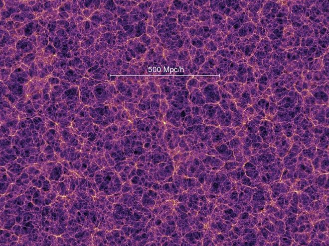
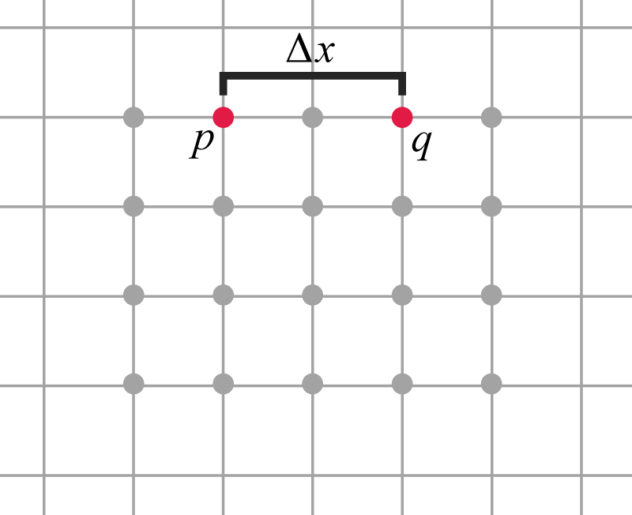

## ചാപ്റ്റര്‍ 1 - ആമുഖം

ചില നിരീക്ഷണങ്ങളിൽ നിന്നും തുടങ്ങാം.

### 1.	പ്രപഞ്ചത്തിന്‍റെ  ഐസോട്രോപ്പിയും ഹോമോജെനേയിറ്റിയും 

ഐസോട്രോപ്പി എന്ന് വെച്ചാൽ എല്ലാ ആംഗിളുകളിലും സമം. അതായതു, നമ്മൾ ആകാശത്തേക്ക് നോക്കുകയാണ് എന്ന് വെക്കുക. 90  ഡിഗ്രി ആംഗിളിൽ കാണുന്ന ഘടന തന്നെയാണ് 45 ഡിഗ്രിയിൽ നോക്കിയാലും കാണുക, അത് തന്നെയാണ് ഏത്  ആംഗിളിലും നോക്കിയാല്‍ കാണുക എന്നുണ്ടെങ്കിൽ ആകാശം ഐസോട്രോപിക് ആണെന്ന് പറയാം.

  
   
ചിത്രത്തില്‍, മദ്ധ്യത്തില്‍ നിന്ന് നോക്കിയാല്‍ സിസ്റ്റം ഐസോട്രോപിക് ആണ്

ഒരു സിസ്റ്റം ഐസോട്രോപിക് ആണെങ്കിൽ അത് ഹോമോജീനിയസ് ആകാൻ സാധ്യത കൂടുതലാണ് (പക്ഷെ അങ്ങനെ ആകണം എന്ന് ഉറപ്പൊന്നും ഇല്ല. ആകാം ആകതെയുമിരിക്കാം). ഹോമോജീനിയസ്  എന്ന് വെച്ചാൽ, എല്ലാ ഇടവും സമം. അതായതു ഒരു സിസ്റ്റത്തിൽ എല്ലാ പോയിന്‍റുകളും തുല്യം. ഒരു പോയിന്‍റിനും പ്രതേക പരിഗണന ഇല്ല.

  
   
ഈ ചിത്രത്തില്‍, മദ്ധ്യത്തില്‍ നിന്ന് നോക്കിയാല്‍ സിസ്റ്റം ഹോമോജീനിയസ്സ് ആണ്

തീർച്ചയായും, ഭൂമിയില്‍ നിന്നും ആകാശത്തേക്ക് നോക്കിയാൽ പ്രപഞ്ചം ഐസോട്രോപിക്കും ഹോമോജീനിയസും ആണെന്ന് നമുക്ക് അനുഭവപ്പെടില്ല. പക്ഷെ, ലക്ഷക്കണക്കിന് പ്രകാശ വർഷങ്ങളുടെ സ്കെയിലിൽ പ്രപഞ്ചം വളരെ അധികം ഐസോട്രോപിക്കും ഹോമോജീനിയസും ആണ്. 

ഉദാഹരണത്തിന്, ഒരു പെട്ടിയില്‍ കുറച്ചു ഗ്യാസ് പാര്‍ടിക്ക്ള്‍സ് ഉണ്ടെന്നു വെക്കുക. അവ റാന്‍ഡം ആയി ഡിസ്ട്രിബ്യൂട്ട് ചെയ്തിരിക്കുന്നു

ഒന്നോ രണ്ടോ പാര്‍ടിക്ക്ളുടെ സ്കയിലില്‍ അവയുടെ ഡിസ്ട്രിബ്യൂഷന്‍ സമമല്ല.

പക്ഷെ പാര്‍ടിക്ക്ളുടെ എണ്ണം കൂടുന്നതനുസരിച്ച് അവയുടെ ഡിസ്ട്രിബ്യൂഷന്‍ ഐസോട്രോപിക്കും ഹോമോജീനിയസ്സും ആകാന്‍ തുടങ്ങുന്നു:

<video style="display:block; margin: 0 auto;" width="640" autoplay="" loop="" muted="" controls="">
        <source src="../videos/gas distribution.mp4">        
        
Your browser does not support HTML5 video.

</video>

 
 

  
  
 <a href="https://wwwmpa.mpa-garching.mpg.de/galform/data_vis/index.shtml"> Volker Springel, Millennium simulation, Max-Planck-Institute for Astrophysics</a>

  

  
  
 <a href="https://wwwmpa.mpa-garching.mpg.de/galform/data_vis/index.shtml">Springel et al. (Virgo Consortium), Max-Planck-Institute for Astrophysics, Simulation code: Gadget-2</a>

 
 
 പ്രപഞ്ചത്തിന്‍റെ  വലിയ സ്കെയിലുകളിലെ സ്ട്രക്ചര്‍ - കംപ്യൂട്ടര്‍ സിമുലേഷനുകള്‍ 

വളരെ വലിയ സ്കെയിലുകളിൽ പ്രപഞ്ചത്തിന്‍റെ അഥവാ സ്പേസിന്‍റെ ഘടന ഐസോട്രോപിക്കും ഹോമോജീനിയസും ആണ് എന്ന് പലതരം ഒബ്സർവേഷൻസിൽ നിന്നും നമുക്ക് മനസ്സിലാക്കാം. ഉദാഹരണത്തിന്, WMAP (Wilkinson Microwave Anisotropic Probe)  മിഷൻ, പ്ലാങ്ക് മിഷന്‍ (Planck mission) എന്നിവ പകർത്തിയ കോസ്മിക് മൈക്രോവേവ് ബാക്ക്ഗ്രൗണ്ട് റേഡിയേഷൻ (CMB) പരിശോധിച്ചാൽ ഇത് വ്യക്തമാകും.

ഗാലക്സികളുടെ ഡിസ്ട്രിബ്യൂഷന്‍ എങ്ങനെയാണ് എന്ന് കണ്ടെത്താന്‍ വളരെയധികം സര്‍വേകള്‍ ഇതിനോടകം നടത്തിയിട്ടുണ്ട്. അതില്‍ ചിലത് ഇവയാണ്:

*	CfA Redshift Survey (Center for Astrophysics, Harvard University)
*	2dF Galaxy Redshift Survey (Australian National University)
*	6dF Galaxy Survey (Australian Astronomical Optics, Royal Observatory, UK)
*	2MASS, the Two Micron All Sky Survey (Caltech)
*	VLA FIRST Survey: Faint Images of the Radio Sky at Twenty-cm using NRAO Vary Large Array (National Radio Astronomy Observatory, United States)
*	EDisCS: ESO Distant Clusters Survey  (Max Planck Institute for Astrophysics, Germany)
*	LCRS, the Las Campanas Redshift Survey (University of Toronto)
*	ESP: the ESO Slice Project (National Institute for Astrophysics, Italy)
*	CNOC1 Cluster Survey (University of Toronto)
*	CNOC2 Field Galaxy Survey  (University of Toronto)
*	Sloan Digital Sky Survey (Sloan Foundation, U.S. Department of Energy Office of Science)
*	GAMA: Galaxy And Mass Assembly Survey (GAMA team, various universities)
*	DEEP2 Redshift Survey
*	VIMOS-VLT Deep Survey
*	UKIDSS: UKIRT Infrared Deep Sky Survey
*	Pan-STARRS: the Panoramic Survey Telescope & Rapid Response System
*	PRIMUS: PRIsm MUlti-object Survey
*	BOSS: Baryon Oscillation Spectroscopic Survey
*	DES: the Dark Energy Survey
*	LSST: the Large Synoptic Survey Telescope

ഇവയില്‍ നിന്നുള്ള ഡാറ്റയും കണ്ടെത്തലുകളും മറ്റു വിവരങ്ങളും ഇവിടെ വായിക്കാം: [http://openmetric.org/science/galaxy-surveys/](http://openmetric.org/science/galaxy-surveys/)

പ്രപഞ്ചത്തിന്റെ അഥവാ സ്പേസിന്റെ ഘടന ഐസോട്രോപിക്കും ഹോമോജീനിയസും ആണ് എന്നത് ഒരു തത്വം ആണ്. **കോസ്മളോജിക്കൽ തത്വം** (Cosmological Principle) എന്നാണ് ഇത് അറിയപ്പെടുന്നത്.

കോസ്മളോജിക്കൽ തത്വം പറയുന്നു:

 
പ്രപഞ്ചത്തിലെ മാറ്റര്‍/എനര്‍ജി ഡിസ്ട്രിബ്യൂഷന്‍ വളരെ വലിയ സ്കെയിലുകളില്‍ (ബില്ല്യണ്‍ പ്രകാശവര്‍ഷങ്ങളുടെ സ്കെയിലുകളില്‍) ഐസോട്രോപിക്കും ഹോമോജീനിയസും ആണ്.    

 
കോസ്മളോജിക്കൽ തത്വത്തില്‍ നിന്ന് നമുക്ക് ഒരു കാര്യം മനസിലാക്കാം അല്ലെങ്കില്‍ അനുമാനിക്കാം: പ്രപഞ്ചം ഗാലക്സികളെ കൊണ്ട് യൂണിഫോം ആയി നിറഞ്ഞിരിക്കുന്നു. അതായത് പ്രപഞ്ചത്തില്‍ ഒരിടത്തും ഗാലക്സികള്‍ കുമിഞ്ഞു കൂടിയിട്ടുമില്ല ഗാലക്സികള്‍ ഇല്ലാത്ത സ്ഥലങ്ങളും ഇല്ല. എല്ലാ ഇടവും ശരാശരി തുല്യമായ അളവില്‍ ഗാലക്സികള്‍ സ്പ്രെഡ് ചെയ്തിരിക്കുന്നു. (ഗാലക്സികള്‍ എന്നതുകൊണ്ട്‌ ഞാന്‍ ഇവിടെ ഉദ്ദേശിക്കുന്നത് മാറ്റര്‍/എനര്‍ജിയുടെ ഡിസ്ട്രിബ്യൂഷന്‍ എന്നാണ്.) ഇത് എത്രത്തോളം ശരിയാണ് എന്ന് പിന്നീട് നാം പരിശോധിക്കാം. തത്കാലം ഇത് ഒരു അസ്സംഷന്‍ ആയി നിലനില്‍ക്കട്ടെ.

പ്രപഞ്ചത്തിന്റെ  ഐസോട്രോപ്പിയും ഹോമോജെനേയിറ്റിയും കൂടുതൽ ശക്തവും ദൃഠവുമായ മാത്തമറ്റിക്കൽ ഭാഷയിൽ നാം പിന്നീട് നിർവചിക്കും.

### 2.	ഹബ്ബിൾ  നിയമം 

പ്രപഞ്ചത്തില്‍ എല്ലാ ഇടവും ശരാശരി തുല്യമായ അളവില്‍ ഗാലക്സികള്‍ സ്പ്രെഡ് ചെയ്തിരിക്കുന്നു എന്ന് മുകളില്‍ അസ്സ്യും ചെയ്തല്ലോ. ഈ ഗാലക്സികളില്‍ ആക്ട്‌ ചെയ്യുന്ന ഫോര്‍സുകള്‍ എന്തെല്ലാമായിരിക്കും എന്ന് നോക്കാം. പ്രധാനമായും ഗ്രാവിറ്റി ആണ് നമ്മുടെ വിഷയം.
ഹോമോജീനിയസ്സും ഐസോട്രോപിക്കും ആയി ഡിസ്ട്രിബ്യൂട്ട് ചെയ്യപ്പെട്ടിട്ടുള്ള ഈ സിസ്റ്റത്തിലെ ഒരു ഗാലക്സി എന്ത് ചെയ്യും? ഗ്രാവിറ്റി മൂലം ചുരുങ്ങി മധ്യത്തിലേക്ക് പോകുമോ അതോ തെറിച്ചു പുറത്തേക്കു പോകുമോ?

നോര്‍മല്‍ കേസ്സില്‍ ആ ഗാലക്സി ഒന്നും ചെയ്യരുത്. കാരണം എല്ലായിടവും തുല്യമായി ഡിസ്ട്രിബ്യൂട്ട് ചെയ്തിരിക്കുകയല്ലേ, അപ്പോള്‍ “പുള്‍” ചെയ്യുന്ന അതെ എണ്ണം ഗാലക്സികല്‍ അപ്പുറത്ത് നിന്ന് “പുഷ്” ചെയ്യാനും ഉണ്ടാകും. എല്ലാ ഫോര്‍സുകളും തമ്മില്‍ കാന്‍സല്‍ ആകണം. അല്ലേ? ഇതാണ് വളരെ കാലം വരെ (ഹബ്ബിള്‍ന്‍റെ കാലം വരെ) ആളുകള്‍ കരുതിയിരുന്നത്. അതായത് ഒരു സ്റ്റാറ്റിക്ക് പ്രപഞ്ചം. ഇത് ശരിയല്ല എന്ന് ഇന്ന് നമുക്കറിയാം. പ്രപഞ്ചം വെറുതെ “ഇരിക്കുക” അല്ല മറിച്ച്, എക്സ്പാന്‍ഡ് ചെയ്യുകയാണ്.

ഈ എക്സ്പാന്‍ഷന്‍ ന്യൂട്ടണിന്‍റെ ഇക്വേഷൻസ് ഉപയോഗിച്ച് നമുക്ക് മോഡല്‍ ചെയ്തു നോക്കാം. ന്യൂട്ടണ് പ്രപഞ്ചത്തിന്‍റെ ഈ എക്സ്പാന്‍ഷന്‍ കണ്ടെത്താമായിരുന്നു. പക്ഷെ എന്തുകൊണ്ടോ അദ്ദേഹം ഈ ഉദ്യമത്തിന് മുതിര്‍ന്നില്ല.

ആദ്യത്തെ സ്റ്റെപ്: ഒരു കോര്‍ഡിനേറ്റ് സിസ്റ്റം ഇന്‍ട്രൊഡ്യൂസ് ചെയ്യുക. (ടെക്നിക്കല്‍ ഭാഷയില്‍ പറഞ്ഞാല്‍ ഒരു മെട്രിക് നിര്‍മ്മിക്കുക – അകലം അളക്കുന്നതിനു വേണ്ടി നിര്‍മ്മിക്കുന്ന ഒരു മെഷറിംഗ് സിസ്റ്റത്തെ മെട്രിക് എന്ന് വിളിക്കുന്നു.)

മറ്റൊരു ഭാഷയില്‍ പറഞ്ഞാല്‍, ഒരു ഗ്രിഡ് നിര്‍മ്മിക്കുക.

  
   
മെട്രിക് ഗ്രിഡ്

ചിത്രത്തില്‍ കാണുന്ന പോലെ ഗാലക്സികളെ ഈ ഗ്രിഡിന്‍റെ ഇന്റര്‍സെക്ഷന്‍ പോയിന്റ്കളില്‍ പ്രതിഷ്ഠിക്കുക.

ഈ ഗാലക്സികള്‍ തമ്മിലുള്ള അകലത്തെ “\\(a\\)” എന്ന് നമുക്ക് വിളിക്കാം. അതായത് \\(a =\\) ഒരു ലാറ്റിസ് അകലം.

    

ഈ സിസ്റ്റത്തില്‍ ഗാലക്സികള്‍ അകന്ന് അകന്നു പോകുകയാണെങ്കില്‍ ഗ്രിഡ് സൈസ് അതിനനുസരിച്ച് വര്‍ധിക്കും. മറിച്ച്, ഗാലക്സികല്‍ അടുത്തേക്ക് ചേരുകയാണെങ്കില്‍ ഗ്രിഡ് സൈസ് അതിനനുസരിച്ച് കുറയും.

ഇങ്ങനെ ഒരു ഗ്രിഡ് പ്രതിഷ്ഠിക്കണമെങ്കില്‍ ഗാലക്സികള്‍ കൊഹീറന്‍റ്  ആയി മൂവ് ചെയ്താലേ സാധിക്കൂ. എന്തായാലും നമ്മുടെ ഭാഗ്യത്തിന് ഈ പ്രപഞ്ചത്തില്‍ സംഭവിക്കുന്നത്‌ അങ്ങനെ തന്നെയാണ്!!

ഈ ഗ്രിഡിന്‍റെ അക്ഷങ്ങളെ നമുക്ക് \\(x, y, z\\) എന്ന് വിളിക്കാം. പക്ഷെ ഒരു കാര്യം ശ്രദ്ധിക്കുക: ഈ ദൂരം മീറ്റര്‍ കൊണ്ടോ മൈലുകള്‍ കൊണ്ടോ അല്ല അളക്കുന്നത്. കാരണം, ദൂരം എന്നത് സമയത്തെ അനുസരിച്ചു മാറും.

ഈ ഗ്രിഡില്‍ \\(x\\) ദൂരം അകലെ ഉള്ള രണ്ടു പോയിന്‍റ്കള്‍ \\(p,q\\) എടുക്കാം. “\\(x\\) ദൂരം” എന്നതിനെ ചുരുക്കത്തില്‍ നമുക്ക് \\(\Delta x\\) എന്ന് വിളിക്കാം.

    

ഇവ തമ്മിലുള്ള അകലം എങ്ങനെ കണക്കാക്കും?

നാം ഡിസ്റ്റന്‍സ് \\(D\\) അഥവാ അകലം എന്ന കോണ്‍സപ്റ്റ് ഡിഫൈന്‍ ചെയ്യാന്‍ പോകുകയാണ്:

$$D = a \cdot \Delta x$$

ഇവിടെ, \\(a\\) എന്നാല്‍ നമ്മുടെ ഒരു ലാറ്റിസ് സെപറേഷന്‍. ഇതിനെ നമുക്ക് **സ്കെയില്‍ ഫാക്ടര്‍** അല്ലെങ്കില്‍ **സ്കെയില്‍ പരാമീറ്റര്‍** എന്ന് വിളിക്കാം.

ഈ സ്കെയില്‍ പരാമീറ്റര്‍ ഒരു കോണ്‍സ്റ്റന്‍റ് ആകാം അല്ലെങ്കില്‍ വേരിയബിളും ആകാം. കോണ്‍സ്റ്റന്‍റ് ആണെങ്കില്‍ രണ്ടു പോയിന്‍റ്കള്‍ തമ്മിലുള്ള അകലം എക്കാലവും കോണ്‍സ്റ്റന്‍റ് ആയിരിക്കും.
നമുക്ക് ഈ സ്കെയില്‍ പരാമീറ്ററിനെ ടൈം ഡിപ്പെണ്ടന്‍റ് ആയി കണക്കാക്കാം. അതായത് \\(a\\) എന്നത് ടൈം  \\(t\\) യുടെ ഒരു ഫങ്ങ്ഷന്‍ ആണ്.

$$D_{pq} = a(t) \cdot \Delta x_{pq}$$

എന്തുകൊണ്ട് സ്കെയില്‍ പരാമീറ്ററിനെ ടൈം ഡിപ്പെണ്ടന്‍റ് ആയി കണക്കാക്കുന്നു? കാരണം അതാണ്‌ നാം പ്രപഞ്ചത്തില്‍ കാണുന്നത്. ഈ പ്രപഞ്ചത്തില്‍ സ്കെയില്‍ പരാമീറ്റര്‍ ടൈം ഡിപ്പെണ്ടന്‍റ് ആണ്.

മുകളില്‍ പറഞ്ഞതിനെ ജെനറലൈസ് ചെയ്യാം. നമ്മുടെ ഗ്രിഡില്‍ ഏതെങ്കിലും രണ്ടു അക്ഷങ്ങളില്‍ ഉള്ള പോയിന്‍റ്കള്‍ \\(p,q\\) എടുക്കാം:

    

ഇവ തമ്മില്‍ ഉള്ള ഡിസ്റ്റന്‍സ്:

$$D_{pq} = a(t) \cdot \sqrt {\Delta x_{pq}^2 + \Delta y_{pq}^2 + \Delta z_{pq}^2}$$

(പൈതാഗറസ്‌ തിയറം)

(നമ്മുടെ ഉദാഹരണത്തില്‍ \\(z\\) അക്ഷം ഇല്ല. നാം എളുപ്പത്തിനായി 2D ഗ്രിഡ് ആണ് പരിഗണിക്കുന്നത്)

\\(p\\)യും \\(q\\) വും തമ്മിലുള്ള വെലോസിറ്റി കണക്കാക്കി നോക്കാം.

മനസ്സിലാകാന്‍ എളുപ്പത്തിനായി \\(p\\) യും \\(q\\) വും \\(x\\) അക്ഷത്തില്‍ ഉള്ള രണ്ടു പോയിന്‍റ്കളാണെന്ന് വെക്കുക.

    

\\(p\\)യും \\(q\\) വും തമ്മിലുള്ള റെലറ്റീവ് വെലോസിറ്റി എന്ന് പറയുന്നത് ഡിസ്റ്റന്‍സ് \\(D\\) യുടെ ടൈം ഡെറിവേറ്റിവ് ആണ്.

അതായത്, ഡിസ്റ്റന്‍സ് \\(D\\) എന്നത്:

$$D_{pq} = a(t) \cdot \Delta x_{pq}$$

ആണെങ്കില്‍ വെലോസിറ്റി എന്നത്:

$$ V_{pq} = \frac{dD_{pq}}  {dt} = \dot D_{pq}$$ 

(\\( \dot D_{pq} \\) എന്നതിനെ ഡി ഡോട്ട് പി ക്യു എന്ന് വായിക്കാം. ഡോട്ട് സൂചിപ്പിക്കുന്നത് ഡെറിവേറ്റിവ് വിത്ത്‌ റെസ്പക്ട് ടു ടൈം എന്നാണ്. ഒരു ഡോട്ട് ആയതിനാല്‍ ഒന്നാം ഡെറിവേറ്റിവ്, രണ്ടു ഡോട്ട് ഉണ്ടെങ്കില്‍ രണ്ടാം ഡെറിവേറ്റിവ് അങ്ങിനെ അങ്ങിനെ.)

ഇവിടെ \\(D_{pq}\\)യില്‍ \\(a(t)\\) മാത്രമാണ് സമയത്തിനനുസരിച്ച് മാറുന്ന ഘടകം.
അതിനാല്‍ മുകളില്‍ പറഞ്ഞതിനെ നമുക്ക് ഇങ്ങനെ എഴുതാം:

$$V_{pq}=a ̇\cdot \Delta x_{pq}$$

വെലോസിറ്റിയും ഡിസ്റ്റന്‍സും തമ്മിലുള്ള റേഷിയോ എന്നത്:

$$\frac{V_{pq}}{D_{pq}} =  \frac {\dot a(t)}{a(t)}$$

ഇവിടെ ഒരു കാര്യം ശ്രദ്ധിക്കുക: \\(\Delta x\\) ക്യാന്‍സല്‍ ആയി. അതായതു വെലോസിറ്റിയും ഡിസ്റ്റന്‍സും തമ്മിലുള്ള റേഷിയോ, നമ്മള്‍ ഏതു പോയിന്‍റ്കളാണ് തെരഞ്ഞെടുത്തത് എന്നതിനെ പരിഗണിക്കുന്നില്ല. എന്ന് വെച്ചാല്‍ ഏതു രണ്ടു പോയിന്‍റ്കള്‍ എടുത്താലും ഈ റേഷിയോ സമം ആയിരിക്കും.

\\( \frac {\dot a(t)}{a(t)} \\)യെ ഹബ്ബിള്‍ കോണ്‍സ്റ്റന്‍ഡ് അല്ലെങ്കില്‍ ഹബ്ബിള്‍ പരാമീറ്റര്‍ എന്ന് വിളിക്കുന്നു. ഇതിനെ പൊതുവേ \\(H\\) എന്ന ക്യാരക്ടര്‍ കൊണ്ട് സൂചിപ്പിക്കുന്നു. (ചില ടെക്സ്റ്റ് ബുക്ക്കളില്‍ ഹബ്ബിള്‍ പരാമീറ്ററിന്‍റെ ഇപ്പോഴത്തെ വാല്യൂവിനെ \\(H_0\\) - “എച് നോട്ട്” എന്നും വിളിക്കാറുണ്ട്)

“ഹബ്ബിള്‍ കോണ്‍സ്റ്റന്‍ഡ്” എന്ന് വിളിക്കുന്നു എങ്കിലും ഇത് സമയത്തെ സംബന്ധിച്ച് ഒരു കോണ്‍സ്റ്റന്‍ഡ് അല്ലാ എന്ന് ഓര്‍ക്കുക. സ്പേസ്നെ സംബന്ധിച്ച് ഇത് ഒരു കോണ്‍സ്റ്റന്‍ഡ് ആണ്.

മുകളില്‍ പറഞ്ഞ ഇക്വേഷന്‍ റീ അറേഞ്ച് ചെയ്‌താല്‍:

 $$V=HD$$

ഇതാണ് ഹബ്ബിള്‍ നിമയം അതിന്‍റെ സ്റ്റാന്‍ഡേര്‍ഡ് ഫോമില്‍.

എന്താണ് ഈ ഇക്വേഷന്‍ പറയുന്നത്‌? 
വെലോസിറ്റിയും ഡിസ്റ്റന്‍സും ഡയറക്ട് ആയി പ്രൊപ്പോഷണല്‍ അഥവാ ആനുപാതികം ആണ്.
അതായത് ഒരു ഓബ്ജക്ട് നമ്മളില്‍ നിന്നും എത്ര ദൂരത്താണോ ഉള്ളത് അതിനനുസരിച്ച് ആയിരിക്കും നമ്മളും അതും തമ്മില്‍ ഉള്ള വെലോസിറ്റി. ദൂരം കൂടുന്നതിന് അനുസരിച്ച് വെലോസിറ്റിയും പ്രൊപ്പോഷണല്‍ ആയി വര്‍ധിക്കും.

വേറൊരു കാര്യം ഈ ഇക്വേഷനില്‍ നിന്ന് മനസ്സിലാക്കാം: ഇതിലെ \\(V\\) പ്രകാശ വേഗം \\(C\\) ആയി സങ്കല്‍പ്പിക്കുക. അപ്പോള്‍:

$$C = HD$$

അതായത് \\(D\\) ദൂരത്ത്‌ ഉള്ള ഒരു ഓബ്ജക്ട് നമ്മളില്‍ നിന്നും പ്രകാശ വേഗത്തില്‍ അകന്നുപോയ്ക്കൊണ്ടിരിക്കുന്നു. അപ്പോള്‍ അതിനും അപ്പുറമുള്ള ഓബ്ജക്ട്കളോ? അവ നമ്മളില്‍ നിന്നും പ്രകാശ വേഗത്തെക്കാള്‍ വേഗതയില്‍ അകന്നു പോയ്ക്കൊണ്ടിരിക്കുന്നു. 

അപ്പോള്‍ നമുക്ക് ചുറ്റും \\(D\\) റേഡിയസ് ഉള്ള ഒരു സ്ഫിയര്‍ സൃഷ്ടിക്കപ്പെടുന്നു. 
ഇതിനെ **ഹബ്ബിള്‍ സ്ഫിയര്‍** അല്ലെങ്കില്‍ **ഹബ്ബിള്‍ ഹൊറൈസണ്‍** എന്ന് വിളിക്കുന്നു.

പ്രപഞ്ചത്തിനു പല തരത്തിലുള്ള "അതിരുകള്‍" ഉണ്ട്. അതില്‍ ഒന്നാണ് ഹബ്ബിള്‍ ഹൊറൈസണ്‍.
 പാര്‍ട്ടിക്ക്ള്‍ ഹൊറൈസണ്‍, ഇവന്‍റ് ഹൊറൈസണ്‍ തുടങ്ങിയവയാണ് മറ്റുള്ളവ. ഇവ വിശദമായി പിന്നീട് നോക്കാം.

ഇവിടെ \\(D\\) എന്നത് **പ്രോപ്പര്‍ ഡിസ്റ്റന്‍സ്** ആണ്. 

കൊസ്മോളജിയില്‍ രണ്ടു തരം  ഡിസ്റ്റന്‍സ്കള്‍ ഡിഫൈന്‍ ചെയ്തിട്ടുണ്ട്: 

പ്രോപ്പര്‍ ഡിസ്റ്റന്‍സ്:

 കോസ്മളോജിക്കല്‍ ടൈം കോണ്‍സ്റ്റന്‍റ് ആക്കി വെച്ചിട്ട് സ്പേസിലെ രണ്ടു പോയിന്‍റുകള്‍ തമ്മില്‍ ഉള്ള ഡിസ്റ്റന്‍സ് ഡിഫൈന്‍ ചെയ്തിരിക്കുന്നതാണ് പ്രോപ്പര്‍ ഡിസ്റ്റന്‍സ്.
 
കോ-മൂവിംഗ് ഡിസ്റ്റന്‍സ്:

നമ്മള്‍ നിര്‍മ്മിച്ച ഗ്രിഡ് വലുതാകുന്നതനുസരിച്ച് മൂവ് ചെയ്യുന്ന പോയിന്‍റുകള്‍ തമ്മില്‍ ഉള്ള ഡിസ്റ്റന്‍സ് ആണ് കോ-മൂവിംഗ് ഡിസ്റ്റന്‍സ്. രണ്ടു പോയിന്‍റുകള്‍ തമ്മില്‍ ഉള്ള കോ-മൂവിംഗ് ഡിസ്റ്റന്‍സ് എപ്പോഴും തുല്യം ആയിരിക്കും.

നിങ്ങള്‍ ആപേക്ഷികത പഠിച്ചിട്ടുണ്ടെങ്കില്‍ ചോദിക്കും എങ്ങനെയാണ് പ്രകാശത്തെക്കാാള്‍ വേഗത്തില്‍ ഓബ്ജക്ട്കള്‍ സഞ്ചരിക്കുന്നതെന്ന്. അത് ആപേക്ഷികതക്ക് എതിരല്ലേ?

ഈ സാഹചര്യത്തെ മറ്റൊരു തരത്തില്‍ വീക്ഷിക്കാം.

ഗാലക്സികള്‍ അല്ല മൂവ് ചെയ്യുന്നത്. മറിച്ച്, അവ തമ്മിലുള്ള ഡിസ്റ്റന്‍സ് വര്‍ദ്ധിക്കുകയാണ് ചെയ്യുന്നത്. അതായത്, പുതിയ “സ്പേസ്” “സൃഷ്ടിക്കപ്പെടുന്നു”. അല്ലെങ്കില്‍ മെട്രിക് വലുതാകുന്നു. ഇതിനെയാണ് മെട്രിക് എക്സ്പാന്‍ഷന്‍ ഓഫ് സ്പേസ് എന്ന് വിളിക്കുന്നത്‌.

വേറൊരു സ്ഥിരമായ ചോദ്യം: എങ്ങോട്ടാണ് സ്പേസ് എക്സ്പാന്‍റ് ചെയ്യുന്നത് എന്നതാണ്.

കോസ്മോളജിസ്റ്റ്കളോട് ചോദിച്ചാല്‍ അവര്‍ പറയും:

സ്പേസ് “ഒരിടത്തോട്ടും” അല്ല എക്സ്പാന്‍റ് ചെയ്യുന്നത്, മെട്രിക് ആണ് എക്സ്പാന്‍റ് ചെയ്യുന്നത് എന്ന്. അതായത് ഈ എക്സ്പാന്‍ഷന്‍ സ്പേസിന്‍റെ ഇന്‍ട്രിന്‍സിക്ക് ജിയോമെട്രിയുടെ എക്സ്പാന്‍ഷന്‍ ആണ്.

ഇത് പൂര്‍ണമായും മനസ്സിലാകണമെങ്കില്‍ നമുക്ക് സ്പേസിന്‍റെ ജിയോമെട്രിയെകുറിച്ച് കൂടുതല്‍ പഠിക്കണം. 
ഇക്കാര്യം വിശദമായി അപ്പോള്‍ നോക്കാം.

 വെലോസിറ്റിയും ഡിസ്റ്റന്‍സും ഡയറക്ട് ആയി ആനുപാതികം ആണ് എന്നതാണല്ലോ ഹബ്ബിള്‍ നിയമം, പക്ഷെ വെലോസിറ്റി നെഗറ്റീവോ പോസിറ്റീവോ ആകാമല്ലോ? അതായത് മറ്റു ഗാലക്സികള്‍ നമ്മളില്‍ നിന്നും അകന്നു പോകുകയോ അടുത്ത് വരികയോ ചെയ്യാമല്ലോ? ഇതില്‍ ഏതാണ് സംഭവിക്കുന്നത്‌ എന്ന് ഈ ഇക്വേഷന്‍ പറയുന്നില്ല. പിന്നെ എങ്ങിനെ നാം അനുമാനിച്ചു അവ അകന്നു പോകുകയാണ് എന്ന്? 

ഉത്തരം: ഗാലക്സികളുടെ റെഡ് ഷിഫ്റ്റ്.

### 3. റെഡ് ഷിഫ്റ്റും അകലവും 

എന്താണ് റെഡ് ഷിഫ്റ്റ്?

നിങ്ങള്‍ ഒരു റോഡില്‍ നില്‍ക്കുകയാണ് എന്ന് വെക്കുക. ഒരു ആംബുലന്‍സ് ദൂരെ നിന്നും വന്ന് നിങ്ങളുടെ മുന്നിലൂടെ പാഞ്ഞു പോയി. അതിന്‍റെ സൈറന്‍ ശ്രദ്ധിച്ചിട്ടുണ്ടോ? ദൂരെ നിന്നും നിങ്ങളുടെ അടുത്തേക്ക് വരുമ്പോള്‍ സൈറന്‍റെ ഫ്രീക്വന്‍സി കൂടുതലായിരിക്കും.പോയി കഴിയുമ്പോള്‍ അത് സ്ലോ ആകുന്നതുപോലെ അനുഭവപ്പെടും.
ഇതിനു കാരണം ഡോപ്ലര്‍ ഷിഫ്റ്റ്‌ എന്ന പ്രതിഭാസം ആണ്.

ഒരു ഉദാഹരണം, കാര്‍ ഹോണ്‍:

  ഹെഡ് ഫോണ്‍ ഉപയോഗിക്കുന്നവര്‍ വോള്യം കുറയ്ക്കുക

  
<audio src="https://upload.wikimedia.org/wikipedia/commons/9/90/Speeding-car-horn_doppler_effect_sample.ogg" controls preload></audio>

 <a href="https://en.wikipedia.org/wiki/File:Speeding-car-horn_doppler_effect_sample.ogg">Credit: Wikipedia user Magickallwiz</a>

  
  
സ്റ്റേഷണറി ആയിട്ടുള്ള ഒരു വസ്തുവില്‍ നിന്നുള്ള തരംഗങ്ങള്‍ 

   
 മൂവ് ആകുന്ന ഒരു വസ്തുവില്‍ നിന്നുള്ള തരംഗങ്ങള്‍ 

  
 <a href="https://en.wikipedia.org/wiki/File:Dopplereffectsourcemovingrightatmach0.7.gif"> Credit: Wikipedia user Lookang,  Fu-Kwun Hwang and author of Easy Java Simulation Francisco Esquembre </a>

എല്ലാ തരംഗങ്ങള്‍ക്കും ഇത് സംഭവിക്കും. പ്രകാശത്തിനു ഉള്‍പ്പടെ. 
ഒരു വീക്ഷകന്‍റെ അടുത്തേക്ക് വരുന്ന ഒരു ഓബ്ജക്ടില്‍ നിന്നും വരുന്ന പ്രകാശ തരംഗങ്ങള്‍ കംപ്രസ്സ് ആകുന്നു. അതിനാല്‍ അവ EM സ്പെക്ട്രത്തിന്‍റെ “നീല“ വിഭാഗത്തിലേക്ക് ഷിഫ്റ്റ്‌ ചെയ്യുന്നു. ഇതിനെ ബ്ലു ഷിഫ്റ്റ്‌ എന്ന് വിളിക്കുന്നു. ഇതിന്‍റെ നേര്‍ വിപരീതമാണ് റെഡ് ഷിഫ്റ്റ്‌. അതായത്  ഒരു വീക്ഷകനില്‍ നിന്നും അകന്നു പൊയ്ക്കൊണ്ടിരിക്കുന്ന ഒരു ഓബ്ജക്ടില്‍ നിന്നും വരുന്ന പ്രകാശ തരംഗങ്ങള്‍ വലിഞ്ഞു പോകുന്നു. അങ്ങനെ അവ ചുവക്കുന്നു.

കെമിക്കല്‍ എലമെന്‍റ്കള്‍ പ്രകാശം അബ്സോര്‍ബ് ചെയ്യുന്നതും എമിറ്റ് ചെയ്യുന്നതും അതിന്‍റേതായ അദ്വിതീയമായ രീതിയിലാണ്. സ്പെക്ട്രോസ്കോപ്പി എന്ന പ്രക്രിയയിലൂടെ ഇവ തിരിച്ചറിയാനാകും.  

ചുരുക്കി പറഞ്ഞാല്‍ പ്രകാശവും ദ്രവ്യവും തമ്മിലുള്ള ഇന്‍ററാക്ഷന്‍ ദ്രവ്യത്തിന്‍റെ ഇലക്ട്രോണ്‍ കോണ്‍ഫിഗറെഷന്‍ അനുസരിച്ച് ഇരിക്കും. ഇത് ഡിസ്ക്രൈബ് ചെയ്യുന്ന ശാഖയാണ്‌ ക്വാണ്ടം ഇലക്ട്രോ ഡൈനാമിക്സ്.

 <a href="https://en.wikipedia.org/wiki/File:Hydrogen-SpinFlip.svg"> Credit: Wikipedia</a>

ഹൈഡ്രജന്‍ ആറ്റത്തിന്‍റെ ഫോട്ടോണ്‍ എമിഷന്‍ കൊസ്മോളജിയില്‍ വളരെ പ്രാധാന്യമുള്ളതാണ്. പ്രപഞ്ചത്തില്‍ ഉള്ള ദ്രവ്യത്തിന്‍റെ ഭൂരിഭാഗവും ഹൈഡ്രജന്‍ ആണല്ലോ. ഈ എമിഷന്‍ ലൈനിനെ 21 cm ലൈന്‍ എന്ന് അറിയപ്പെടുന്നു. ഇവയുടെ പഠനം ഒരു പ്രത്യേക മേഖല തന്നെയാണ് – 21 cm കൊസ്മോളജി എന്ന് ഇത് അറിയപ്പെടുന്നു.

  
  
 <a href="https://commons.wikimedia.org/wiki/File:Redshift.svg"> Credit: Wikipedia</a>

  
സൂര്യനില്‍ നിന്നുള്ള പ്രകാശത്തിന്‍റെ വിസിബിള്‍ സ്പെക്ട്രത്തിന്‍റെ അബ്സോര്‍ബ്ഷഷന്‍ ലൈന്‍ (ഇടത്) - വിദൂരത്തുള്ള ഗാലക്സി ക്ലസ്റ്ററില്‍ നിന്നുള്ള പ്രകാശത്തിന്‍റെ സ്പെക്ട്രത്തിന്‍റെ അബ്സോര്‍ബ്ഷഷന്‍ ലൈന്‍.
ആരോകള്‍ റെഡ് ഷിഫ്റ്റിനെ ചൂണ്ടിക്കാണിക്കുന്നു.

അപ്പോള്‍ ഒരു ഗാലക്സിയെ നോക്കി അതിന്‍റെ പ്രകാശത്തിന്‍റെ സ്പെക്ട്രം അനലൈസ് ചെയ്യുകയാണെങ്കില്‍ ആ ഗാലക്സി നമ്മളില്‍ നിന്നും അകലുകയാണോ അതോ അടുത്ത് വരികയാണോ എന്ന് മനസ്സിലാക്കാം.
ആന്‍ണ്ട്രോമഡ ഗാലക്സി പോലെയുള്ള ചുരുക്കം ചില വസ്തുക്കള്‍ ഒഴിച്ചാല്‍ നമ്മുടെ മില്‍കി വേയുടെ ചുറ്റും ഉള്ള മറ്റ് എല്ലാ വസ്തുക്കളും റെഡ് ഷിഫ്റ്റഡ് ആണെന്ന് ബെല്‍ജിയന്‍ അസ്ട്രോണമര്‍ ആയിരുന്ന ജോര്‍ജിസ് ലമാതൃ കണ്ടെത്തി. അതായത് അവ എല്ലാം നമ്മളില്‍ നിന്നും അകന്നു പൊയ്കൊണ്ടിരിക്കുന്നു.   

റെഡ് ഷിഫ്റ്റും അകലവും തമ്മില്‍ ഒരു ബന്ധം ഉണ്ട്.   

ഇതാണ് ഹബ്ബിള്‍ കണ്ടെത്തിയത്.  

ചുറ്റുമുള്ള കുറെ ഗാലക്സികളുടെ റെഡ്ഷിഫ്റ്റ്‌ ഹബ്ബിള്‍ അളന്നു. എന്നിട്ട് അവയിലേക്കുള്ള ദൂരവും. ഇത് രണ്ടും കൂടി ഒരു x-y അക്ഷത്തില്‍ പ്ലോട്ട് ചെയ്തു. അങ്ങനെയാണ് ഹബ്ബിള്‍ നിയമം ഡിറൈവ് ചെയ്തത്.   

  
   
ഹബ്ബിള്‍ ഡയഗ്രം

ശരിക്ക് പറഞ്ഞാല്‍ രണ്ടു കാര്യങ്ങളാണ് ഹബ്ബിള്‍ കണ്ടെത്തിയത്:  

1.	ഏകദേശം 10 മെഗാ പാര്‍സെക് ദൂരത്തിനു അപ്പുറമുള്ള ഒബ്ജക്ട്കള്‍ റെഡ് ഷിഫ്റ്റഡ് ആണ്. ഇത് അവയുടെ റിസഷണല്‍ വെലോസിറ്റിയെ സൂചിപ്പിക്കുന്നു.  

2.	ഈ ഡോപ്ലര്‍ ഷിഫ്റ്റ്‌, അല്ലെങ്കില്‍ റിസഷണല്‍ വെലോസിറ്റി, ഒബ്ജക്ട്കളുടെ ദൂരവുമായി താരതമ്യം ചെയ്യുമ്പോള്‍ നേര്‍ ആനുപാതികം ആണ്.  

(നോട്ട്: “പാര്‍സെക്” എന്നത് അസ്ട്രോണമിയില്‍ ദൂരം അളക്കുന്നതിന് ഉപയോഗിക്കുന്ന ഒരു യൂണിറ്റ് ആണ്. 1 പാര്‍സെക് = ഏകദേശം 3.26 പ്രകാശ വര്‍ഷം = 30 ട്രില്ല്യണ്‍  km) 
  

റെഡ് ഷിഫ്റ്റിനെ \(z\) എന്ന പരാമീറ്റര്‍ കൊണ്ടാണ് സൂചിപ്പിക്കുന്നത്. \(z\) താഴെ പറയുന്നത് പോലെ ഡിഫൈന്‍ ചെയ്തിരിക്കുന്നു:  

$$ z = \frac {\lambda_{o}}{\lambda_{e}} - 1 $$  

ഇവിടെ,  
\\( \lambda_{o} \\) എന്നത് ഒബ്സര്‍വ് ചെയ്തപ്പോള്‍ ഉള്ള വേവ് ലെങ്ങ്ത്   
\\( \lambda_{e} \\) എന്നത് എമിറ്റ് ചെയ്തപ്പോള്‍ ഉള്ള വേവ് ലെങ്ങ്ത്  

മുന്‍പ് ചോദിച്ച അതേ ചോദ്യം വീണ്ടും ചോദിക്കാം: ഇതില്‍ നിന്നും ഗാലക്സികള്‍ അല്ല മൂവ് ചെയ്യുന്നത് പക്ഷേ സ്പേസ് ആണ് എക്സ്പാന്‍ഡ് ചെയ്യുന്നത് എന്ന് എങ്ങനെ മനസ്സിലാക്കാം?

ഉത്തരം: ഇത് രണ്ടും തിരിച്ചറിയാന്‍ പറ്റാത്ത വിധം ഒന്നാണ്. ഗാലക്സികള്‍ പോലെ അകലെ ഉള്ള വസ്തുക്കളില്‍ നിന്നും വരുന്ന റെഡ് ഷിഫ്റ്റ്‌ ആയ പ്രകാശം യഥാര്‍ത്ഥത്തില്‍ സ്പേസ്ന്‍റെ എക്സ്പാന്‍ഷന്‍ കൊണ്ടാണ് ഉണ്ടാകുന്നത്. പക്ഷെ ഇത് ഗാലക്സികള്‍ അകന്നു പോകുന്നത് കൊണ്ട് ഉണ്ടാകുന്ന ഡോപ്ലര്‍ ഷിഫ്റ്റിന് തുല്യമാണ്.

ഇവ രണ്ടും തിരിച്ചറിയാന്‍ പറ്റാത്ത വിധം ഒന്നാണ് എങ്കില്‍ സ്പേസ്ന്‍റെ എക്സ്പാന്‍ഷന്‍ കൊണ്ടാണ് ഈ റെഡ് ഷിഫ്റ്റ്‌ ഉണ്ടാകുന്നത് എന്ന് എങ്ങനെ പറയാനാകും? ഗാലക്സികള്‍ എല്ലാം അകന്നു പോകുകയായിരിക്കും ചെയ്യുന്നത്. അല്ലേ?

ഈ ഡോപ്ലര്‍ ഷിഫ്റ്റ്‌ സ്പേസ്ന്‍റെ എക്സ്പാന്‍ഷന്‍ കൊണ്ടാണ് എന്ന കണ്‍ക്ലൂഷന്‍ എത്താന്‍ കാരണം ഉണ്ട്. അത് ശരിക്കും മനസ്സിലാകണമെങ്കില്‍ നമുക്ക് കൂടുതല്‍ പഠിക്കണം.

ചുരുക്കത്തില്‍ പറയാം:

1.	ഒബ്സര്‍വ് ചെയ്ത എല്ലാ ഗാലക്സികളും നമ്മളില്‍ നിന്നും അകന്നു പോകുന്നു എന്ന് പറയണമെങ്കില്‍ നമ്മള്‍ ഒരു പ്രത്യേക സ്ഥാനത്ത് ആയിരിക്കണം – നടുക്ക്. ഇത് രണ്ടു കാര്യങ്ങള്‍ക്ക് എതിരാണ് – 

    *	സ്പേസിന്‍റെ ഹോമോജെനെയിറ്റി (എല്ലാ പോയിന്‍റുകളും തുല്യം) 

    *	കോപ്പര്‍നിക്കന്‍ തത്വം (നമ്മളല്ല പ്രപഞ്ചത്തിന്‍റെ നടുവില്‍)

2.	വിദൂരത്തുള്ള ഗാലക്സികളുടെ റെഡ് ഷിഫ്റ്റില്‍ നിന്നും അവയുടെ വെലോസിറ്റി കണക്കാക്കിയാല്‍ അവ പ്രകാശ വേഗത്തെക്കാള്‍ വേഗതയില്‍ സഞ്ചരിക്കുന്നു എന്ന് കാണാം. ഇത് സാധ്യമല്ലാ എന്ന് നമുക്കറിയാം.
  
3.	ജനറല്‍ ആപേക്ഷികത സ്പേസിന്‍റെ എക്സ്പാന്‍ഷന്‍ അനുവദിക്കുന്നു.

4.	പ്രപഞ്ചത്തിന്‍റെ ജിയോമെട്രി  ജനറല്‍ ആപേക്ഷികമാണ് എന്ന് നമുക്കറിയാം

5.	ജനറല്‍ / സ്പെഷ്യല്‍ ആപേക്ഷികതയില്‍ സ്പേസിന്‍റെ എക്സ്പാന്‍ഷന്‍ മൂലം പ്രകാശത്തിനു ഡോപ്ലര്‍ ഷിഫ്റ്റ്‌ സംഭവിക്കുന്നു. 

6.	ആപേക്ഷികത മൂലം ഉണ്ടാകുന്ന റെഡ് ഷിഫ്റ്റ്‌ ഒബ്സര്‍വ് ചെയ്ത ഡാറ്റയുമായി യോജിക്കുന്നു. 

ഇവയെല്ലാം വിശദമായി വരും ചാപ്റ്ററുകളില്‍ നാം പരിശോധിക്കും. 

ഈ കണ്‍ക്ലൂഷനിലേക്ക് നയിച്ച മറ്റൊരു വലിയ ഒരു തെളിവ് എന്നത് കോസ്മിക് മൈക്രോവേവ് ബാക്ക്ഗ്രൌണ്ട് എന്ന് അറിയപ്പെടുന്ന റേഡിയേഷന്‍ ആണ്.

### 3. കോസ്മിക് മൈക്രോവേവ് ബാക്ക്ഗ്രൌണ്ട്

  
   
   Nine year Microwave sky – ഒന്‍പതു വര്‍ഷത്തെ WMAP ഡാറ്റയില്‍ നിന്ന് ചിത്രീകരിച്ച നവജാത പ്രപഞ്ചത്തിന്‍റെ ചിത്രം. 13.77 ബില്ല്യണ്‍ വര്‍ഷത്തെ താപനിലാ വ്യതിയാനങ്ങള്‍ ഇതില്‍ കാണാം (വര്‍ണ്ണ വ്യത്യാസങ്ങള്‍ ഇവ ചൂണ്ടിക്കാട്ടുന്നു). ഇവയാണ് പിന്നീട് ഗാലക്സികളായി പരിണമിച്ചത്.± 200 മൈക്രോ കെല്‍വിന്‍ റേഞ്ചില്‍ ഉള്ള താപനിലയാണ് ഇതില്‍.  
 <a href="https://en.wikipedia.org/wiki/File:Ilc_9yr_moll4096.png"> Credit: NASA / WMAP Science Team, hosted on Wikipedia</a>

കൊസ്മോളജിയിലും ആസ്ട്രോണമിയിലും എന്ന് വേണ്ട ചരിത്രത്തില്‍ തന്നെ വളരെ നിര്‍ണ്ണായകമായ ഒരു കണ്ടെത്തലാണ് കോസ്മിക് മൈക്രോവേവ് ബാക്ക്ഗ്രൌണ്ട് (CMB) എന്ന് അറിയപ്പെടുന്ന പ്രപഞ്ചത്തിന്‍റെ  ബാക്ക്ഗ്രൌണ്ട് റേഡിയേഷന്‍.

വളരെ വളരെ പ്രാധാന്യമുള്ള ഒരു വിഷയമാണ് ഇത് എന്നുള്ളതിനാല്‍ ഇതിനായി ഒരു ചാപ്റ്റര്‍ തന്നെ ഞാന്‍ മാറ്റി വെച്ചിട്ടുണ്ട്.

1964ല്‍ CMBയുടെ കണ്ടെത്തലിനു ശേഷം ഇതിനോടകം  ഇതിനെ അസ്ട്രോണമേര്‍സും മറ്റും തലങ്ങും വിലങ്ങും കീറി മുറിച്ചു പഠിച്ചിട്ടുണ്ട്. അതിനാല്‍ വളരെയധികം കാര്യങ്ങള്‍ ഇതില്‍ നിന്നും നമുക്ക് മനസ്സിലാക്കാന്‍ ഉണ്ട്. 

 
പ്രപഞ്ച പരിണാമത്തില്‍ **റീ കോംബിനേഷന്‍** (Recombination) എന്ന് അറിയപ്പെടുന്ന പ്രക്രിയയിലൂടെ  ഉത്ഭവിച്ച ഇലക്ട്രോ മാഗ്നറ്റിക് റേഡിയേഷന്‍ ആണ് CMB.  ബിഗ്‌ ബാംഗ് ന്യൂക്ലിയോ സിന്തസിസ് കാലഘട്ടത്തില്‍ ഉണ്ടായിരുന്ന താപനില ആയ \\(10^9\\) കെല്‍വിനില്‍ നിന്നും റീ കോംബിനേഷന്‍ സംഭവിച്ച യുഗത്തില്‍ താപനില 4000 K ആയി കുറഞ്ഞു. ഇതിനു അനുശ്രിതമായി പ്രോട്ടോണുകളും ഇലക്ട്രോണുകളും കൂടി ചേര്‍ന്ന് ആദ്യത്തെ ആറ്റങ്ങള്‍ ഉണ്ടായി. ഈ കാലത്താണ് അതാര്യം (opaque) ആയിരുന്ന പ്രപഞ്ചം സുതാര്യം (transparent) ആകുന്നത്.

[(പ്രപഞ്ച പരിണാമത്തിന്‍റെ ടൈം ലൈന്‍ കാണാന്‍ ക്ലിക്ക് ചെയ്യുക)](universe-timeline.md)

<table style="width: 188px;" border="1">
<tbody>
<tr>
<td style="width: 30px;"><a href="https://rnand.github.io/lambda-ml">ഹോം</></td>
<td style="width: 106px;"><a href="https://rnand.github.io/lambda-ml/chapters/ch2-from-newton.html">അടുത്ത ചാപ്റ്റര്&zwj;</a></td>
</tr>
</tbody>
</table>