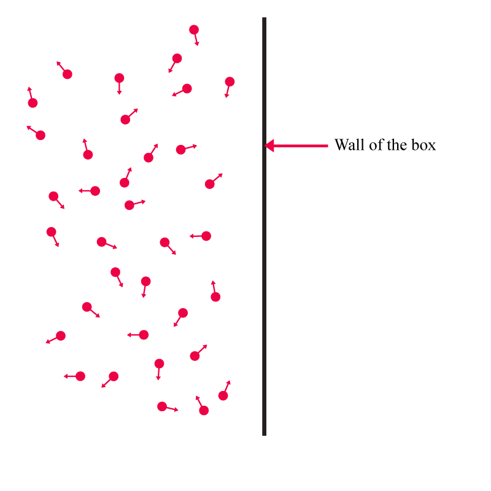

## ചാപ്റ്റര്‍ 3 - പ്രപഞ്ചത്തിന്‍റെ ഉള്ളടക്കവും സ്കെയില്‍ ഫാക്ടറും

ഇതുവരെ നാം നോക്കിയത് പ്രപഞ്ചം ഗാലക്സികളെ കൊണ്ട് നിറഞ്ഞിരിക്കുന്ന സാഹചര്യത്തെ കുറിച്ചാണ്. അതായത് പ്രപഞ്ചം ദ്രവ്യം  അഥവാ മാറ്റര്‍ കൊണ്ട് നിറഞ്ഞിരുന്നപ്പോള്‍. 

പ്രപഞ്ചത്തില്‍ റേഡിയേഷന്‍ മാത്രമേ ഉള്ളൂ എങ്കിലോ?

അപ്പോള്‍ എങ്ങിനെയാണ് സ്കെയില്‍ ഫാക്ടര്‍ മാറുക?
മാറ്ററും റേഡിയേഷനും മിക്സ് ചെയ്യപ്പെട്ട കേസില്‍ ആണെങ്കിലോ?

ഇവയൊക്കെയാണ് നാം ഈ ചാപ്ടരില്‍ നോക്കാന്‍ പോകുന്നത്.

ഇതിനു മുമ്പുള്ള ചാപ്റ്ററില്‍ നാം ഫ്രീഡ്മന്‍ സമവാക്യത്തില്‍ എത്തിച്ചേര്‍ന്നു.

പക്ഷെ നാം അതിനു ന്യൂട്ടന്‍റെ നിയമങ്ങള്‍ ആണ് ഉപയോഗിച്ചത്. ന്യൂട്ടോണിയന്‍ കാഴ്ചപ്പാടില്‍ ഉള്ള മോഷന്‍, പ്രകാശ വേഗത്തെക്കാള്‍ വളരെ കുറഞ്ഞ വേഗതകള്‍ മാത്രമേ പരിഗണിക്കുന്നുള്ളൂ. അതായത് പ്രകാശ വേഗതയില്‍ സഞ്ചരിക്കാത്ത വസ്തുക്കള്‍ കൊണ്ടാണ് പ്രപഞ്ചം നിറഞ്ഞിരിക്കുന്നത് എങ്കില്‍ നമുക്ക് ഈ സമവാക്യങ്ങള്‍ ഉപയോഗിക്കാം.

നമ്മുടെ പ്രപഞ്ചത്തില്‍ പക്ഷെ പ്രകാശ വേഗതയില്‍ സഞ്ചരിക്കുന്ന വസ്തുക്കള്‍ ഉണ്ട്- ഫോട്ടോണുകള്‍.

നമ്മുടെ പ്രപഞ്ചം ഫോട്ടോണുകളെക്കൊണ്ട് നിറഞ്ഞിരിക്കുന്നു. നക്ഷത്രങ്ങളില്‍ നിന്നും വരുന്ന ഫോട്ടോണുകള്‍ അല്ല ഇവിടെ ഉദ്ദേശിക്കുന്നത്. നക്ഷത്രങ്ങളില്‍ നിന്നും വരുന്ന ഫോട്ടോണുകള്‍ വളരെ ചെറിയ അംശം മാത്രമേ ആകൂ. ഇവിടെ ഉദ്ദേശിക്കുന്നത് പ്രപഞ്ചം നോണ്‍ അയോണൈസ് ആയപ്പോള്‍ ഉണ്ടായ ഫോട്ടോണുകള്‍ ആണ് (പ്രപഞ്ച പരിണാമത്തിന്‍റെ മാപില്‍ റീകോംബിനേഷന്‍ എന്ന ഭാഗം നോക്കുക).

ഇവയെക്കൂടി നമ്മുടെ സമവാക്യത്തില്‍ ഉള്‍പ്പെടുത്തേണ്ടതുണ്ട്. അപ്പോള്‍ സമവാക്യം കുറച്ചൊന്നു മാറും. ഇതും നാം ഈ ചാപ്റ്ററില്‍ കാണും.

നമ്മള്‍ എത്തിച്ചേര്‍ന്ന ഫ്രീഡ്മന്‍ സമവാക്യം മറ്റൊരു കാര്യം കൂടി അസ്സ്യൂം ചെയ്തിരുന്നു – മൊത്തം എനര്‍ജി പൂജ്യം ആണെന്ന്. അതായത് എസ്കേപ്പ് വെലോസിറ്റി കേസ്.

മൊത്തം എനര്‍ജി പൂജ്യം അല്ലെങ്കിലോ? എനര്‍ജി നെഗറ്റിവ് ആണെങ്കിലോ? അല്ലെങ്കില്‍ എനര്‍ജി പോസിറ്റിവ് ആണെങ്കിലോ?

നമുക്ക് നോക്കാം.
മുമ്പ് പരിഗണിച്ച അതേ കേസ് തന്നെ വീണ്ടും പരിഗണിക്കാം.

ഒറിജിനില്‍ നമ്മുടെ ഗാലക്സി. കുറച്ചു ദൂരെ മറ്റൊരു ഗാലക്സി. അതിന്‍റെ മോഷന്‍ നമുക്ക് അറിയണം.
എനര്‍ജി കണ്‍സര്‍വേഷന്‍ സമവാക്യം എഴുതാം, മുന്‍പ് എഴുതിയ പോലെ.

$$\frac {1}{2}mV^2 - \frac {mMG}{D} = E$$

എളുപ്പത്തിനായി, നമ്മളും വിദൂര ഗാലക്സിയും തമ്മുലുള്ള ദൂരം \\(D\\) ഒന്നാണ് എന്ന് വെക്കുക. അതായത് \\(D =1 \\)

മുമ്പ് \\(E = 0 \\) ആയി പരിഗണിച്ചു. പക്ഷെ ഇവിടെ നമുക്ക് \\(E \\)യുടെ വാല്യൂ അറിയില്ല എന്ന് വെക്കുക.

\\(m\\) കൊണ്ട് ഹരിക്കാം:

$$\frac {1}{2} V^2 - \frac {MG}{D}=\frac {E}{m}$$

\\(2\\) കൊണ്ട് ഗുണിക്കാം:

$$V^2 - \frac {2MG}{D}=\frac {2E}{m}$$

നമുക്കറിയാം:

$$ D= a x$$

$$V = \dot a x$$

ദൂരം ഒന്നാക്കി നേരത്തെ സങ്കല്‍പ്പിച്ചല്ലോ. അതായത് \\(x =1\\)

അപ്പോള്‍,

$$ D= a $$

$$V = \dot a $$

മുകളില്‍ എഴുതിയ സമവാക്യത്തില്‍ ഇവ ഉപയോഗിച്ചാല്‍:

$$\dot a^2 - \frac {2MG}{a}=\frac {2E}{m}$$

വലതു വശത്ത് ഉള്ളവയെല്ലാം കോണ്‍സ്റ്റന്‍റുകളാണ്. അവയെ നമുക്ക് \\(\kappa\\) (ഗ്രീക്ക് ലെറ്റര്‍ കാപ) എന്ന് വിളിക്കാം.

അപ്പോള്‍:

$$\dot a^2 - \frac {2MG}{a}=\kappa$$

നമുക്ക് വേണ്ടത് \\(a\\)യുടെ റേഷിയോകളാണ്.

\\(a^2 \\) കൊണ്ട് ഹരിക്കാം:

$$\frac {\dot a^2}{a^2}  - \frac {2MG}{a^3}= \frac {\kappa}{a^2}$$

ഇപ്പോള്‍ വലതു വശം കോണ്‍സ്റ്റന്‍റ് അല്ല.

ഇനി, മുന്‍പ് ചെയ്ത പോലെ ഡെന്‍സിറ്റിയുടെ ഒരു ഘടകം കൊണ്ട് വരാം.

മദ്ധ്യത്തില്‍ \\(  \frac {\frac {4}{3} \pi} { \frac {4}{3} \pi } \\) കൊണ്ട് ഗുണിക്കാം: 

$$\frac {\dot a^2}{a^2}  - \frac {2MG \frac {4}{3} \pi  }{ \frac {4}{3} \pi  a^3}= \frac {\kappa}{a^2}$$

നമുക്കറിയാം:

$$ \frac {M}{\frac{4}{3} \pi a^3} = \frac {Mass}{Volume} = \rho$$

അപ്പോള്‍:

$$\frac {\dot a^2}{a^2}  - 2G \frac {4}{3} \pi  \rho = \frac {\kappa}{a^2}$$

ഒന്ന് സിംപ്ലിഫൈ ചെയ്‌താല്‍:

$$\left( \frac {\dot a}{a}\right)^2 - \frac {8}{3} \pi  G \rho = \frac {\kappa}{a^2}$$

മദ്ധ്യത്തില്‍ ഉള്ളതിനെ വലത് വശത്തേക്ക് ആക്കിയാല്‍:

$$\left( \frac {\dot a}{a}\right)^2 = \frac {8}{3} \pi  G \rho +  \frac {\kappa}{a^2}$$

ഫ്രീഡ്മന്‍ സമവാക്യത്തില്‍ നാം എത്തിച്ചേര്‍ന്നു. പക്ഷെ ഇവിടെ വലത് ഭാഗത്ത്‌ പുതിയൊരു ഘടകവും ഉണ്ട്. ഈ ഘടകം മൊത്തം എനര്‍ജിയെ സൂചിപ്പിക്കുന്നു.

\\(\rho\\) എന്നത് \\( \frac {\nu}{a^3} \\) ആണെന്ന് നമുക്കറിയാം.

അപ്പോള്‍:

$$ \left( \frac {\dot a}{a}\right)^2 = \frac {8}{3} \pi  G \frac {\nu}{a^3} +  \frac {\kappa}{a^2}$$

ഇനി, \\(\frac{1}{a^3} \\) ആണോ അതോ \\(\frac{1}{a^2} \\) ആണോ വലുത്?

അത് \\(a\\)യുടെ വാല്യൂ അനുസരിച്ച് ഇരിക്കും.

\\(a\\)യുടെ വാല്യൂ ചെറുതാണെങ്കില്‍ \\(\frac{1}{a^3} \\) ആണ് വലുത്. 

അപ്പോള്‍ മുകളില്‍ എഴുതിയ സമവാക്യത്തിലെ \\(\frac{\kappa}{a^2} \\) എന്ന ഘടകത്തെ അവഗണിക്കാം.

ഈ സാഹചര്യം നാം മുന്‍പത്തെ ചാപ്റ്ററില്‍ കണ്ടു.

\\(a\\)യുടെ വാല്യൂ \\(t^{\frac{2}{3}}\\)ന് ആനുപാതികമായി മാറുമെന്നു നാം കണ്ടെത്തി.

\\(a\\)യുടെ വാല്യൂ വലുതാണെങ്കിലോ?

എങ്കില്‍ \\(\frac{1}{a^2}\\) എന്ന ഘടകം ആയിരിക്കും ആദ്യം വലുതാകുക

$$ \left( \frac {\dot a}{a}\right)^2 = \frac {\kappa}{a^2}$$

രണ്ടു വശവും സ്ക്വയര്‍ റൂട്ട് എടുത്താല്‍:

$$\frac {\dot a}{a} = \frac {\kappa}{a }$$

\\(a\\) കൊണ്ട് ഗുണിച്ചാല്‍:
$$\dot a = \kappa$$

അതായത്, \\(\dot a\\) എന്നത് ഒരു കോണ്‍സ്റ്റന്‍റായി മാറുന്നു.

മൊത്തം എനര്‍ജി നെഗറ്റിവ് ആണെങ്കിലോ?

$$ \left( \frac {\dot a}{a}\right)^2 = \frac {8}{3} \pi  G \frac {\nu}{a^3} -  \frac {\kappa}{a^2}$$

\\(\frac {\kappa}{a^2}\\)യുടെ മുന്‍പില്‍ നെഗറ്റിവ് സൈന്‍ ശ്രദ്ധിക്കുക.

ഈ സമവാക്യം എങ്ങനെ ബീഹേവ്‌ ചെയ്യും?

തുടക്കത്തില്‍ \\( \frac {8}{3} \pi  G \frac {\nu}{a^3}\\) എന്ന ഘടകം ആയിരിക്കും വലുത്.

എന്നാല്‍ പിന്നീട് \\(\frac {\kappa}{a^2}\\) വലുതാകും.

ഇതിനു രണ്ടിനും ഇടയില്‍ ഒരു ക്രോസ് ഓവര്‍ പോയിന്‍റ് ഉണ്ടാകും.
അവിടെ \\( \left( \frac {\dot a}{a}\right)^2\\) പൂജ്യമായിരിക്കും.

മുകളിലേക്ക് എറിഞ്ഞ കല്ലിന്‍റെ കേസ് പോലെ. കല്ല്‌ പരമാവധി പൊങ്ങി നിന്നിട്ട് താഴേക്ക്‌ വീഴാന്‍ പോകുന്ന പോയിന്‍റ് ആണ് ഇത്.

മാറ്റര്‍ ആധിപത്യം പുലര്‍ത്തുന്ന ഒരു പ്രപഞ്ചത്തിന്‍റെ കാര്യമാണ് നാം നോക്കിയത്. അതായത് മൊത്തം എനര്‍ജി എന്നത് \\(E=mc^2\\) പോലെയുള്ള എനര്‍ജി ആണ്. അതിലെ മൂന്ന്‍   കേസുകളും നാം നോക്കി:

* മൊത്തം എനര്‍ജി പോസിറ്റിവ് ആയിരുന്നാല്‍
* നെഗറ്റിവ് ആയിരുന്നാല്‍
* അല്ലെങ്കില്‍ പൂജ്യം ആയിരുന്നാല്‍

ആപേക്ഷികതയുടെ കാഴ്ചപ്പാടില്‍ നിന്നും നോക്കിയാല്‍, ഈ മൂന്നു കേസുകളും സ്പേസിന്‍റെ ജിയോമെട്രിയുമായി ബന്ധപ്പെട്ടിരിക്കുന്നു എന്ന് കാണാം.

ഉദാഹരണത്തിന്, ജനറല്‍ ആപെക്ഷികതയിലെ ഐന്‍സ്റ്റൈന്‍ സമവാക്യങ്ങളുടെ ഘടന ഇങ്ങനെയാണ്:

 [ജിയോമെട്രി] = [ഡെന്‍സിറ്റി] അല്ലെങ്കില്‍ [എനര്‍ജി മൊമെന്‍റം ടെന്‍സര്‍] 

നമ്മള്‍ മുകളില്‍ എഴുതിയ സമവാക്യങ്ങള്‍ നോക്കിയാല്‍ ഈ ഘടന കാണാം:

$$ \left( \frac {\dot a}{a}\right)^2 + \frac {\kappa}{a^2} = \frac {8}{3} \pi  G \frac {\nu}{a^3} $$

ഇവിടെ ഇടത് വശം ജിയോമെട്രി, വലതു വശം ഡെന്‍സിറ്റി.

\\(\kappa\\)എന്ന് നാം വിളിച്ച ഘടകം സ്പേസിന്‍റെ കര്‍വേച്ചറിനെ സൂചിപ്പിക്കുന്നു എന്ന് നാം പിന്നീട് മനസ്സിലാക്കും.

### റേഡിയേഷന്‍റെ ആധിപത്യം 

ഇനി നമുക്ക് പ്രപഞ്ചം റേഡിയേഷന്‍ കൊണ്ട് നിറഞ്ഞിരുന്നാല്‍ ഉണ്ടാകുന്ന മാറ്റങ്ങളെ കുറിച്ച് നോക്കാം.

പ്രപഞ്ച പരിണാമത്തില്‍ ഒരിടക്ക് റേഡിയേഷന്‍ ആയിരുന്നു പ്രപഞ്ചത്തിന്‍റെ ഉള്ളടക്കത്തിന്‍റെ ഭൂരിഭാഗവും.

അതിനു ശേഷം പ്രപഞ്ചത്തിലെ മാറ്റര്‍ ഉള്ളടക്കം കുറച്ചു കൂടി. 

എന്നാല്‍ ഇന്ന് ഡാര്‍ക്ക്‌ എനര്‍ജിയാണ് പ്രപഞ്ചത്തിന്‍റെ ഉള്ളടക്കത്തിന്‍റെ ഭൂരിഭാഗവും. നമ്മുടെ സമവാക്യങ്ങളില്‍ ഇതുവരെ നാം ഇതിനെ പരിഗണിച്ചിട്ടില്ല. അതിലേക്കു ഇനി വരുന്ന ചാപ്റ്ററുകളില്‍ എത്തിച്ചേരും.

തുടക്കത്തില്‍ നാം പരിഗണിച്ച ഗ്രിഡ് ഓര്‍മയുണ്ടല്ലോ. 

ആ ഗ്രിഡിനെ നമുക്ക് ഒരു പെട്ടിയായി എടുക്കാം.

പെട്ടിയുടെ വശങ്ങള്‍ ഒരു യൂണിറ്റ് ആയും കണക്കാക്കാം. അതായത് \\(\Delta x =1\\)

 

ഈ പെട്ടിയില്‍ കുറച്ചു ഫോട്ടോണുകള്‍ ഉണ്ടെന്നു കരുതുക. 

ഇവയെ പാര്‍ടിക്ക്ളുകളായിട്ടോ തരംഗങ്ങള്‍ ആയിട്ടോ ചിത്രീകരിക്കാം:

 

 

സാധാരണ പാര്‍ടിക്ക്ളുകള്‍ ആണെങ്കില്‍ അവയ്ക്ക് അവയുടെ മാസ്സിനു തുല്യമായ എനര്‍ജി ഉണ്ടാകും. ഇത് മാറില്ല (അവ വെറുതെ പെട്ടിയില്‍ ഇരിക്കുകയാണെങ്കില്‍). പക്ഷെ ഫോട്ടോണുകള്‍ വ്യത്യസ്തമാണ്. അവയുടെ എനര്‍ജി എന്നത് അവയുടെ വേവ് ലെങ്ങ്തുമായി ബന്ധപ്പെട്ടിരിക്കുന്നു, താഴെ പറയുന്ന റിലേഷനിലൂടെ:

$$E=\frac{hc}{\lambda}$$

ഇവിടെ,

\\(h \\) എന്നത് പ്ലാങ്ക്സ് കോണ്‍സ്റ്റന്‍റ്

\\(c\\) എന്നത് പ്രകാശ വേഗം

\\(\lambda\\) എന്നത് വേവ് ലെങ്ങ്ത്

എന്ന് വെച്ചാല്‍ ഫോട്ടോണുകളുടെ എനര്‍ജി അതിന്‍റെ വേവ് ലെങ്ങ്തിന്‍റെ വിപരീതമാണ്.

വേവ് ലെങ്ത് കൂടുകയാണെങ്കില്‍ എനര്‍ജി കുറയും.

വേവ് ലെങ്ത് കുറയുകയാണെങ്കില്‍ എനര്‍ജി കൂടും.

വേവ് ലെങ്ങ്തും ഫ്രീക്വന്‍സിയും ആയുള്ള ബന്ധവും അറിഞ്ഞിരിക്കുന്നത് നന്നായിരിക്കും. അത് ഇങ്ങനെ:

$$\lambda f = c$$

അതായത് വേവ് ലെങ്ങ്ത് കൂടുമ്പോള്‍ ഫ്രീക്വന്‍സി കുറയും.

വേവ് ലെങ്ങ്ത് കുറയുമ്പോള്‍ ഫ്രീക്വന്‍സി കൂടും.

ഈ പെട്ടിയെ പതിയെ വലുതാക്കിയാലോ? അതായത് പെട്ടിയുടെ വശങ്ങളുടെ നീളം കൂട്ടുകയാണെങ്കിലോ? 

ഈ “എക്സ്പാന്‍ഷന്‍” പതുക്കെ ആണെങ്കില്‍ (ടെക്നിക്കല്‍ ഭാഷയില്‍ പറഞ്ഞാല്‍ ഏഡിയോബാറ്റിക് എക്സ്പാന്‍ഷന്‍ ആണെങ്കില്‍) ആ പെട്ടിയില്‍ ഉള്ള ഫോട്ടോണുകളുടെ വേവ് ലെങ്ങ്തും കൂടും!!

ഇത് മനസ്സില്‍ ചിത്രീകരിക്കാന്‍ ഒരു വഴി: ഫോട്ടോണുകളെ തരംഗങ്ങള്‍ ആയി ചിന്തിക്കുമ്പോള്‍ അവ പെട്ടിയുടെ വശങ്ങളിന്‍ ഘടിപ്പിച്ച സ്പ്രിങ്ങുകള്‍ ആയി മനസ്സില്‍ ചിത്രീകരിച്ചാല്‍ മതി. അപ്പോള്‍ പെട്ടിയുടെ വശങ്ങളുടെ നീളം കൂടുമ്പോള്‍ സ്പ്രിങ്ങുകള്‍ വലിയും, അവയുടെ വേവ് ലെങ്ങ്ത് കൂടും.

 

വേവ് ലെങ്ങ്ത് കൂടുമ്പോള്‍ എനര്‍ജി കുറയുമല്ലോ.
എനര്‍ജി താഴെ പറയുന്നപോലെ ആണ് പെട്ടിയുടെ വലിപ്പവുമായി ബന്ധപ്പെട്ടിരിക്കുന്നത്:

$$E= \frac{h}{a}$$

ഇവിടെ,

\\(a\\) എന്നത് ഒരു ലാറ്റിസ് അകലം. ഈ സാഹചര്യത്തില്‍ അത് \\(\Delta x\\)ന് തുല്യം

\\(h\\) എന്നത് പ്ലാങ്ക്സ് കോണ്‍സ്റ്റന്‍റ്

ഇതിനര്‍ത്ഥം, പ്രപഞ്ചം വികസിക്കുന്നതിനനുസരിച്ച് പ്രപഞ്ചത്തില്‍ ഉള്ള ഫോട്ടോണുകളുടെ എനര്‍ജി കുറയുന്നു. 

അപ്പോള്‍ നമ്മുടെ സമവാക്യത്തില്‍, വലതു വശത്ത് ഒരു \\(\frac{1}{a}\\) കൂടി വരും.
അതായത്,

$$\left( \frac {\dot a}{a}\right)^2 = \frac{8 \pi}{3} G \frac{\nu}{a^4}$$

(മുന്‍പ്, ഡെന്‍സിറ്റി ഘടകം \\(\frac{1}{a^3}\\) പോലെ ആയിരുന്നു എന്ന് ഓര്‍ക്കുക.)

വലതുവശത്തുള്ള മിക്കതും കോണ്‍സ്റ്റന്‍റുകളാണ്. അപ്പോള്‍ നമ്മള്‍ ഗ്രിഡ് സൈസ് ബുദ്ധിപൂര്‍വ്വം തെരഞ്ഞെടുത്താല്‍ ഇവയെ 1 ആക്കവുന്നതേ ഉള്ളൂ.

അപ്പോള്‍:

$$\left( \frac {\dot a}{a}\right)^2 = \frac{1}{a^4}$$

സ്ക്വയര്‍ റൂട്ട് എടുത്താല്‍:

$$\frac{\dot a}{a} = \frac{1}{a^2}$$

\\(a\\)കൊണ്ട് ഗുണിച്ചാല്‍:

$$\dot a = \frac {1}{a}$$

എന്ന് വെച്ചാല്‍:

$$\frac{da}{dt} = \frac{1}{a}$$

മുന്‍പ് ചെയ്ത ട്രിക്ക് വീണ്ടും ചെയ്യാം (ഫ്ലിപ്പ് ചെയ്യുക):

$$\frac{dt}{da} = a$$

ഏതു ഫങ്ങ്ഷനാണ് \\(a\\) എന്ന ഡെറിവേറ്റിവ് ഉള്ളത്?

ഉത്തരം: \\(\frac{1}{2}a^2\\)

മുന്‍പിലുള്ള \\(\frac{1}{2}\\) ഇഗ്നോര്‍ ചെയ്യാം.

അപ്പോള്‍:

$$t = a^2$$

അതായത്:

$$a=t^{\frac{1}{2}}$$

അപ്പോള്‍ എന്ത് മനസ്സിലാക്കി?

റേഡിയേഷന്‍ കൊണ്ട് നിറഞ്ഞ പ്രപഞ്ചം \\(t\\)യുടെ സ്ക്വയര്‍ റൂട്ടിന് ആനുപാതുകമായി വികസിക്കും.

ഗ്രാഫ്:

 

### റേഡിയേഷനും മാറ്ററും – മിക്സഡ്‌ കേസ് 

റേഡിയേഷനും മാറ്ററും മിക്സ് ചെയ്യപ്പെട്ട കേസില്‍ എങ്ങനെ സ്കെയില്‍ ഫാക്ടര്‍ മാറും?

മിക്സ് ചെയ്യപ്പെട്ട കേസില്‍, മാറ്റര്‍ കേസില്‍ കണ്ട \\(\frac{1}{a^3}\\) ഘടകവും റേഡിയേഷന്‍ കേസില്‍ കണ്ട \\(\frac{1}{a^4}\\) ഘടകവും സ്കെയില്‍ ഫാക്ടറിനെ ബാധിക്കും:

$$ \left( \frac {\dot a}{a}\right)^2 = \frac{C_M}{a^3} + \frac{C_R}{a^4}$$

ഇവിടെ,

\\( C_M\\) എന്നത് മാറ്ററിനെ സൂചിപ്പിക്കുന്നു.

\\( C_R\\) എന്നത് റേഡിയേഷനെ സൂചിപ്പിക്കുന്നു.

ഈ രണ്ടു ഘടകങ്ങളില്‍ ഏതാണ് \\(\frac {\dot a}{a}\\)യെ കൂടുതല്‍ സ്വാധീനിക്കുക എന്നത് \\(a\\)യുടെ സൈസ് അനുസരിച്ച് ഇരിക്കും.

\\(a\\) ചെറുതാണെങ്കില്‍ (അതായത് ആദിമ പ്രപഞ്ചത്തില്‍), \\(\frac {\dot a}{a}\\)യെ കൂടുതല്‍ സ്വാധീനിക്കുക റേഡിയേഷന്‍ ആയിരിക്കും.

അതായത് ആദ്യ കാലങ്ങളില്‍, പ്രപഞ്ച വികാസം \\(t^{\frac{1}{2}}\\)ന് ആനുപാതികം.

മാറ്ററിന്‍റെ അളവ് കൂടിയപ്പോള്‍, പ്രപഞ്ച വികാസം \\(t^{\frac{2}{3}}\\)ന് ആനുപാതികം ആയി മാറി.

ഇവ രണ്ടു പോലെയും അല്ല ഇന്നത്തെ പ്രപഞ്ച വികാസം. കാരണം, \\( C_M, C_R \\) എന്നിവ പോലെ വേറൊരു ഘടകവും ഇന്നത്തെ പ്രപഞ്ച വികാസത്തെ സ്വാധീനിക്കുന്നു – ഡാര്‍ക്ക്‌ എനര്‍ജി  \\( C_{\Lambda}\\).

### ഡാര്‍ക്ക്‌ എനര്‍ജി \\( C_{\Lambda}\\)

\\( C_{\Lambda}\\) നാം നോക്കിയ മറ്റു കേസുകളില്‍ നിന്നും വ്യത്യസ്തമാണ്.

ഇത് ഡൈല്യൂട്ട് ആകുന്നില്ല.

അതായത് നമ്മുടെ പെട്ടിയുടെ ഉദാഹരണം എടുത്താല്‍, ആ പെട്ടിയില്‍ കുറച്ചു ഡാര്‍ക്ക്‌ എനര്‍ജി എടുത്തിട്ട് പെട്ടിയെ വലുതാക്കിയാല്‍, ഡാര്‍ക്ക്‌ എനര്‍ജിയുടെ ഡെന്‍സിറ്റി മാറില്ല.

അപ്പോള്‍, മുകളില്‍ എഴുതിയ സമവാക്യത്തില്‍ \\( C_{\Lambda}\\)യെ കൂടി ഉള്‍പ്പെടുത്താം:

$$ \left( \frac {\dot a}{a}\right)^2 = \frac{C_M}{a^3} + \frac{C_R}{a^4} + C_{\Lambda} $$

### ഇക്വേഷന്‍ ഓഫ് സ്റ്റേറ്റ്

ഡാര്‍ക്ക്‌ എനര്‍ജിയുടെ ഡെന്‍സിറ്റി കുറയില്ല എന്നും മാറ്റര്‍ ഡെന്‍സിറ്റി എങ്ങനെ \\(\frac{1}{a^3}\\)ന് ആനുപാതുകമായി കുറയുന്നു എന്നും റേഡിയേഷന്‍ ഡെന്‍സിറ്റി എങ്ങനെ \\(\frac{1}{a^4}\\)ന് ആനുപാതുകമായി കുറയുന്നു എന്നും നാം കണ്ടു. എങ്ങനെയാണ് ഈ കാര്യങ്ങള്‍ നാം കണ്ടെത്തിയത്?

ഇവ ഒരു പൊതുവായ റിലേഷനില്‍ നിന്നും ഉരുത്തിരിഞ്ഞവയാണ് – പ്രഷറും എനര്‍ജി ഡെന്‍സിറ്റിയും തമ്മിലുള്ള റിലേഷനില്‍ നിന്നും.

പ്രഷറും എനര്‍ജി ഡെന്‍സിറ്റിയും തമ്മില്‍ ബന്ധിപ്പിക്കുന്ന സമവാക്യത്തെ നമ്മള്‍ **ഇക്വേഷന്‍ ഓഫ് സ്റ്റേറ്റ്** എന്ന് വിളിക്കുന്നു.

അത് ഇങ്ങനെ:

$$P = w \rho$$

ഇവിടെ,
\\(P\\) എന്നത് പ്രഷര്‍

\\(w\\) എന്നത് ഒരു സിസ്റ്റത്തെ വിശേഷിപ്പിക്കുന്ന ഒരു സംഖ്യ

\\(\rho\\) എന്നത് എനര്‍ജി ഡെന്‍സിറ്റി 

മാറ്റര്‍ ആധിപത്യം പുലര്‍ത്തുന്ന പ്രപഞ്ചത്തില്‍, എനര്‍ജി ഡെന്‍സിറ്റി \\(\frac{1}{a^3}\\)ന് ആനുപാതികമായി മാറണം എന്ന് എങ്ങനെയാണ് ഈ ഇക്വേഷന്‍ ഓഫ് സ്റ്റേറ്റ് പറയുന്നത് എന്ന് നോക്കാം.

മാറ്റര്‍ ആധിപത്യം പുലര്‍ത്തുന്ന പ്രപഞ്ചം എന്ന് വെച്ചാല്‍ ആപേക്ഷികമല്ലാത്ത, അതായത് പ്രകാശ വേഗതയെക്കാള്‍ വളരെ കുറഞ്ഞ വേഗതയില്‍ സഞ്ചരിക്കുന്ന, വസ്തുക്കള്‍ നിറഞ്ഞ പ്രപഞ്ചം. ഗാലക്സികള്‍, നക്ഷത്രങ്ങള്‍, തമോഗര്‍ത്തങ്ങള്‍ എന്ന് തുടങ്ങുന്ന എല്ലാം ഈ ഗ്രൂപ്പില്‍ പെടും.

ഇത്തരത്തിലുള്ള ഒരു പ്രപഞ്ചത്തിലെ എനര്‍ജി ഡെന്‍സിറ്റി എന്തായിരിക്കും?

അവയുടെ എനര്‍ജി എന്നത് ആ വസ്തുക്കളുടെ റസ്റ്റ്‌ എനര്‍ജി ആയിരിക്കും. അതായത്  \\(E=mc^2\\) എന്ന എനര്‍ജി.

അപ്പോള്‍ എനര്‍ജി ഡെന്‍സിറ്റി എന്നത് പാര്‍ട്ടിക്കളുകളുടെ എണ്ണം പെര്‍ യൂണിറ്റ് വോള്യം ഗുണം ഒരു പാര്‍ടിക്കളിന്‍റെ എനര്‍ജി.

ഇതില്‍ \\(c^2 \\) എന്ന ഒരു വലിയ ഘടകം ഉണ്ട്. ഇതിനര്‍ത്ഥം ഒരു ചെറിയ പാര്‍ടിക്കളിന് പോലും വലിയ എനര്‍ജി ഡെന്‍സൈറ്റി ഉണ്ടാവും എന്നാണ്. 

ഇനി, എന്താണ് പ്രഷര്‍?

ഒരു പെട്ടിയില്‍ കുറച്ചു ഗ്യാസ് പാര്‍ടിക്ക്ളുകള്‍ ഉണ്ടെന്നു വെക്കുക.

 
 
 ആരോകള്‍ പാര്‍ടിക്ക്ള്കളുടെ മോഷനെ (വെലോസിറ്റിയെ) സൂചിപ്പിക്കുന്നു.

ഇവിടെ പ്രഷര്‍ എന്നത്, ആ പെട്ടിയുടെ വശങ്ങളില്‍ അതിനുള്ളിലുള്ള ഗ്യാസ് പാര്‍ടിക്ക്ളുകള്‍ വന്നിടിച്ച്‌ ഉണ്ടാകുന്ന ഫോര്‍സ് ആണ്.

 
 

അതായത് പ്രഷര്‍ എന്നത് പാര്‍ടിക്ക്ളുകളുടെ വെലോസിറ്റിക്ക് ആനുപാതികമായിരിക്കും.

ഇവിടെ വെലോസിറ്റി എന്നത് വളരെ കുറവാണല്ലോ (പ്രകാശ വേഗത്തെ അപേക്ഷിച്ച്).

അതിനാല്‍ പ്രഷര്‍ എന്നത് വളരെ വളരെ കുറവായിരിക്കും.

$$P \approx 0$$

അപ്പോള്‍, \\(P = w \rho\\) എന്ന സമവാക്യത്തില്‍ \\(w=0\\) ആയിരിക്കണമല്ലോ.

അതായത്, മാറ്റര്‍ ആധിപത്യം പുലര്‍ത്തുന്ന പ്രപഞ്ചത്തില്‍ \\(w=0\\) ആയിരിക്കും.

ഇനി \\(w\\)യുടെ വാല്യൂ അറിയുന്നതിലൂടെ, എനര്‍ജി ഡെന്‍സിറ്റി \\(\frac{1}{a^3}\\)ക്ക് ആനുപാതികം എന്നതില്‍ എങ്ങനെ എത്തിച്ചേരും എന്ന് നോക്കാം. 

മുകളില്‍ നാം പരിഗണിച്ച പെട്ടി എടുക്കാം.

അതിന്‍റെ ഒരു ഭിത്തിയില്‍ ഉണ്ടാകുന്ന പ്രഷര്‍ എന്നത്:

$$P = \frac {F}{A}$$

ഇവിടെ,

\\(F\\) എന്നത് ഫോര്‍സ്

\\(A\\) എന്നത് ഏരിയ

(ഫോര്‍സ് പെര്‍ ഏരിയ ആണല്ലോ പ്രഷര്‍)

ഈ പെട്ടിയുടെ ഒരു വശം \\(dx\\) എന്ന അളവ് വലുതാക്കി എന്ന് വെക്കുക:

 
 

ഇതിനുള്ളിലുള്ള ഗ്യാസ് പാര്‍ടിക്ക്ളുകള്‍ ഇതിന്‍റെ ഭിത്തിയില്‍ പ്രഷര്‍ ചെലുത്തുന്നുണ്ടെങ്കില്‍, നാം ഭിത്തി നീക്കുകയാണെങ്കില്‍, ആ ഗ്യാസ് പാര്‍ടിക്ക്ളുകള്‍ കുറച്ചു വര്‍ക്ക് ചെയ്യുന്നു.

$$W = Fdx$$

ഇവിടെ,

\\(W\\) എന്നത് വര്‍ക്ക് 

\\(F\\) എന്നത് ഫോര്‍സ് 

\\(dx\\) എന്നത് വശത്തിന്‍റെ കൂടിയ നീളം

\\(W\\) എന്നത് പ്രഷറിനു തുല്യം.

അതായത്:

$$Fdx = P Adx$$

ഇവിടെ,

\\(P\\) എന്നത് പ്രഷര്‍

\\(A\\) എന്നത് ഏരിയ

\\( Adx\\) എന്നത് എന്താണ്?

പെട്ടിയുടെ വോള്യത്തില്‍ ഉണ്ടാകുന്ന മാറ്റം.

അതായത്,

$$Fdx = P dV$$

ഇവിടെ,

\\( dV \\) എന്നത് പെട്ടിയുടെ വോള്യത്തില്‍ ഉണ്ടാകുന്ന മാറ്റം

ഈ പെട്ടിയില്‍ ഉള്ള എനര്‍ജിക്ക് എന്ത് സംഭവിക്കും?

പെട്ടിയിലുള്ള ഗ്യാസ് കുറച്ചു വര്‍ക്ക് ചെയ്തിട്ടുണ്ടല്ലോ. വര്‍ക്ക്‌ ചെയ്‌താല്‍ എനര്‍ജി കുറയണം. അതാണ്‌ നിയമം.

$$ \therefore dE = - Pdv$$

പെട്ടിയിലെ എനര്‍ജി എന്നത് \\(E = \rho V\\) ആണെന്ന് ഓര്‍ക്കുക.

അപ്പോള്‍ എനര്‍ജിയുടെ മാറ്റം എന്നത്:

$$dE = \rho dV+ d\rho V$$

ഇത് \\(-PdV\\)ക്ക് തുല്യമായിരിക്കും.

അതായത്:

$$\rho dV+ d\rho V = -PdV$$

\\(P = w \rho\\) ആണെന്ന് ഓര്‍ക്കുക. ഇത് മുകളില്‍ പറഞ്ഞ സമവാക്യത്തില്‍ ഉപയോഗിക്കാം:

$$\rho dV+ d\rho V = -w \rho dV$$

\\(dV\\)യെ ഒരു വശത്ത് ആക്കിയാല്‍:

$$Vd\rho = - \rho dV – w \rho dV$$

വലതു വശത്ത് \\(\rho dV\\) യെ പുറത്തെടുത്താല്‍:

$$ Vd \rho = -(1 + w) \rho dV$$

\\(\rho\\) കൊണ്ട് ഹരിച്ചാല്‍:

$$ V \frac{d \rho}{\rho} = -(1 + w) dV$$

\\(V \\) കൊണ്ട് ഹരിച്ചാല്‍:

$$  \frac{d \rho}{\rho} = -(1 + w) \frac{dV}{V}$$

\\(\frac{d \rho}{\rho}\\) എന്നത് എന്താണ്?

ലോഗരിതം \\(\rho\\)യുടെ ഡിഫറന്‍ഷ്യല്‍.

\\(\frac{dV}{V}\\) എന്നത് എന്താണ്?

ലോഗരിതം \\(V \\)യുടെ ഡിഫറന്‍ഷ്യല്‍.

അപ്പോള്‍:

$$log \rho = -(1+w) log V$$

$$\therefore \rho = \frac{constant}{V^{(1+w)}}$$

ഇനി, എന്താണ് \\(V \\)?

വോള്യം. അതായത് \\(a^3 \\). (3 ഡൈമെന്‍ഷനില്‍)

അപ്പോള്‍:

$$\rho = \frac{constant}{a^{3(1+w)}}$$

മാറ്റര്‍ ആധിപത്യം പുലര്‍ത്തുന്ന പ്രപഞ്ചത്തില്‍ \\(w=0\\) ആണെന്ന് നേരത്തെ പറഞ്ഞു.

അപ്പോള്‍ മാറ്റര്‍ ആധിപത്യം പുലര്‍ത്തുന്ന പ്രപഞ്ചത്തില്‍:

$$\rho = \frac{constant}{a^{3(1+0)}}$$

അതായത്:

$$\rho = \frac{constant}{a^3}$$

ഇനി റേഡിയേഷന്‍റെ കാര്യം നോക്കാം.

റേഡിയേഷന്‍ എന്ന് വെച്ചാല്‍ മാസ് ഇല്ലാത്ത പാര്‍ടിക്ക്ളുകള്‍. അതായത് ഫോട്ടോണുകള്‍. ഇവയെ ഇലക്ട്രോ മാഗ്നറ്റിക് തരംഗങ്ങള്‍ ആയും കണക്കാക്കാം. എങ്ങനെ ആയാലും ഒരേ ഉത്തരത്തില്‍ എത്തും.

ഫോട്ടോണുകളുടെ ഒരു സവിശേഷത എന്നാല്‍ അവ റെലറ്റിവിസ്ടിക് ആണ് – അതായത് അവ വളരെ വളരെ വേഗതയില്‍ സഞ്ചരിക്കുന്നു. കൃത്യമായി പറഞ്ഞാല്‍ പ്രകാശ വേഗതയില്‍.

നമ്മുടെ പെട്ടിയില്‍ ഫോട്ടോണുകള്‍ നിറഞ്ഞ അവസ്ഥയില്‍ ഉള്ള  ഇക്വേഷന്‍സ് ഓഫ് സ്റ്റേറ്റ് എഴുതി നോക്കാം.

 
 
 ഇവിടെ പെട്ടിയില്‍ ഉള്ളത് ഫോട്ടോണുകള്‍ ആണെന്ന് സങ്കല്‍പ്പിക്കുക

ഈ പെട്ടിയില്‍ ഫോട്ടോണുകള്‍ യൂണിഫോം ആയി നിറഞ്ഞിരിക്കുന്നു.

അവ പെട്ടിയുടെ വശങ്ങളില്‍ ഇടിക്കുകയും ദിശ മാറി ചലിക്കുകയും ചെയ്യുന്നു. ഇങ്ങനെ സംഭാവികുമ്പോള്‍ അവയുടെ എനര്‍ജി ഒട്ടും നഷ്ടമാകില്ല എന്ന് നമുക്ക് സങ്കല്‍പ്പിക്കാം.

പെട്ടിയിലുള്ള എല്ലാ ഫോട്ടോണുകള്‍ക്കും ഒരേ എനര്‍ജി ആണ് എന്നും സങ്കല്‍പ്പിക്കാം (ഇത് ഇങ്ങനെയല്ലെങ്കിലും ആണെങ്കിലും ഒരേ ഉത്തരത്തില്‍ തന്നെ എത്തും).

തെര്‍മല്‍ ഇക്വിലിബ്രിയത്തില്‍ നിലനില്‍ക്കുന്ന ഫോട്ടോണുകളുടെ സവിശേഷതയാണ് ഇവക്കു ഒരേ എനര്‍ജി ആയിരിക്കും എന്നത്.

ഒരു ഫോട്ടോണിന്‍റെ എനര്‍ജിയെ \\(\epsilon\\) (ഗ്രീക്ക് ലെറ്റര്‍ എപ്സിലോണ്‍) എന്ന് വിളിക്കാം.

ഇനി ഈ ഫോട്ടോണുകളുടെ മൊമെന്‍റം എന്താണെന്ന് അറിയണം. 

എന്തിന്? കാരണം ഫോര്‍സുകള്‍ എന്ന് പറയുന്നത് മൊമെന്‍റത്തില്‍ ഉണ്ടാകുന്ന മാറ്റത്തിന്‍റെ ഫലമാണ്.

ഉദാഹരണത്തിന് ഒരു ടെന്നീസ് ബോള്‍ ഭിത്തിയിലേക്ക് എറിയുന്നു എന്ന് വെക്കുക. ആ ബോളിന് ഒരു മൊമെന്‍റം ഉണ്ടാകും. 

ഭിത്തിയില്‍ ഇടിച്ചു തിരിച്ചു വരുമ്പോള്‍ വിപരീത മൊമെന്‍റവും. അതായത് മൊമെന്‍റത്തില്‍ ഒരു മാറ്റം ഉണ്ടായി. ബോളിന്‍റെ മൊമെന്‍റത്തില്‍ ഒരു ഭാഗം ഭിത്തിയിലേക്ക് കൈമാറ്റം ചെയ്യപ്പെട്ടു. ഈ കൈമാറ്റം ചെയ്യപ്പെട്ട മൊമെന്‍റം, പെര്‍ യൂണിറ്റ് സമയം എന്നതാണ് ആ ഭിത്തിയില്‍ അനുഭവപ്പെട്ട ഫോര്‍സ്.

അപ്പോള്‍, ഫോട്ടോണിന്‍റെ മൊമെന്‍റത്തെ \\(\Pi\\) (ഗ്രീക്ക് ലെറ്റര്‍ പൈ) എന്ന് വിളിക്കാം. (മൊമെന്‍റത്തിന്‍റെ മാഗ്നിറ്റ്യൂട് ആണ് ഇത്. അതായത് \\(\Pi\\) ഒരു സ്കെയിലാര്‍ ആണ്, വെക്ടര്‍ അല്ല.)

എനര്‍ജിയും മൊമെന്‍റവും തമ്മിലുള്ള ബന്ധം എന്നത്:

$$\epsilon = c \Pi$$

നമുക്ക് പ്രകാശ വേഗം \\(c \\)യെ 1 ആക്കി സങ്കല്‍പ്പിക്കാം. അതായത് \\(c=1\\)

അപ്പോള്‍,

$$\epsilon =  \Pi$$

ഇനി ഫോട്ടോണുകളുടെ ഡെന്‍സിറ്റി \\(\nu\\) (ഗ്രീക്ക് ലെറ്റര്‍ നു):

$$\nu = \frac {\text{number of photons}}{\text{volume}}$$

ഇനി പ്രഷര്‍ കണക്കാക്കാം. 

പക്ഷെ അതിനു മുന്‍പ് പ്രഷറിനെ ഡിഫൈന്‍ ചെയ്യുന്ന ഒരു ശരിയായ തിയറി വേണം.

നമ്മുടെ പെട്ടിയുടെ ഒരു ഭിത്തി എടുക്കാം:

 
 

ഫോട്ടോണുകള്‍ ഈ ഭിത്തിയുടെ ഇടതു വശത്താണ്.

ഒരു ചെറിയ സമയത്തിന്‍റെ ഇന്‍റര്‍വെല്‍ എടുക്കാം: \\(\Delta t\\)

\\(\Delta t\\)യില്‍ ഈ ഭിത്തിയില്‍ വന്നിടിക്കുന്ന ഫോട്ടോണുകളുടെ എണ്ണം നമുക്കറിയണം എന്ന് വെക്കുക. ഇത് എങ്ങനെ കണ്ടുപിടിക്കാം?

ഉത്തരം: ഭിത്തിയോട് ഏറ്റവും അടുത്തുത്തുള്ള ഫോട്ടോണുകള്‍ ആകും ഭിത്തിയില്‍ സമയം  \\(\Delta t\\)യില്‍ ഇടിക്കുക – അവ വലത്തേക്ക് ചലിക്കുകയാണെങ്കില്‍.

ഒരു ചെറിയ ദൂരം: \\(\Delta x\\) എടുക്കാം.

 
 

\\(\Delta x\\)ക്ക് ഉള്ളില്‍ ഉള്ള, ഭിത്തിക്ക് നേര്‍ ലംബമായി ചലിക്കുന്ന ഫോട്ടോണുകള്‍, \\(\Delta t\\) സമയത്തിനുള്ളില്‍ ഭിത്തിയില്‍ വന്നിടിക്കും.

അതായത്:

$$\Delta x = \Delta t$$

പക്ഷെ, ഭിത്തിക്ക് നേര്‍ ലംബമായി ചലിക്കാത്ത ഫോട്ടോണുകളോ?

അവ, അവയുടെ ചലനത്തിന്‍റെ ആങ്കിളിന്‍റെ കോസൈന് അനുസരിച്ചാകും ഭിത്തിയില്‍ ഇടിക്കുക:

$$\Delta x = \Delta t \; cos \theta$$

\\( cos \theta = 1\\) ആണെങ്കില്‍, ഫോട്ടോണ്‍ ഭിത്തിക്ക് ലംബമായി ചലിക്കുന്നു എന്ന് അര്‍ത്ഥം.  \\( cos \theta =0\\) ആണെങ്കില്‍, ഫോട്ടോണ്‍ നേരെ മേല്‍പ്പോട്ടു പോകുന്നു എന്നും അര്‍ത്ഥം.

ഇനി, ഒരു ഫോട്ടോണ്‍ ഭിത്തിയില്‍ ഇടിച്ചു എന്നിരിക്കട്ടെ. അതിന്‍റെ മൊമെന്‍റത്തില്‍ ഉണ്ടായ മാറ്റം എത്രയാകും?

$$\Delta \Pi = \epsilon \; cos \theta$$

ഇത് പക്ഷെ പൂര്‍ണ്ണമല്ല. ഇതിന്‍റെ ഇരട്ടിയാകണം മൊമെന്‍റത്തില്‍ ഉണ്ടായ മാറ്റം. കാരണം, ഭിത്തിക്ക് നേരെ പോകുമ്പോള്‍ ഫോട്ടോണിന് ഒരു മൊമെന്‍റം. ഭിത്തിയില്‍ ഇടിച്ചു തിരിച്ചു പോകുമ്പോള്‍ വേറൊരു മൊമെന്‍റം. 

$$\Delta \Pi = 2 \epsilon cos \theta$$

 ഭിത്തിയില്‍ അനുഭവപ്പെട്ട ഫോര്‍സ് എന്നത് ‘ഈ മൊമെന്‍റത്തില്‍ ഉണ്ടായ മാറ്റം പെര്‍ യൂണിറ്റ് സമയം’ ആണ്.

അപ്പോള്‍:

 $$\frac{\Delta \Pi}{\Delta t} = \frac{2 \epsilon cos \theta}{\Delta t}$$

ഇത് ഒരു ഫോട്ടോണ്‍ ഭിത്തിയിയില്‍ ചെലുത്തുന്ന ഫോര്‍സ്. ഇനി, ഇതുപോലെ എത്ര ഫോട്ടോണുകള്‍ ഭിത്തിയിയില്‍ ഫോര്‍സ് ചെലുത്തുന്നു?

ഉത്തരം: \\(\Delta x\\)ന് ഉള്ളില്‍ ഉള്ള, ആങ്കില്‍ \\(\theta\\)യില്‍ ചലിക്കുന്ന ഫോട്ടോണുകള്‍.

ഇവയെ \\(N\\) എന്ന് വിളിക്കാം:

$$N = \Delta x \; A \; \nu$$

ഇവിടെ,

\\(A\\) എന്നത് ഏരിയ 

\\(\nu\\) എന്നത് \\(\frac{\text{number of photons}}{\text{volume}}\\)

അപ്പോള്‍, മൊത്തം ഫോര്‍സ് എന്നത്:

$$F = \frac{2 \epsilon cos \theta}{\Delta t} \Delta x A \nu$$

ഇതില്‍, \\(\Delta x\\) എന്നത് എന്താണ്?

\\(\Delta x = \Delta t cos \theta\\)

അപ്പോള്‍, \\(\frac {\Delta x}{\Delta t}\\) എന്നത് \\( cos \theta\\) ആണല്ലോ.

$$\therefore F = 2 \epsilon cos^2 \theta A \nu$$

പ്രഷര്‍ എന്നത് \\(\frac{F}{A}\\) ആണല്ലോ. അപ്പോള്‍ രണ്ടു വശവും \\(A \\) കൊണ്ട് ഡിവൈഡ് ചെയ്യാം:

$$ \frac{F}{A} = 2 \; \epsilon \;  cos^2 \theta \;  \frac{A \nu}{A}$$

$$P = 2 \; \epsilon \; cos^2 \theta \;  \nu$$

\\(\Delta x\\) ദൂരത്തിനുള്ളില്‍ ഉള്ള ഫോട്ടോണുകളുടെ കാര്യമാണ് ഇത്. പക്ഷെ ഈ ഫോട്ടോണുകള്‍ ഇടത്തോട്ടോ വലത്തോട്ടോ ചലിക്കാമല്ലോ. വലത്തേക്ക് ചലിക്കുന്ന ഫോട്ടോണുകള്‍ മാത്രമല്ലേ ഭിത്തിയില്‍ ഇടിക്കുകയുള്ളൂ. അവയുടെ പ്രഷര്‍ മാത്രമേ ഭിത്തിയില്‍ അനുഭവപ്പെടൂ. അതിനാല്‍ മുകളില്‍ ഉള്ള സമവാക്യം അല്‍പം അഡ്ജസ്റ്റ് ചെയ്യണം. 
ഫോട്ടോണുകള്‍ വലത്തോട്ടോ ഇടത്തോട്ടോ ചലിക്കാന്‍ ഉള്ള പ്രോബബിളിറ്റി എന്താണ്? 

ഉത്തരം: 0.5.

അതായത്, ശരാശരി, \\(\Delta x\\)ല്‍ ഉള്ള പകുതി ഫോട്ടോണുകള്‍  വലത്തേക്കും പകുതി ഇടത്തേക്കും ചലിക്കുന്നു.

അപ്പോള്‍,

$$P =\frac{1}{2} \;  2 \; \epsilon \; cos^2 \theta \;  \nu$$

$$ie, \; P = \epsilon \; cos^2 \theta \;  \nu$$

ഇനി, എന്താണ് \\(\epsilon \; \nu\\)?

\\(\epsilon\\) എന്ന് വെച്ചാല്‍ ഒരു ഫോട്ടോണിന്‍റെ എനര്‍ജി.

\\(\nu\\) എന്ന് വെച്ചാല്‍ \\(\frac{\text{number of photons}}{\text{volume}}\\)

അപ്പോള്‍, ഇവ രണ്ടും ഗുണിച്ചാല്‍ കിട്ടുന്നത് എനര്‍ജി ഡെന്‍സിറ്റി \\(\rho\\).

$$\therefore P=\rho cos^2 \theta$$

x-അക്ഷത്തില്‍, ആങ്കിള്‍ \\(\theta\\)യില്‍ മാത്രം ചലിക്കുന്ന ഫോട്ടോണുകളുടെ പ്രഷര്‍ ആണ് നാം ഇപ്പോള്‍ കണ്ടെത്തിയത്. y-അക്ഷവും z-അക്ഷവും ഉണ്ടല്ലോ? അവയുടെ കാര്യമോ? ഇവയ്ക്കിടയില്‍ ഏത് ആങ്കിളിലും ഫോട്ടോണുകള്‍ക്ക് ചലിക്കാം. അപ്പോള്‍, മുഴുവന്‍ പ്രഷര്‍ കണക്കാക്കാന്‍, ഈ മോഷനുകളെ എല്ലാ അക്ഷങ്ങളിലും ഇന്‍റഗ്രേറ്റ് ചെയ്യേണ്ടി വരും.

ഇതിന് പകരം ഒരു എളുപ്പ വഴിയുണ്ട്: \\(cos^2\\)ന്‍റെ ശരാശരി കണക്കാക്കിയാല്‍ മതി.

ഫോട്ടോണുകളുടെ ഡയറക്ഷന്‍, 3 ഡൈമെന്‍ഷനുകളില്‍, ഒരു യൂണിറ്റ് വെക്ടര്‍ കൊണ്ട് സൂചിപ്പിക്കുന്നു എന്ന് വെക്കുക. ഈ യൂണിറ്റ് വെക്ടറിനെ \\(\hat n\\) (എന്‍ ഹാറ്റ്‌) എന്ന് വിളിക്കാം.

\\(\hat n\\)ന് മൂന്നു ഘടകങ്ങള്‍ ഉണ്ട്: \\(\hat n_x\\), \\(\hat n_y\\), \\(\hat n_z\\)

\\( \hat n_x\\) എന്നത് \\(cos \theta\\) ആണെന്ന് നമുക്കറിയാം.

$$ie, \; \hat n_x = cos \theta $$

യൂണിറ്റ് വെക്ടറുകളുടെ മറ്റൊരു പ്രത്യേകത:

$$\hat n_x^2 + \hat n_y^2 + \hat n_z^2 = 1 $$

\\(\hat n\\)ന്‍റെ  മൂന്നു ഘടകങ്ങളുടെ ശരാശരി കണക്കാകാം:

$$\langle \hat n_x^2 \rangle + \langle \hat n_y^2 \rangle  + \langle \hat n_z^2 \rangle = 1 $$

പക്ഷെ നമുക്കറിയാം ഈ ഘടകങ്ങളുടെ മാഗ്നിറ്റ്യൂഡ് തുല്യമാണ് എന്ന്.

അതിനാല്‍ ശരാശരി എന്നത് \\(\frac{1}{3}\\) ആയിരിക്കും.
(4 ഡൈമെന്‍ഷന്‍ ആയിരുന്നെങ്കില്‍ ഇത്  \\(\frac{1}{4}\\) ആയിരുന്നേനെ)

അപ്പോള്‍,

$$ P=\rho \langle cos^2 \theta \rangle $$

$$ie, \; P = \frac{1}{3} \rho$$

എന്ന് വെച്ചാല്‍, എനര്‍ജി ഡെന്‍സിറ്റിയുടെ മൂന്നില്‍ ഒന്നും റേഡിയേഷന്‍ പ്രഷര്‍ ആണ് എന്നര്‍ത്ഥം.

ഇക്വേഷന്‍ ഓഫ് സ്റ്റേറ്റിലെ \\(w\\)ന്‍റെ വാല്യൂ കണക്കാക്കാക്കുക എന്നതാണല്ലോ നമ്മുടെ ലക്ഷ്യം.

ഓര്‍ക്കുക:

$$P=w\rho$$

നാം മുകളില്‍ എത്തിച്ചേര്‍ന്നത്:

$$P = \frac{1}{3} \rho$$

എന്ന് വെച്ചാല്‍:

$$ w = \frac{1}{3}$$

നമുക്കറിയാം:

$$ \rho = \frac{\text{constant}}{V^{1+w}} $$

കൂടാതെ ഇതും നമുക്കറിയാം:

$$V = a^3$$

$$\therefore \rho = \frac{\text{constant}}{a^{3({1+\frac{1}{3}})}}$$

$$ie, \; \rho = \frac{\text{constant}}{a^4}$$

അപ്പോള്‍ എന്താണ് കണ്ടെത്തല്‍?

റേഡിയേഷന്‍ കൊണ്ട് നിറഞ്ഞ പ്രപഞ്ചത്തില്‍, എനര്‍ജി ഡെന്‍സിറ്റി \\(\frac{1}{a^4}\\) ന് ആനുപാതികമായി “ഡൈല്യൂട്ട്” ആകുന്നു.

ഇനി ഒരു കേസ് കൂടി ഉണ്ട് – വാക്വം എനര്‍ജി/കോസ്മളോജിക്കല്‍ കോണ്‍സ്റ്റന്‍റ് കേസ്. അതെങ്ങനെ എന്ന് നോക്കാം.

ചോദ്യം: പ്രഷര്‍ എപ്പോഴെങ്കിലും നെഗറ്റിവ് ആകുമോ?

ഉത്തരം: ചില സന്ദര്‍ഭങ്ങളില്‍ പ്രഷര്‍ നെഗറ്റിവ് ആകാം.

മറുചോദ്യങ്ങള്‍: എപ്പോള്‍? എങ്ങനെ? അതിന്‍റെ പരിണിതഫലങ്ങള്‍ എന്തെല്ലാം?

നെഗറ്റിവ് പ്രഷറിനെ മറ്റൊരു പേരില്‍ അറിയപ്പെടുന്നു – ടെന്‍ഷന്‍.
ഒരു 1-ഡൈമെന്‍ഷണല്‍ ലോകത്തെ സങ്കല്‍പ്പിക്കുക:

[[]]
ഇതില്‍ നമ്മുടെ പെട്ടിയും. 1-ഡൈമെന്‍ഷണല്‍ പെട്ടി എന്ന് വെച്ചാല്‍ ഒരു ലൈന്‍ ഇന്‍റര്‍വെല്‍:

[[]]

ഈ “പെട്ടിയില്‍” പാര്‍ടിക്ക്ള്കള്‍ ചലിക്കുന്നു. അവ പെട്ടിയുടെ ഭിത്തിയില്‍ ഇടിക്കുകയും തെറിച്ചു ദിശമാറി ചലിക്കുകയും ഒക്കെ ചെയ്യുന്നു. അതായത് ഈ പാര്‍ടിക്ക്ള്കള്‍ പെട്ടിയുടെ ഭിത്തിയില്‍ ഒരു പ്രഷര്‍ ചെലുത്തുന്നു. അവ പെട്ടിയുടെ ഭിത്തിയെ പുറത്തേക്കു തള്ളുന്നു.

ഇനി, ഈ പാര്‍ടിക്ക്ള്കള്‍ക്ക് പകരം, പെട്ടിയുടെ ഭിത്തികള്‍ ഒരു സ്പ്രിങ്ങ് കൊണ്ട് ബന്ധിപ്പിച്ചിരിക്കുന്നു എന്ന് വിചാരിക്കുക:

[[]]

നാം ഈ പെട്ടിയുടെ ഭിത്തികളെ പുറത്തേക്കു വലിക്കാന്‍ ശ്രമിച്ചാല്‍, സ്പ്രിങ്ങ് അവയെ അകത്തേക്ക് വലിക്കും. ഇതാണ് **നെഗറ്റിവ് പ്രഷര്‍** അഥവാ **ടെന്‍ഷന്‍**.

നെഗറ്റിവ് പ്രഷറിന്‍റെ ഒരു പ്രത്യേകത എന്തെന്നാല്‍, നാം പെട്ടിയെ വലുതാക്കാന്‍ ശ്രമിക്കുന്തോറും അതിനകത്തുള്ള എനര്‍ജി കൂടുന്നു. ഇതിനു നേര്‍ വിപരീതമാണ് മുമ്പേ കണ്ട കേസുകള്‍ എന്ന് ഓര്‍ക്കുക.

നെഗറ്റിവ് പ്രഷറിന് ഒരു ഉദാഹരണം ആണ് **വാക്വം എനര്‍ജി**.

ക്വാണ്ടം ഫീല്‍ഡ് തിയറിയുടെ ഒരു അനന്തര ഫലമാണ് വാക്വം എനര്‍ജി.

ശൂന്യമായ സ്പേസിന് അസൈന്‍ ചെയ്തിട്ടുള്ള എനര്‍ജിയാണ് ഇത്.

ക്വാണ്ടം മെക്കാനിക്സില്‍, ഫീല്‍ഡുകളുടെ ക്വാണ്ടയെ സൂചിപ്പിക്കുന്ന ഹാര്‍മോണിക്ക് ഓസ്സിലേറ്ററുകളുടെ സീറോ പോയിന്‍റ് എനര്‍ജിയില്‍ (ക്വാണ്ടം ഫ്ലക്ചുവേഷന്‍സ്) നിന്ന് ആണ് വാക്വം എനര്‍ജി ഉത്ഭവിക്കുന്നത്. 

അതായത് ശൂന്യമായ സ്പേസിന് ഉള്ള ഒരു സ്ഥിരമായ എനര്‍ജി ആണ് വാക്വം എനര്‍ജി. ശൂന്യമായ സ്പേസിന്‍റെ ഒരു സവിശേഷതയാണ് ഇത്. 

ഇനി നമ്മുടെ പെട്ടി എടുക്കാം.

ഈ പെട്ടിയില്‍ എന്തുമാത്രം വാക്വം എനര്‍ജി ഉണ്ടാകും?

ഉത്തരം: സ്പേസിന്‍റെ വാക്വം എനര്‍ജി ഡെന്‍സിറ്റി എത്രയാണോ അത് ഗുണം പെട്ടിയുടെ വോള്യം.

സ്പേസിന്‍റെ വാക്വം എനര്‍ജി ഡെന്‍സിറ്റി എന്നത് ഒരു സ്ഥിരാംഗം ആണ്. അത് മാറില്ല.

എന്ന് വെച്ചാല്‍ ഈ പെട്ടി വലുതാക്കിയാലോ ചെറുതാക്കിയാലോ അതിനുള്ളിലുള്ള വാക്വം എനര്‍ജി ഡെന്‍സിറ്റി മാറില്ല.

ഈ വാക്വം എനര്‍ജി ഡെന്‍സിറ്റിക്ക് ഒരു പേര് കൊടുക്കാം: \\(\rho_0\\) (റോ നോട്ട്).

ഇതിനെ മറ്റൊരു പേരിലാണ് പൊതുവേ അറിയപ്പെടുന്നത്: **\\(\Lambda\\)** (ലാംഡ). അഥവാ **കോസ്മളോജിക്കല്‍ കോണ്‍സ്റ്റന്‍റ്**.

\\(\rho_0\\)നെ ഇങ്ങനെ ഡിഫൈന്‍ ചെയ്യാം:

$$\rho_0 = \frac{3}{8 \pi G} \Lambda$$

(ഫ്രീഡ്മന്‍ സമവാക്യത്തിലെ \\(\frac{8 \pi G}{3}\\) ക്യാന്‍സല്‍ ആകാന്‍ ആണ് ഇങ്ങനെ ചെയ്തത്.)

പെട്ടിയുടെ വലിപ്പം മാറുന്നതിനനുസരുച്ചു വാക്വം എനര്‍ജി ഡെന്‍സിറ്റി മാറില്ല എങ്കില്‍, സ്കെയില്‍ ഫാക്ടര്‍ \\(a\\), എനര്‍ജി ഡെന്‍സിറ്റി \\(\rho_0\\) എന്നിവ തമ്മിലുള്ള ബന്ധം എന്തായിരിക്കും?

ഒരു ബന്ധവും ഉണ്ടാവില്ല!

യില്‍ ഫാക്ടര്‍ \\(a\\)യില്‍ ഉണ്ടാകുന്ന മാറ്റങ്ങള്‍ എനര്‍ജി ഡെന്‍സിറ്റി \\(\rho_0\\)യെ ബാധിക്കില്ല.

അങ്ങനെയാണെങ്കില്‍ ഇതിന്‍റെ ഇക്വേഷന്‍ ഓഫ് സ്റ്റേറ്റ് എന്തായിരിക്കും?

പെട്ടിയില്‍ ഉള്ള എനര്‍ജി:

$$E = \rho_0 \; V$$

ഇവിടെ,

\\(V\\) എന്നത് പെട്ടിയുടെ വോള്യം.

പെട്ടി വലുതാക്കുമ്പോള്‍ എനര്‍ജിയില്‍ ഉണ്ടാകുന്ന മാറ്റം:

$$dE = \rho_0 dV + d \rho_0 V$$

\\(\rho_0\\) മാറില്ല എന്ന് നമുക്കറിയാം. അപ്പോള്‍ \\( d \rho_0\\) എന്നത് പൂജ്യം.

$$\therefore dE = \rho_0 dV$$

\\(dE \\) എന്നത് \\(-PdV\\) എന്നതിന് തുല്യമാണ് എന്ന് നമുക്കറിയാം. (മാറ്ററിന്‍റെ ഇക്വേഷന്‍ ഓഫ് സ്റ്റേറ്റ് കണക്കാക്കിയപ്പോള്‍ ഇത് ഡിറൈവ് ചെയ്തതാണ്.)

അപ്പോള്‍:

$$\rho_0 dV = -P dV$$

\\(P = w\rho\\) ആയതിനാല്‍:

$$\rho_0 dV  = -w \rho_0 dV$$

അപ്പോള്‍:

$$w = -1$$

വാക്വം എനര്‍ജി മാത്രം ഉള്ള ഒരു ശൂന്യമായ പ്രപഞ്ചത്തിന്‍റെ ഇക്വേഷന്‍ ഓഫ് സ്റ്റേറ്റ് ആണ് ഇത്.

ഇങ്ങനെയുള്ള ഒരു പ്രപഞ്ചത്തില്‍ ആണ് നാം ജീവിക്കുന്നതെങ്കില്‍ ഇതില്‍ എങ്ങനെയാകും പ്രപഞ്ച പരിണാമം എന്ന് നോക്കാം.

ഫ്രീഡ്മന്‍ സമവാക്യം എഴുതാം:

$$\left( \frac{ \dot a}{a} \right)^2 = \frac{8 \pi G}{3}\rho$$

ഇവിടെ \\(\rho \\) വാക്വം എനര്‍ജി ആണ്. അപ്പോള്‍:

$$\left( \frac{ \dot a}{a} \right)^2 = \Lambda$$

( \\(8, \pi,G\\) എന്നിവയൊക്കെ എവിടെപ്പോയി എന്നറിയാന്‍ \\(\Lambda\\)യുടെ ഡെഫനിഷന്‍ നോക്കുക)

സ്ക്വയര്‍ റൂട്ട് എടുത്താല്‍:

$$\frac {\dot a}{a} = \sqrt{\Lambda}$$

അതായത്:

$$\dot a = \sqrt{\Lambda} \; a$$

അഥവാ:

$$\frac{da}{dt} =  \sqrt{\Lambda} \; a $$

സമയത്തിനനുസരിച്ച് ഒരു വേരിയബിളില്‍ ഉണ്ടാകുന്ന മാറ്റം ആ വേരിയബിളിനു ആനുപാതികമാണെങ്കില്‍ ഏതായിരിക്കും ആ വേരിയബിള്‍?

ഉത്തരം: എക്സ്പൊണെന്‍ഷ്യല്‍ \\(e\\)

അതായത്, ഇതിന്‍റെ സൊല്യൂഷന്‍:

$$a = constant \; e^{\sqrt{\Lambda}t}$$

എന്നുവെച്ചാല്‍ ഈ പ്രപഞ്ചം എക്സ്പൊണെന്‍ഷ്യല്‍ ആയി വികസിക്കും.

ഈ പ്രപഞ്ചത്തില്‍ ഹബ്ബിള്‍ കോണ്‍സ്റ്റന്‍റ് എങ്ങനെയാകും?

$$\left( \frac{ \dot a}{a} \right)^2 = \Lambda$$

$$ie, \; H^2 = \Lambda$$

$$H = \sqrt{\Lambda}$$

അപ്പോള്‍:

$$a = constant \; e^{Ht}$$

ഇതിനെയാണ് **ഡി സിറ്റര്‍ സ്പേസ്** (de Sitter space) എന്ന് വിളിക്കുന്നത്‌ (കൃത്യമായി പറഞ്ഞാല്‍ ഒരു തരത്തിലുള്ള ഡി-സിറ്റര്‍ സ്പേസ്).

ഇന്നത്തെ നമ്മുടെ പ്രപഞ്ചം ഇത്തരത്തിലുള്ള ഒരു എക്സ്പാന്‍ഷനിലേക്കാണ് പൊയ്ക്കൊണ്ടിരിക്കുന്നത്. ഇതിനു കാരണം, മറ്റു എനര്‍ജി ഡെന്‍സിറ്റികള്‍ \\(a\\)ക്ക് അനുസരിച്ച് ഡൈല്യൂട്ട് ആകുന്നു എന്നതാണ്. പക്ഷെ വാക്വം എനര്‍ജി ഡൈല്യൂട്ട് ആകുന്നില്ല. അപ്പോള്‍ ഭാവിയില്‍ പ്രപഞ്ചത്തിന്‍റെ എനര്‍ജി ഡെന്‍സിറ്റി വാക്വം എനര്‍ജി മാത്രം ആകും. അപ്പോള്‍ അതിന്‍റെ വികാസം എക്സ്പൊണെന്‍ഷ്യലും.

ഇനി പ്രപഞ്ചത്തിന്‍റെ ജിയോമെട്രിയെ കുറിച്ച് നോക്കാം, അടുത്ത ചാപ്റ്ററില്‍.

<table>
<tbody>
<tr>
<td style="text-align:center"><a href="https://rnand.github.io/lambda-ml/chapters/ch3-matter-radiation">മുമ്പത്തെ  ചാപ്റ്റര്&zwj;</a></td>
<td style="text-align:center"><a href="https://rnand.github.io/lambda-ml">ഹോം</a></td>
<td style="text-align:center"><a href="https://rnand.github.io/lambda-ml/chapters/ch4-geometry-of-the-universe">അടുത്ത ചാപ്റ്റര്&zwj;</a></td>
</tr>
</tbody>
</table>
