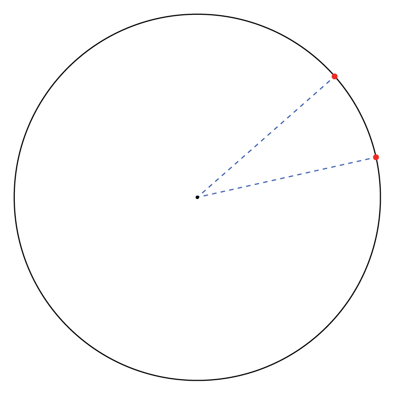
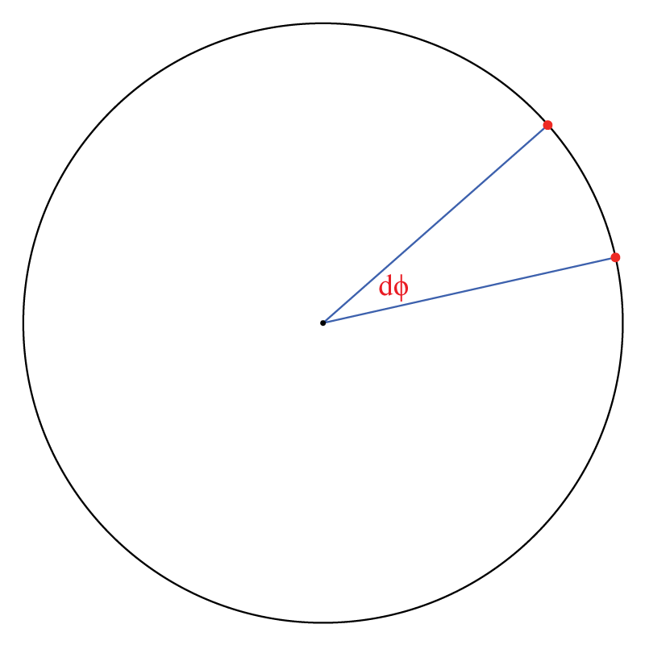
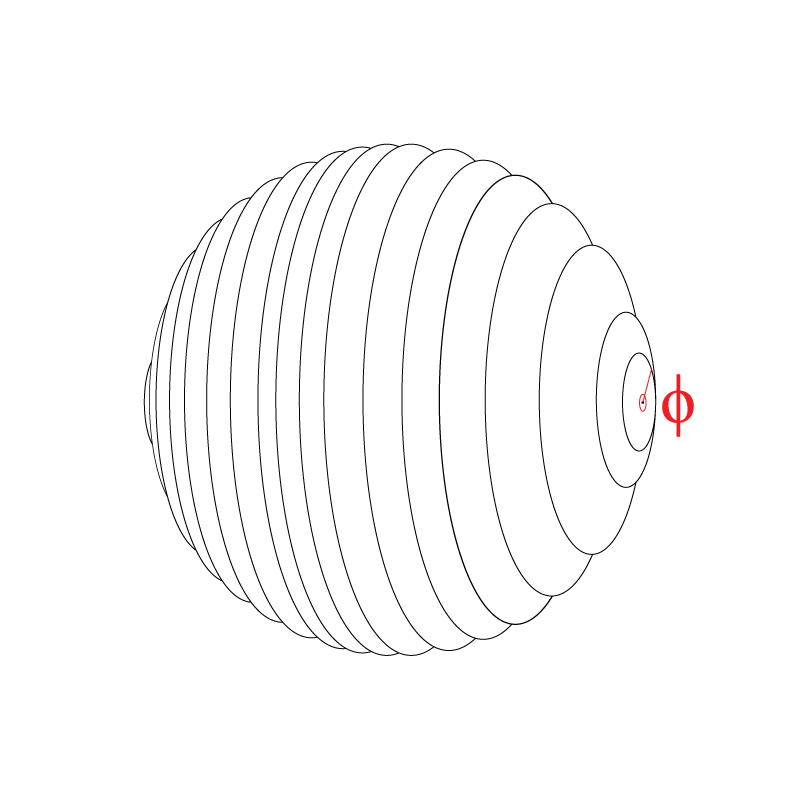
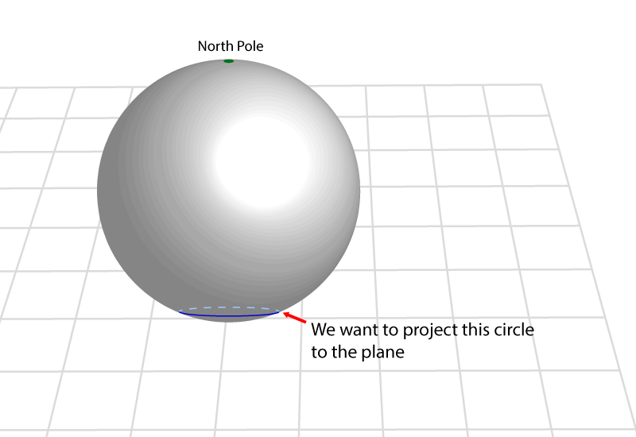
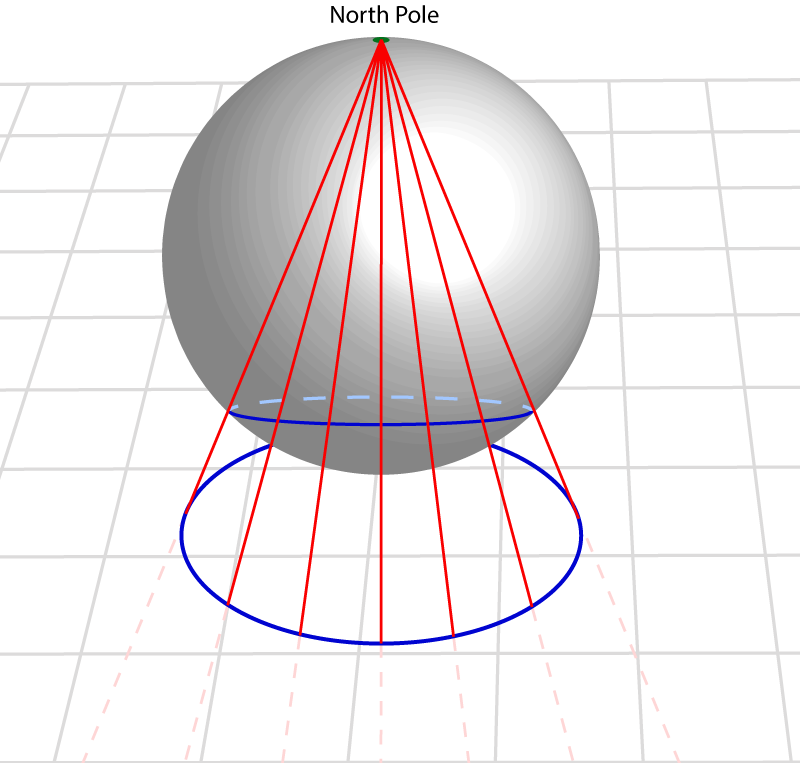

## ചാപ്റ്റര്‍ 4 – പ്രപഞ്ചത്തിന്‍റെ ജിയോമെട്രി

ഇതുവരെ നാം പരിഗണിച്ചത് ഒരു ഫ്ലാറ്റ് സ്പേസിനെ ആണ്. 

പ്രപഞ്ചത്തിന്‍റെ ജിയോമെട്രി മറ്റു പല രീതിയിലും ആകാം.

അവയെക്കുറിച്ച് നമുക്ക് ഈ ചാപ്റ്ററില്‍ പരിശോധിക്കാം.

ഇവിടെ നാം ജനറല്‍ ആപേക്ഷികത (General Relativity) ഉപയോഗിക്കും. അതിനാല്‍ സമവാക്യങ്ങള്‍ കുറച്ചു കട്ടിയായിരിക്കും.

ജനറല്‍ ആപേക്ഷികതയുടെ സമവാക്യങ്ങള്‍ ഞാന്‍ ഇവിടെ ഡിറൈവ് ചെയ്യാനൊന്നും ഉദ്ദേശിക്കുന്നില്ല. അതിനാല്‍ ഇവയെക്കുറിച്ച് അറിഞ്ഞിരിക്കുന്നത് നന്നായിരിക്കും.

സ്പേസിന്‍റെ ജിയോമെട്രി എങ്ങനെയാണ് എന്ന് മനസ്സിലാക്കുന്നതിനു വേണ്ടി പലതരം പഠനങ്ങള്‍ നടക്കുകയുണ്ടായി. ഇവയുടെ എല്ലാം ഫലം സൂചിപ്പിക്കുന്നത് സ്പസ് ഫ്ലാറ്റ് ആണ് എന്നാണ്.

പക്ഷെ ഇതില്‍ നിന്നും പ്രപഞ്ചം ഫ്ലാറ്റ് ആണ് എന്ന് പറയാന്‍ സാധിക്കില്ല. കാരണം, നമുക്ക് ഏകദേശം 20 ബില്ല്യണ്‍ പ്രകാശവര്‍ഷങ്ങള്‍ക്കുള്ളില്‍ ഉള്ള കാര്യങ്ങള്‍ മാത്രമേ കാണാന്‍ സാധിക്കൂ. പ്രപഞ്ചം വളരെ വളരെ വലുതാണ്‌ എന്ന് നമുക്കറിയാം. അതിനാല്‍ സ്പേസ് ഒരു സ്ഫിയര്‍ ആണെങ്കില്‍ അതിന്‍റെ കര്‍വേച്ചര്‍ കണ്ടുപിടിക്കുക എന്നത് കുറച്ചു പ്രയാസമുള്ള പണിയാണ്.

ഉദാഹരണത്തിന് ഭൂമിയില്‍ നില്‍ക്കുന്ന ഒരാള്‍ ചുറ്റും നോക്കിയാല്‍ ഭൂമി പരന്നതാണ് എന്ന് പറയും. ഭൂമിയുടെ കര്‍വേച്ചര്‍ കാണണമെങ്കില്‍ കുറച്ചു സൂം ഔട്ട്‌ ചെയ്യണം. അല്ലെങ്കില്‍, പണ്ട് എറടോസ്തനീസ് ഭൂമിയുടെ കര്‍വേച്ചര്‍ കണക്കാക്കിയ പോലെ ചെയ്യേണ്ടി വരും. പക്ഷെ പ്രപഞ്ചത്തിന്‍റെ കാര്യത്തില്‍ ഇത് സാധിക്കില്ലല്ലോ. നമുക്ക് സഞ്ചരിക്കാന്‍ സാധിക്കുന്നതില്‍ ഒരു പരിധിയുണ്ട്.

അപ്പോള്‍ നമുക്ക് ചെയ്യാന്‍ പറ്റുന്നത് എന്തെന്നാല്‍ സ്പേസിന്‍റെ ജിയോമെട്രി എങ്ങനെയൊക്കെ ആകാം എന്ന് പഠിക്കാം. എന്നിട്ട് അതിന്‍റെ ഭവിഷ്യത്തുകള്‍ എന്താണെന്ന് നോക്കൊം. ഈ ഭവിഷ്യത്തുകള്‍ പ്രപഞ്ചത്തില്‍ ദൃശ്യമാകുന്നുണ്ടോ എന്നും നോക്കാം.

പ്രപഞ്ചം ഹോമോജീനിയസ്സും ഐസോട്രോപിക്കും ആണ് എന്ന് നാം അസ്സ്യൂം ചെയ്യുന്നു. ഇതും ടെസ്റ്റ് ചെയ്യാന്‍ സാധിക്കുന്ന ഒന്നാണ്.

ആദ്യം ഒരു മെട്രിക് എന്നതിന്‍റെ ഡെഫനിഷന്‍ :

### മെട്രിക് (മാത്തമാറ്റിക്കല്‍ ഡെഫനിഷന്‍)

മെട്രിക് എന്നത്, ഒരു സെറ്റ് \\(X\\)ല്‍ ഡിഫൈന്‍ ചെയ്തിരിക്കുന്ന ഒരു ഫങ്ങ്ഷന്‍ ആണ്. ഇതിനെ ഡിസ്റ്റന്‍സ് ഫങ്ങ്ഷന്‍ അല്ലെങ്കില്‍ ഡിസ്റ്റന്‍സ് എന്ന് വിളിക്കുന്നു. ഇത് ഇങ്ങനെ:

$$ d: X \times X \longrightarrow [0, \infty)$$

ഇവിടെ, \\([0, \infty)\\) എന്നത്, നോണ്‍ നെഗറ്റിവ് ആയ ഇന്‍റിജറുകളുടെ ഒരു സെറ്റ് ആണ്. 

കൂടാതെ, എല്ലാ \\(x, y, z \in X\\), താഴെ പറയുന്ന എല്ലാ കണ്ടിഷനുകളും പാലിക്കുന്നു:

1.	\\( d(x,y) \ge 0 \\)
2.	\\( d(x,y) = 0 \iff x=y \\)
3.	\\( d(x,y) = d(y,x) \\)
4.	\\( d(x,z) \le d(x,y) + d(y,z) \\)

ഡെഫനിഷന്‍ എന്ന ഫോര്‍മാലിറ്റി കഴിഞ്ഞ സ്ഥിതിക്ക്, ഇനി കാര്യത്തിലേക്ക് കടക്കാം!

ഫിസിക്സില്‍, പ്രത്യേകിച്ചും ജനറല്‍ ആപേക്ഷികതയില്‍, മെട്രിക് എന്ന കോണ്‍സപ്റ്റിനെ \\(dS^2\\) എന്ന നൊട്ടേഷന്‍ കൊണ്ട് സൂചിപ്പിക്കുന്നു. ഇതിനെ സ്ക്വയേഡ് ഡിസ്റ്റന്‍സ് എന്ന് വിളിക്കാം.

\\(dS^2\\)നെ പറ്റി ഒരു ആഴത്തിലുള്ള അറിവ് ഉണ്ടായിരിക്കുന്നത് നല്ലതാണ്. അതിനാല്‍ ഇതിനെ കുറച്ചു ഡീറ്റെയില്‍ഡ് ആയി നോക്കാം.

3 ഡൈമെന്‍ഷനുകളില്‍ ഉള്ള ഒരു കര്‍വിന്‍റെ നീളം അളക്കണം എന്ന് വെക്കുക. 

നമുക്ക് ആ കര്‍വിനെ മുറിച്ചു ചെറിയ കഷണങ്ങള്‍ ആക്കി അതിലെ ഓരോ പീസിനെയും ഓരോ സ്ട്ട്രെയിറ്റ് ലൈന്‍ കൊണ്ട് റീപ്ലെയിസ് ചെയ്യാം. എന്നിട്ട് ആ സ്ട്ട്രെയിറ്റ് ലൈനുകള്‍ എല്ലാം എടുത്തു കൂട്ടിച്ചേര്‍ത്താല്‍ യഥാര്‍ത്ഥ കര്‍വിന്‍റെ ഒരു ഏകദേശ നീളം കിട്ടും. 

നമ്മള്‍ മുറിച്ച കഷണങ്ങളുടെ നീളം കുറയുംതോറും നമ്മള്‍ കണക്കാക്കുന്ന നീളത്തിന്‍റെ കൃത്യത കൂടിക്കൂടി വരും.
(കാല്‍ക്കുലസ് പഠിച്ചിട്ടുള്ളവര്‍ക്ക് ഇത് പെട്ടന്ന് കത്തും.)

ഓരോ പീസിന്‍റെയും നീളം കണക്കാക്കാന്‍ അവയുടെ തുടക്കത്തിന്‍റെയും ഒടുക്കത്തിന്‍റെയും \\(x, y, z\\) കോര്‍ഡിനേറ്റുകള്‍ എടുത്ത് അവയുടെ വ്യത്യാസം കണക്കാക്കിയാല്‍ മതി. 

അതായത് \\(\Delta x = x_2 – x_1, \Delta y = y_2 – y_1, \Delta z = z_2 –z_1\\)

എന്നിട്ട് \\(\Delta s^2\\) കണക്കാക്കാം:

$$\Delta s^2 = \Delta x^2 + \Delta y^2 + \Delta z^2$$

അപ്പോള്‍ ലെങ്ങ്ത് എന്ന് പറയുന്നത് \\(\sqrt {\Delta s^2}\\) ആയിരിക്കും.

\\(\Delta s^2\\) എന്നതിനെ കുറിച്ച് ഒരു ഏകദേശ രൂപം കിട്ടിക്കാണും എന്ന് പ്രതീക്ഷിക്കുന്നു.

ഇനി, എന്താണ് \\(\Delta s^2, dS^2\\) എന്നിവ തമ്മിലുള്ള വ്യതാസം?

\\(dS^2\\) എന്നത് കാല്‍ക്കുലസ് നൊട്ടേഷന്‍ ആണ്. ഇവിടെ \\(d\\) എന്നത് ഒരു വളരെ ചെറിയ വ്യത്യാസത്തെ കാണിക്കുന്നു. കാല്‍ക്കുലസ്സിലെ “ലിമിറ്റ്” എന്ന കോണ്‍സപ്റ്റും ഇവിടെ നാം ഉപയോഗിക്കുന്നു.

\\(\Delta s^2\\) രണ്ടു പോയിന്‍റുകള്‍ തമ്മില്‍ ഉള്ള ദൂരം കണക്കാക്കുന്നു. എന്നാല്‍ \\(dS^2\\) കുറച്ചുകൂടി കൃത്യമാണ്. ഇത്, രണ്ടു  പോയിന്‍റുകള്‍ അടുത്തടുത്ത്‌ വരുമ്പോള്‍ ഉള്ള നീളം, അതായത് പോയിന്‍റുകള്‍ തമ്മിലുള്ള അകലം കുറഞ്ഞു കുറഞ്ഞു വരുമ്പോള്‍ ഉള്ള നീളം കണക്കാക്കുന്നു. എന്നുവെച്ചാല്‍ രണ്ടു പോയിന്‍റുകളുടെ അകലങ്ങളുടെ ലിമിറ്റ് ആണ് \\(dS^2\\) പരിഗണിക്കുന്നത്.

പക്ഷെ \\(dS^2\\) അല്ല യഥാര്‍ത്ഥ നീളത്തിന്‍റെ അളവ്, മറിച്ച് \\(\sqrt{dS^2}\\) ആണ് എന്ന് ഓര്‍ക്കുക. ഇത് ഓര്‍മ്മിപ്പിക്കാന്‍ ആണ് നൊട്ടേഷനില്‍ സ്ക്വയര്‍ എഴുതുന്നത്‌.

ഇനി ജിയോമെട്രി.

ജിയോമെട്രി എന്നത് പല വിധത്തില്‍ ഉണ്ട്. പല തരത്തില്‍ ഉണ്ട്. കോടിക്കണക്കിന് അല്ലെങ്കില്‍ ഇന്‍ഫിനിറ്റ് തരത്തില്‍.

പക്ഷെ ഹോമോജീനിയസ്സും ഐസോട്രോപിക്കും ആയിട്ടുള്ള ജിയോമെട്രി മൂന്നു തരം മാത്രം:
1.	പോസിറ്റിവ് കര്‍വ്ഡ് (ഉദാഹരണം: ഒരു സ്ഫിയര്‍)
2.	നെഗറ്റിവ് കര്‍വ്ഡ് (ഉദാഹരണം: ഒരു ഹൈപര്‍ബോളിക് പ്ലെയിന്‍)
3.	സീറോ കര്‍വ്ഡ് (ഉദാഹരണം: ഫ്ലാറ്റ് പ്ലെയിന്‍)

ഇവയെ കുറിച്ച് മനസ്സിലാക്കുന്നതിന്, സ്ഫിയറുകളെ പറ്റി പഠിക്കാം.

മാത്തമാറ്റിഷ്യന്‍സ് സ്ഫിയറുകളെ പറ്റി സംസാരിക്കുമ്പോള്‍ അവര്‍ 1-സ്ഫിയര്‍, 2-സ്ഫിയര്‍, 3-സ്ഫിയര്‍...n-സ്ഫിയര്‍ എന്നിവയെക്കുറിച്ച് പറയുന്നു.

പല ഡൈമെന്‍ഷനുകളില്‍ ഉള്ള യുണിഫോം ആയ ടോപോളജികളുടെ അബ്സ്ട്രാക്ട് കോണ്‍സപ്റ്റുകളാണ് ഇത്.

യുണിഫോം ടോപോളജി എന്ന് വെച്ചാല്‍ അവയ്ക്ക് കോണ്‍സ്റ്റന്‍റ് ആയ കര്‍വേച്ചര്‍ ആയിരിക്കും എന്നാണ്.

ഒരു വൃത്തം (circle) ഒരു 1-സ്ഫിയര്‍ ആണ്.

ഒരു ഗോളം (sphere) ഒരു 2-സ്ഫിയര്‍ ആണ് (ഉദാഹരണം: ഭൂമി ഒരു 2-സ്ഫിയര്‍ ആണ്).

മനുഷ്യര്‍ 1-സ്ഫിയറിനെ വരക്കുമ്പോള്‍, അത് 2-ഡൈമെന്‍ഷനുകളില്‍ ആണ് ചിത്രീകരിക്കുന്നത്:

 

അതുപോലെ, 2-സ്ഫിയറിനെ വരക്കുമ്പോള്‍, അത് 3-ഡൈമെന്‍ഷനുകളിലും:

 

ഇത് മനുഷ്യന് ചിത്രീകരിക്കാന്‍ മാത്രമാണ് ഇങ്ങനെ ചെയ്യുന്നത്. കാരണം മനുഷ്യന്‍റെ തലച്ചോര്‍, 3 ഡൈമെന്‍ഷനുകളില്‍ നമ്മെ നാവിഗേറ്റ് ചെയ്യുന്നതിനായി പരിണമിച്ചതാണ്.   മറ്റു ഡൈമെന്‍ഷനുകളില്‍ ഉള്ള ഓബ്ജെക്റ്റ്കളെ ചിത്രീകരിക്കാന്‍ മനുഷ്യന്‍റെ തലച്ചോറിനു സാധിക്കില്ല, മാത്തമാറ്റിക്സിന്‍റെ സഹായമില്ലാതെ.

ഉദാഹരണത്തിന്, നിങ്ങള്‍ കണ്ണടച്ച് ഒരു   പെട്ടിയെ മനസ്സില്‍ സങ്കല്‍പ്പിക്കൂ.

നിങ്ങള്‍ക്ക് ആ പെട്ടിയുടെ എല്ലാ വശങ്ങളും മനസ്സില്‍ കാണാന്‍ കഴിയുന്നില്ലേ?
അതായത് ആ പെട്ടി ഒരു 3 ഡൈമെന്‍ഷണല്‍ ഓബ്ജക്റ്റ് ആയി നിങ്ങള്‍ക്ക് മനസ്സില്‍ കാണാന്‍ കഴിയുന്നുണ്ടല്ലോ?

ഇനി ഒരു വൃത്തം മനസ്സില്‍ സങ്കല്‍പ്പിക്കൂ. 

നിങ്ങള്‍ ഇപ്പോള്‍ മനസ്സില്‍ കാണുന്നത് ഒന്നുകില്‍ ഒരു പേപ്പറില്‍ അല്ലെങ്കില്‍ ഒരു ബ്ലാക്ക് ബോര്‍ഡില്‍ വരച്ചിട്ടുള്ള വൃത്തം (അതായത് ഒരു 2 ഡൈമെന്‍ഷണല്‍ ഓബ്ജക്റ്റ്) ആയിരിക്കും. പക്ഷെ ഒരു വൃത്തം ഒരു 1 ഡൈമെന്‍ഷണല്‍ ഓബ്ജക്റ്റ് ആണ്.

ഇനി ഒരു 0 ഡൈമെന്‍ഷണല്‍ പോയിന്‍റ് എടുക്കാം. 

എന്താണ് നിങ്ങള്‍ മനസ്സില്‍ കാണുന്നത്?

ഒന്നുകില്‍ നിങ്ങള്‍ കണ്ടത് ഒരു പേപ്പറില്‍ വരച്ചിട്ടുള്ള ഒരു പോയിന്‍റ് (അതായത് ഒരു 2 ഡൈമെന്‍ഷണല്‍ ചിത്രം), അല്ലെങ്കില്‍ വായുവില്‍ സസ്പെന്‍ഡ് ചെയ്തിരിക്കുന്ന പോലെ ഉള്ള ഒരു ചിത്രം (അതായത് ഒരു 3 ഡൈമെന്‍ഷണല്‍ ചിത്രം).
പക്ഷെ ഇത് രണ്ടും അല്ല ഒരു 0 ഡൈമെന്‍ഷണല്‍ പോയിന്‍റ്.

ഇനി, ഒരു 4 ഡൈമെന്‍ഷണല്‍ ഓബ്ജക്റ്റ് ആയാലോ? 
വളരെ ബുദ്ധിമുട്ടാകും.

മനുഷ്യന് മനസ്സില്‍ ചിത്രീകരിക്കാന്‍ പ്രയാസമില്ലാത്തത് എന്നതൊഴിച്ചാല്‍, 3 ഡൈമെന്‍ഷന് മാത്തമാറ്റിക്സിന്‍റെ കാഴ്ചപ്പാടില്‍ മറ്റു ഡൈമെന്‍ഷനുകളില്‍ നിന്നും വലിയ പ്രത്യേകതയൊന്നുമില്ല.

ഒരു 1-സ്ഫിയര്‍ എന്നത് ഒരു  1 ഡൈമെന്‍ഷണല്‍ ഓബ്ജെക്റ്റ് ആണ് .

എന്ന് വെച്ചാല്‍ ഒരു 1-സ്ഫിയറിനെ പറ്റി പറയുമ്പോള്‍, അതിനു അതിന്‍റേതായ “ഇന്‍ട്രിന്‍സിക്ക്” ടോപോളജി ഉണ്ടെന്നു മനസ്സിലാക്കുക.

അതായത് അതിനെ ഒരു “എക്സ്ട്രിന്‍സിക്ക്” ഉയര്‍ന്ന ഡൈമെന്‍ഷനില്‍ (2-ഡൈമെന്‍ഷനില്‍) പ്രതിഷ്ഠിക്കേണ്ട ആവശ്യം ഇല്ല.

ഒരു 1-സ്ഫിയറില്‍ അഥവാ ഒരു വൃത്തത്തില്‍ ജീവിക്കുന്ന ഒരു 1-ഡൈമെന്‍ഷണല്‍ ജീവിയെ പരിഗണിക്കാം:

[[]]

വൃത്തത്തിന് ഉള്ളിലെക്കോ വൃത്തത്തിന് പുറത്തേക്കോ ചലിക്കുക അല്ലെങ്കില്‍ നോക്കുക എന്ന ഒരു കോണ്‍സപ്റ്റ് ആ ജീവിക്ക് ഉണ്ടാകില്ല. ആ ജീവിയെ സംബന്ധിച്ച് വൃത്തം മാത്രമാണ് പ്രപഞ്ചം. 

അത് പോലെ, 1-സ്ഫിയര്‍, 2-സ്ഫിയര്‍, 3-സ്ഫിയര്‍... എന്നിവയെ അതിന്‍റേതായ ടോപോളജി ആയി മനസ്സില്‍ ചിത്രീകരിക്കണം.

അപ്പോള്‍ സ്പേസ് ഒരു 2-സ്ഫിയര്‍ ആണ് എന്ന് പറയുമ്പോള്‍ (ഉദാഹരണത്തിന്), ആ സ്പേസ് ഒരു ഗോളത്തിന്‍റെ ഉപരിതലം ആയി കാണണം. ആ ഗോളത്തിന് ഉള്ളില്‍ എന്താണ്, അല്ലെങ്കില്‍ ആ ഗോളത്തിന് പുറത്തു എന്താണ് എന്ന് ചോദിക്കരുത്. കാരണം ആ ചോദ്യങ്ങള്‍ക്ക് അര്‍ത്ഥമില്ല.

ഇനി, ഈ ജിയോമെട്രികളെ എങ്ങനെ സമവാക്യങ്ങള്‍ കൊണ്ട് വിവരിക്കാം എന്ന് നോക്കാം.

ഒരു വൃത്തത്തിന്‍റെ സമവാക്യം സുപരിചിതമാണ്:

$$x^2 + y^2 = r^2$$

ഇവിടെ, \\(r\\) എന്നത് വൃത്തത്തിന്‍റെ റേഡിയസ്.

നമുക്ക് തല്‍ക്കാലം റേഡിയസ്സിനെ \\(a\\) എന്ന് വിളിക്കാം.

അപ്പോള്‍,

$$x^2 + y^2 = a^2$$

(വൃത്തം ഒരു 1-സ്ഫിയര്‍ ആണെന്ന് ഓര്‍ക്കുക)

ഒരു 1-ഡൈമെന്‍ഷണല്‍ ഓബ്ജക്റ്റിനെ ഇത്തരത്തില്‍  വിവരിക്കാന്‍ രണ്ടു ഡൈമെന്‍ഷനുകള്‍  (അല്ലെങ്കില്‍ ആക്സിസ്സുകള്‍) ഉപയോഗിക്കേണ്ടി വരും – \\(x, y\\)

ഒരു ഗോളത്തെ (sphere) വിവരിക്കുന്ന സമവാക്യം:

$$x^2 + y^2 + z^2= a^2$$

(ഗോളം ഒരു 2-സ്ഫിയര്‍ ആണെന്ന് ഓര്‍ക്കുക)

ഒരു 2-ഡൈമെന്‍ഷണല്‍ ഓബ്ജക്റ്റിനെ വിവരിക്കാന്‍ മൂന്ന് ഡൈമെന്‍ഷനുകള്‍  (അല്ലെങ്കില്‍ ആക്സിസ്സുകള്‍) - \\(x ,y, z\\)

ഒരു 3-ഡൈമെന്‍ഷണല്‍ ഓബ്ജക്റ്റിനെ വിവരിക്കാന്‍ നാല് ഡൈമെന്‍ഷനുകള്‍ (അല്ലെങ്കില്‍ ആക്സിസ്സുകള്‍) - \\(x ,y, z, w\\):

$$x^2 + y^2 + z^2 +w^2= a^2$$

അങ്ങനെ അങ്ങനെ, \\(n\\) ഡൈമെന്‍ഷണല്‍ ഓബ്ജക്റ്റിനെ ഇത്തരത്തില്‍  വിവരിക്കാന്‍ \\(n+1\\) ഡൈമെന്‍ഷനുകള്‍ (അല്ലെങ്കില്‍ ആക്സിസ്സുകള്‍) ആവശ്യമാണ്‌.

ഈ ജിയോമെട്രികള്‍ക്ക് പേരുകള്‍ നല്‍കാം.

ഒരു യൂണിറ്റ് 1-സ്ഫിയറിനെ \\(\Omega_1\\) (ഒമേഗ വണ്‍) എന്ന് വിളിക്കുന്നു.

അതായത്,

$$x^2 + y^2 = 1  = \Omega_1 $$ 

ഒരു യൂണിറ്റ് 2-സ്ഫിയറിനെ \\(\Omega_2\\) എന്ന് വിളിക്കുന്നു.

അതായത്,

$$x^2 + y^2 + z^2 = 1  = \Omega_2 $$ 

ഒരു യൂണിറ്റ് 3-സ്ഫിയറിനെ \\(\Omega_3\\) എന്ന് വിളിക്കുന്നു.

അതായത്,

$$x^2 + y^2 + z^2 + w^2 = 1  = \Omega_3 $$ 

അങ്ങനെ അങ്ങനെ, ഒരു യൂണിറ്റ് n-സ്ഫിയറിനെ \\(\Omega_n\\) എന്ന് വിളിക്കുന്നു.

ഈ ജിയോമെട്രികളെ ഒരു ഉയര്‍ന്ന ഡൈമെന്‍ഷനില്‍ നിന്നും വിവരിക്കുന്നതിന് പകരം മറ്റൊരു രീതിയിലും വിവരിക്കാം - അതിന്‍റെ ഇന്‍ട്രിന്‍സിക്ക് മെട്രിക് ഉപയോഗിച്ച്.

ഉദാഹരണത്തിന്, ഭൂമിയിലെ ഒരു പോയിന്‍റിനെ സൂചിപ്പിക്കാന്‍ നാം \\(x, y, z\\) അക്ഷങ്ങള്‍ ഉപയോഗിക്കുന്നതിനു പകരം ലോന്‍ജിറ്റ്യൂഡും ലാറ്റിറ്റ്യൂഡും ഉപയോഗിക്കുന്നത് പോലെ. 

ഒരു വൃത്തത്തെ വിവരിക്കാന്‍ ഒരു ആങ്കിള്‍ ഉപയോഗിച്ച് സാധ്യമാണ്. ആ ആങ്കിളിനെ \\(\phi\\) (ഗ്രീക്ക് ലെറ്റര്‍ ഫൈ) എന്ന് വിളിക്കാം:

 

ആ വൃത്തത്തിലെ എല്ലാ പോയിന്‍റുകളെയും \\(\phi\\) കൊണ്ട് സൂചിപ്പിക്കാന്‍ സാധിക്കും.

അങ്ങനെയാണെങ്കില്‍ ആ  വൃത്തത്തിലെ രണ്ടു പോയിന്‍റുകള്‍  തമ്മിലുള്ള ദൂരം എങ്ങനെ വിവരിക്കും?

 

ചിത്രം നോക്കുകയാണെങ്കില്‍, ആ പോയിന്‍റുകള്‍ തമ്മിലുള്ള അകലം, അവ തമ്മിലുള്ള ആങ്കിളിന്‍റെ വ്യത്യാസത്തിനു ആനുപാതികമാണെന്ന് കാണാം.

 
അപ്പോള്‍ നമുക്ക് ആ അകലം ഇങ്ങനെ വിവരിക്കാം:

$$dS^2 = d \phi^2$$

 

മുമ്പ് ചെയ്ത പോലെ ഇതിനും ഒരു പേര് നല്‍കാം: \\(d \Omega_1^2\\) (ഡി ഒമേഗ വണ്‍ സ്ക്വയേഡ്)

അതായത്,

$$d \Omega_1^2  = d \phi^2$$

ഇനി, ഒരു 2-സ്ഫിയര്‍ എടുക്കാം.

ഒരു 2-സ്ഫിയര്‍ എന്നത്, ഒരു കൂട്ടം 1-സ്ഫിയറുകള്‍ ചേര്‍ത്ത് വെച്ച് ഉണ്ടാക്കിയ ജിയോമെട്രി ആയി കണക്കാക്കാം:

 

വൃത്തത്തിന്‍റെ മെട്രിക് എഴുതിയപോലെ, ഇവിടെയും നമ്മള്‍  1-സ്ഫിയറിന്‍റെ മദ്ധ്യത്തില്‍ നില്‍ക്കുകയാണ് എന്ന് സങ്കല്‍പ്പിക്കുക. അതായത് ഈ ഗോളങ്ങളുടെ ഏതെങ്കിലും ഒരു ധ്രുവത്തില്‍ ആണ് നാം:

 

ഈ ധ്രുവങ്ങള്‍ ഇങ്ങനെ തന്നെ ആകണം എന്നില്ല. ഏതു രണ്ടു പോയിന്‍റുകള്‍ വേണമെങ്കിലും എടുക്കാം:

 

ഒരു 2-സ്ഫിയറിനെ ഇതുപോലെ വിവരിക്കാന്‍ രണ്ട് ആങ്കിളുകള്‍ ആവശ്യമാണ്‌: \\( \phi\\)യും \\( \alpha\\)യും.

\\( \phi\\) എന്ന ആങ്കിള്‍ 1-സ്ഫിയറുകളെ വിവരിക്കുന്നു:

 

അതായത് \\( \phi\\) എന്ന ആങ്കിളിന്‍റെ വാല്യു പൂജ്യത്തില്‍ നിന്ന്  \\(2 \pi\\) വരെ വ്യതിചലിക്കുന്നു (360 ഡിഗ്രീ).

 \\( \alpha\\) എന്ന ആങ്കിള്‍ ഒരു ധ്രുവത്തില്‍ നിന്ന് മറ്റൊരു ധ്രുവത്തിലേക്ക് ഉള്ള ആങ്കില്‍ വിവരിക്കുന്നു:
 

 

അതായത് \\( \alpha\\) എന്ന ആങ്കിളിന്‍റെ വാല്യു പൂജ്യത്തില്‍ നിന്ന്  \\( \pi\\) വരെ വ്യതിചലിക്കുന്നു (180 ഡിഗ്രീ).

ഇതിന്‍റെ മെട്രിക് ഇങ്ങനെ എഴുതാം:

$$dS^2 = d \alpha^2 + sin^2 \alpha \; d \phi^2$$

ഇതില്‍, \\(sin \alpha\\) എവിടുന്നു വന്നു?

\\( \alpha\\) വിവരിക്കുന്ന വൃത്തങ്ങള്‍ ശ്രദ്ധിക്കുക.
ആ വൃത്തങ്ങളുടെ റേഡിയസ്സ് പൂജ്യത്തില്‍ നിന്നും ആരംഭിച്ച് കൂടി കൂടി വന്ന് ഒരു മാക്സിമം വരെ എത്തിയിട്ട് തിരിച്ചു പൂജ്യം ആകുന്നു. അതായത് ഒരു \\(sin\\) ഫങ്ങ്ഷന്‍. ഇതിനെ ആണ്  \\(sin \alpha\\) വിവരിക്കുന്നത്.

നമ്മള്‍ നേരത്തെ \\( d \phi^2\\)ന് ഒരു പേര് നല്‍കിയിരുന്നു: \\(d \Omega_1^2\\).

മുകളിലത്തെ സമവാക്യത്തില്‍ ഇത് ഉപയോഗിച്ച് \\( d \phi^2\\)യെ റീപ്ലെയ്സ് ചെയ്യാം:

$$dS^2 = d \alpha^2 + sin^2 \alpha \; d \Omega_1^2$$

ഈ മെട്രിക്കിനും ഒരു പേര് നല്‍കാം: \\(d \Omega_2^2\\)

അതായത്:

$$d \Omega_2^2 = d \alpha^2 + sin^2 \alpha \; d \Omega_1^2 $$

ഓരോ ഹയര്‍ ഡൈമെന്‍ഷണല്‍ ജിയോമെട്രിയെയും അതില്‍ നിന്നും ഒന്ന് കുറവുള്ള ഡൈമെന്‍ഷണല്‍ സ്ഫിയറുകള്‍ കൊണ്ട് നിര്‍മ്മിക്കുക എന്നതാണ് നാം ചെയ്യുന്നത്. അതായത് 2-സ്ഫിയറുകളെ 1-സ്ഫിയറുകള്‍ കൊണ്ട് നിര്‍മ്മിക്കുന്നു, 3-സ്ഫിയറുകളെ 2-സ്ഫിയറുകള്‍ കൊണ്ട് നിര്‍മ്മിക്കുന്നു, 4-സ്ഫിയറുകളെ 3-സ്ഫിയറുകള്‍ കൊണ്ട് നിര്‍മ്മിക്കുന്നു, അങ്ങനെ അങ്ങനെ. മാത്തമാറ്റിക്കല്‍ ഇന്‍റക്ഷന്‍ ഉപയോഗിച്ച് ഏതു ഡൈമെന്‍ഷണല്‍ ജിയോമെട്രിയെയും ഇതില്‍ നിന്നും വിവരിക്കാന്‍ സാധിക്കും.

അപ്പോള്‍, ഒരു 3-സ്ഫിയറിനെ ഇങ്ങനെ വിവരിക്കാം:

$$dS^2 = d \alpha^2 + sin^2 \alpha \; d \Omega_2^2$$

ഇതിനെ പൂര്‍ണ്ണമായി എഴുതിയാല്‍:

$$dS^2 = d \alpha^2 + sin^2 \alpha \;  \left( d \alpha^2 + sin^2 \alpha \;  d \Omega_1^2 \right)$$

ഒരു 4-സ്ഫിയറിനെ ഇങ്ങനെ വിവരിക്കാം:

$$dS^2 = d \alpha^2 + sin^2 \alpha \;  d \Omega_3^2$$

ഒരു 5-സ്ഫിയറിനെ ഇങ്ങനെ വിവരിക്കാം:

$$dS^2 = d \alpha^2 + sin^2 \alpha \;  d \Omega_4^2$$

ജെനറലൈസ് ചെയ്‌താല്‍, ഒരു D-ഡൈമെന്‍ഷണല്‍ സ്ഫിയര്‍ \\(\Omega_D^2\\) എന്നതിന്‍റെ മെട്രിക്:

$$  dS^2 = d \alpha^2 + sin^2 \alpha \;  d \Omega_{D-1}^2$$

ഇനി, \\(a\\) എന്ന റേഡിയസ് ഉള്ള ഒരു സ്ഫിയറിന്‍റെ മെട്രിക് ആണ് വേണ്ടതെങ്കില്‍, എളുപ്പമാണ് - \\(a\\) കൊണ്ട് ഗുണിച്ചാല്‍ മതി:

 $$dS^2 = a \left( d \alpha^2 + sin^2 \alpha \; d \Omega_3^2 \right) $$

ഇതാണ് ഒരു പോസിറ്റിവ് കര്‍വേച്ചര്‍ ജിയോമെട്രി.

ഒരു നെഗറ്റിവ് കര്‍വേച്ചര്‍ ജിയോമെട്രിയിലേക്ക് പോകുന്നതിനു മുന്‍പ് പോസിറ്റിവ് കര്‍വേച്ചര്‍ ജിയോമെട്രിയെ മറ്റൊരു രീതിയില്‍ എങ്ങനെ വിവരിക്കാം എന്ന് നോക്കാം. നെഗറ്റിവ് കര്‍വേച്ചര്‍ ജിയോമെട്രിയെ മനസ്സിലാക്കാന്‍ ഈ ചിത്രം ഉപകരിക്കും.

“പ്രൊജക്ഷന്‍” എന്ന പ്രക്രിയയാണ് നാം ചെയ്യാന്‍ പോകുന്നത്. അതായത് ഒരു ഉയര്‍ന്ന ഡൈമെന്‍ഷണല്‍ ഓബ്ജക്ടിനെ ഫ്ലാറ്റ് പ്ലെയിനിലേക്ക് “പ്രൊജെക്റ്റ്‌” ചെയ്യും.

ഉദാഹരണത്തിന് ഒരു ഗ്ലോബിനെ ഒരു ഭൂപടം ആയി പേപ്പറിലേക്ക്‌ പകര്‍ത്തുന്നത് പോലെ.
പലതരം പ്രൊജക്ഷനുകള്‍ ഉണ്ട്. പലതിനും പല പ്രത്യേകതകളും. 

മുകളില്‍ പറഞ്ഞ ഗ്ലോബിനെ ഒരു ഭൂപടം ആയി പകര്‍ത്തുന്നത്തിനു സാധാരണയായി മെര്‍ക്കേറ്റര്‍ പ്രൊജക്ഷന്‍ (Mercator projection) ആണ് ഉപയോഗിക്കുന്നത്. 

 
 
 <a href="https://en.wikipedia.org/wiki/File:Mercator_projection_SW.jpg"> Credit: Wikipedia</a>

 മെര്‍ക്കേറ്റര്‍ പ്രൊജക്ഷന്‍റെ ഒരു പ്രത്യേകത എന്തെന്നാല്‍ അത് ആങ്കിളുകളും ഷെയിപ്പുകളും കാത്തുസൂക്ഷിക്കുന്നു എന്നതാണ്. പക്ഷെ അവയുടെ വലിപ്പം കാത്തുസൂക്ഷിക്കുന്നില്ല. അതായത് ഒരു ഗ്ലോബില്‍ നിന്നും ഭൂപടത്തിലേക്ക് ഒരു ഭൂഖണ്ഡത്തെ ചിത്രീകരിക്കുമ്പോള്‍, അവയുടെ ഷെയിപ്പ് കൃത്യമായിരിക്കും പക്ഷെ അവയുടെ വലിപ്പം ധ്രുവങ്ങളോട് അടുക്കുംതോറും വളരെയധികം വലുതാകുന്നു.
 

 
 
 <a href="https://en.wikipedia.org/wiki/File:Usgs_map_mercator.svg"> Credit: Wikipedia</a>

 
 
 <a href="https://en.wikipedia.org/wiki/File:Worlds_animate.gif"> Credit: Wikipedia</a>

നാം ചെയ്യാന്‍ പോകുന്ന പ്രൊജക്ഷന്‍റെ പേര് “സ്റ്റെരിയോഗ്രാഫിക് പ്രൊജക്ഷന്‍” എന്നാണ്.

ഇതിനും പല പ്രത്യേകതകള്‍ ഉണ്ട്. ഇത് ഒരു കണ്‍ഫോര്‍മല്‍ (conformal) പ്രൊജക്ഷന്‍  ആണ്. അതായത് ആങ്കിളുകള്‍ കാത്തുസൂക്ഷിക്കപ്പെടുന്നു.

ഈ പ്രത്യേകതയുടെ ഒരു ഭവിഷ്യത്ത് എന്തെന്നാല്‍, ഇത് വൃത്തങ്ങളെ വൃത്തങ്ങളായിത്തന്നെ പകര്‍ത്തുന്നു എന്നതാണ്.

ഒരു സ്റ്റെരിയോഗ്രാഫിക് പ്രൊജക്ഷന് ആദ്യം ആവശ്യം ഒരു ഇന്‍ഫിനിറ്റ് പ്ലെയിന്‍ ആണ്! (അതിനാല്‍ തന്നെ ഈ പ്രൊജക്ഷന് മാത്തമാറ്റിക്സിനു പുറത്തു വലിയ ഉപയോഗങ്ങള്‍ ഒന്നും ഇല്ല!)

ആ ഇന്‍ഫിനിറ്റ് പ്ലെയിന്‍ താഴെ കാണുന്ന പോലെ നിവര്‍ത്തി വെക്കുക:

 

എന്നിട്ട് നമ്മള്‍ പ്രോജെക്റ്റ്‌ ചെയ്യാന്‍ ഉദ്ദേശിക്കുന്ന ഉയര്‍ന്ന ഡൈമെന്‍ഷണല്‍ ഓബ്ജക്ടിനെ ഈ പ്ലെയിനിന്‍റെ ഒറിജിന്‍ പോയിന്‍റില്‍ വെക്കുക. 
ഉദാഹരണത്തിന് ഒരു 2-സ്ഫിയര്‍ എടുക്കാം.

ആ 2-സ്ഫിയറിന്‍റെ ഏതെങ്കിലും ഒരു ധ്രുവം ഒറിജിന്‍ പോയിന്‍റില്‍ വരുന്ന രീതിയില്‍ വേണം വെക്കാന്‍. ആ ധ്രുവത്തിലാണ്  നമ്മള്‍ എന്ന് സങ്കല്‍പ്പിക്കുക (അതിനെ നമുക്ക് തെക്കേ ധ്രുവം (South pole) എന്ന് വിളിക്കാം):

 

2-സ്ഫിയറില്‍ ഉള്ള ഒരു പോയിന്‍റ് എടുക്കാം. ഇതിനെ പ്ലെയിനിലേക്ക് പ്രൊജെക്റ്റ്‌ ചെയ്യാന്‍ താഴെ പറയുന്ന കാര്യങ്ങള്‍ ചെയ്യുക:

 

(1)	വടക്കേ ധ്രുവത്തില്‍ നിന്നും ആരംഭിച്ച്, നമ്മള്‍ പരിഗണിക്കുന്ന പോയിന്‍റിലൂടെ കടന്നു പോകുന്ന ഒരു സ്ട്രെയിറ്റ് ലൈന്‍ വരക്കുക.

  

    
   

(2)	ഈ ലൈന്‍, പ്ലെയിനില്‍ വന്നിടിക്കുന്ന പോയിന്‍റ് അടയാളപ്പെടുത്തുക.

   

    
   

(3)	ഈ പോയിന്‍റ് ആണ് 2-സ്ഫിയറിലെ പോയിന്‍റിന്‍റെ പ്ലെയിനില്‍ ഉള്ള പ്രൊജക്ഷന്‍.

മറ്റൊരു ഉദാഹരണം:

 

    
   

   
സ്ഫിയറില്‍ ഉള്ള വൃത്തങ്ങളെ ഇത്തരത്തില്‍ എങ്ങനെ പ്രൊജെക്റ്റ് ചെയ്യും എന്ന് നോക്കാം.

സൗത്ത്‌ പോളിന് ചുറ്റും വളരെ അകലെ അല്ലാതെയുള്ള ഒരു വൃത്തം പരിഗണിക്കാം (സൗത്ത്‌ പോളിന് ചുറ്റും എന്നുവെച്ചാല്‍ നമ്മുടെ ചുറ്റും; നമ്മള്‍ സൗത്ത്‌ പോളില്‍ ആണെന്ന് നേരത്തെ സങ്കല്‍പ്പിച്ചല്ലോ):

    

   
നേരത്തെ ചെയ്ത പോലെ, നോര്‍ത്ത് പോളില്‍ നിന്നും വൃത്തത്തിലൂടെ കടന്നുപോകുന്ന സ്ട്രെയിറ്റ് ലൈനുകള്‍ വരക്കുക, അവ പ്ലെയിനില്‍ വന്നിടിക്കുന്ന പോയിന്‍റുകള്‍ അടയാളപ്പെടുത്തുക, ആ പോയിന്‍റുകള്‍ യോജിപ്പിച്ചാല്‍ വൃത്തമായി :

    

സൗത്ത്‌ പോളില്‍ നിന്നും കുറച്ചുകൂടി അകലെ ഉള്ള ഒരു വൃത്തം എങ്ങനെ പ്രൊജെക്റ്റ് ആകും എന്ന് നോക്കാം:

    

സൗത്ത്‌ പോളില്‍ (നമ്മുടെ ലൊക്കേഷനില്‍) നിന്നും  ഇനിയും കുറച്ചുകൂടി അകലെ ഉള്ള ഒരു വൃത്തം എങ്ങനെ പ്രൊജെക്റ്റ് ആകും എന്ന് നോക്കാം:

    

അതായത്, സൗത്ത്‌ പോളില്‍ (നമ്മുടെ ലൊക്കേഷനില്‍) നിന്നും അകന്നകന്നു പോകും തോറും, പ്രൊജെക്റ്റ് ചെയ്യപ്പെടുന്ന വൃത്തങ്ങളുടെ വലിപ്പം കൂടിക്കൂടി വരും.

നോര്‍ത്ത് പോളിന്‍റെ ചുറ്റും ഉള്ള ഒരു വൃത്തം പ്ലെയിനില്‍ വളരെ വളരെ വലിപ്പമുള്ള വൃത്തമായി പ്രൊജെക്റ്റ് ചെയ്യപ്പെടുന്നു.

നോര്‍ത്ത് പോള്‍ എന്ന പോയിന്‍റ്, പ്ലെയിനില്‍ ഒരു ഇന്‍ഫിനിറ്റ് റേഡിയസ്സ് ഉള്ള വൃത്തമായി  പ്രൊജെക്റ്റ് ചെയ്യപ്പെടുന്നു.

ഈ പ്ലെയിനിനെ മുകളില്‍ നിന്നും നോക്കിയാല്‍ ഇങ്ങനെ ഇരിക്കും:

    

അതായത് സ്റ്റെരിയോഗ്രാഫിക് പ്രൊജക്ഷന്‍റെ പ്രത്യേകത എന്തെന്നാല്‍ അത്  നമ്മുടെ ലൊക്കേഷന് അടുത്ത് ഉള്ള ഒബ്ജെകറ്റുകളുടെ വലിപ്പം കൃത്യമായി പ്രൊജകറ്റ് ചെയ്യും. പക്ഷെ നമ്മളില്‍ നിന്നും അകലെയുള്ള ഒബ്ജെകറ്റുകളുടെ വലിപ്പം ക്രമാതീതമായി വര്‍ദ്ധിക്കുന്നതായി ചിത്രീകരിക്കും.

നമ്മുടെ പ്രപഞ്ചത്തിന്‍റെ ജിയോമെട്രി എങ്ങനെയാകും എന്ന് കണ്ടെത്തുന്നതിനു ഉപകരിക്കുന്ന ഒരു ട്രിക്ക് ആണ് ഇത്. 

ഒരേ വലിപ്പമുള്ള രണ്ടു ഒബ്ജെകറ്റുകള്‍ എടുക്കുക – ഒന്ന് നമ്മുടെ അടുത്തുള്ളതും ഒന്ന് വളരെ വളരെ അകലെ ഉള്ളതും.

ഇവയെ ഒരു ടെലിസ്കോപ്പിലൂടെ നോക്കുമ്പോള്‍ ഇവ സബ്ടെന്‍റ് ചെയ്യുന്ന ആങ്കിളുകള്‍ ഇത്തരത്തില്‍ വലിപ്പവ്യത്യാസങ്ങള്‍ സൂചിപ്പിക്കുന്നുണ്ടോ എന്ന് നോക്കാന്‍ സാധിക്കും. (ഇത് കാലങ്ങളായി അസ്ട്രോണമേര്‍സ് ചെയ്യുന്ന സ്ഥിരം പണിയാണ്!) 

ഒരു ഫ്ലാറ്റ് സ്പേസ് ആണെങ്കില്‍, സബ്ടെന്‍റ് ചെയ്യുന്ന ആങ്കിളുകള്‍, ഒബ്ജെകറ്റുകള്‍ അകലുന്തോറും കുറഞ്ഞു കുറഞ്ഞു വരും:

    

ഇനി നെഗറ്റിവ് കര്‍വ്ഡ് ജിയോമെട്രിയെക്കുറിച്ച്.

നെഗറ്റിവ് കര്‍വ്ഡ് ജിയോമെട്രിയെ മറ്റൊരു പേരിലും അറിയപ്പെടുന്നു: ഹൈപര്‍ബോളിക് ജിയോമെട്രി.

ഹൈപര്‍ബോളിക് ജിയോമെട്രിയെ ചിത്രീകരിക്കാന്‍ പ്രയാസമാണ്. പക്ഷെ അതിന്‍റെ മെട്രിക് എഴുതാന്‍ വളരെ എളുപ്പം. ആകെ ചെയ്യേണ്ടത് നാം മുമ്പ് എഴുതിയ n-സ്ഫിയര്‍ മെട്രിക്ക്കളില്‍ sineന് പകരം ഹൈപര്‍ബോളിക് sine (sinh) എഴുതുക എന്നതാണ്. 

ഉദാഹരണത്തിന്, ഒരു 2 ഡൈമെന്‍ഷണല്‍ ഹൈപര്‍ബോളിക് ജിയോമെട്രിയുടെ മെട്രിക്ക് (\\(d\mathscr{H}_2^2\\)) ഇങ്ങനെ എഴുതാം:

$$dS^2 = d\alpha^2 + sinh^2 \alpha \; d\Omega_1^2$$ 

ഇങ്ങനെ ഉള്ള ഒരു ജിയോമെട്രിയില്‍ വൃത്തങ്ങള്‍ വരച്ചാല്‍ അത് എങ്ങനെ ബിഹേവ്‌  ചെയ്യും?

അതിനു \\(sinh\\)ന്‍റെ ബിഹേവിയര്‍ എങ്ങനെ എന്ന് നോക്കാം.

സൈന്‍ ഫങ്ങ്ഷനുകളുടെ \\(e\\) കൊണ്ടുള്ള ഡെഫനിഷന്‍ എടുക്കാം:

$$sin(r) = \frac{e^{ir}- e^{-ir}}{2i}$$

അതുപോലെ,

$$sinh(r) = \frac{e^r – e^{-r}}{2}$$

### FLRW മെട്രിക്

നമ്മുടെ പ്രപഞ്ചത്തിന്‍റെ ജിയോമെട്രിയെ വിവരിക്കുന്ന മെട്രിക് ആണ് FLRW മെട്രിക്. ജനറല്‍ ആപേക്ഷികതയില്‍ നിന്നാണ് ഇത് ഡിറൈവ് ചെയ്തിട്ടുള്ളത്. അത് ഇങ്ങനെ:

$$d\tau^2  = dt^2 – a(t)^2 \; d\Omega_3^2$$ 

ഇവിടെ,

\\( d\tau\\) എന്നത് പ്രോപ്പര്‍ ടൈം

\\(dt\\) എന്നത് ഒരു ക്ലോക്ക് അളക്കുന്ന ടൈം

\\( a(t) \\) എന്നത് സ്കെയില്‍ ഫാക്ടര്‍ 

\\( d\Omega_3\\) എന്നത് ഒരു 3-സ്ഫിയര്‍

(\\(c = 1\\) ആയി സങ്കല്‍പ്പിക്കുന്നു)

ഓര്‍ക്കുക, ഈ 3-സ്ഫിയര്‍ സ്പേസിന്‍റെ മാത്രം ജിയോമെട്രിയെ സൂചിപ്പിക്കുന്നു. സ്പേസ്ടൈമിന്‍റെ അല്ല. 

ഒരു ഹോമോജീനിയസ്സും ഐസോട്രോപ്പിക്കും ആയ, യൂണിഫോം പോസിറ്റിവ് കര്‍വേച്ചര്‍ ഉള്ള, സമയത്തെ ഡിപ്പെന്‍റ് ചെയ്ത് വികസിക്കുന്ന (അല്ലെങ്കില്‍ ചുരുങ്ങുന്ന) 3-ഡൈമെന്‍ഷണല്‍ സ്പേസ് ഉള്ള ഒരു പ്രപഞ്ചത്തെയാണ് ഈ മെട്രിക് വിവരിക്കുന്നത്. 
ആ സ്പേസിന്‍റെ റേഡിയസ് എന്നത് സ്കെയില്‍ ഫാക്ടര്‍ \\(a\\) ആണ്.

പോസിറ്റിവ് കര്‍വെച്ചര്‍ ഉള്ള മെട്രിക് ആയതിനാല്‍ ഇതിനെ \\(k=+1) \\) എന്ന കേസ് എന്ന് വിളിക്കുന്നു. (\\(k \\) യുടെ മൂന്നു വാല്യൂകള്‍ നാം നേരത്തെ കണ്ടതാണ്: +1, -1, അല്ലെങ്കില്‍ 0)
