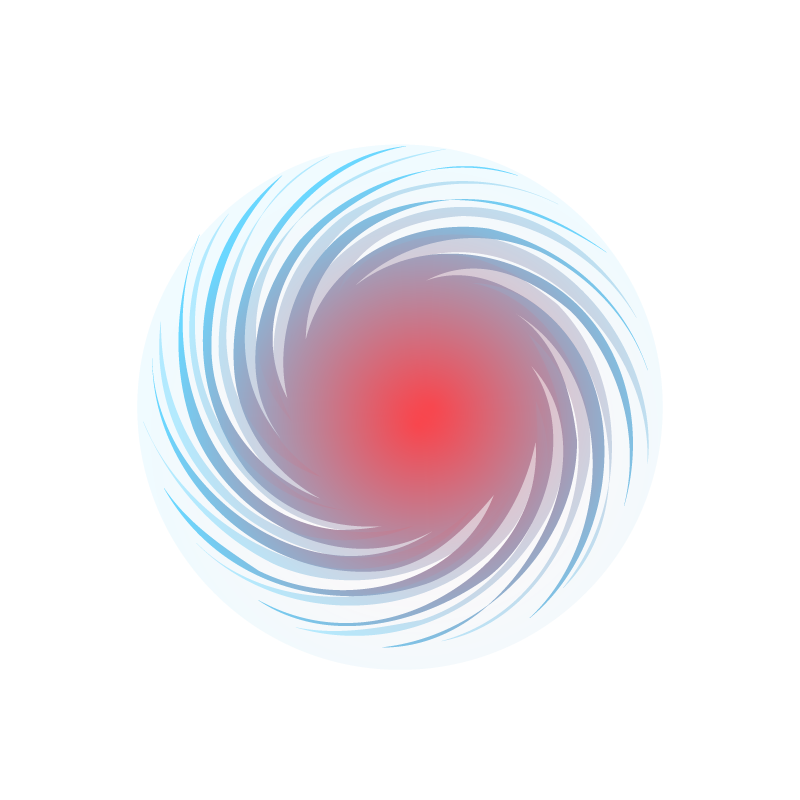
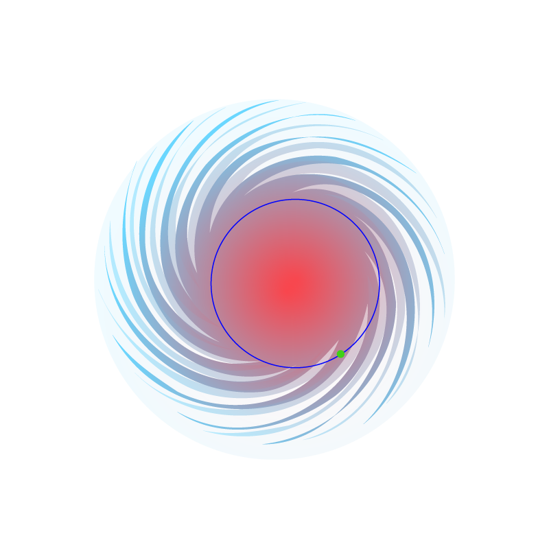
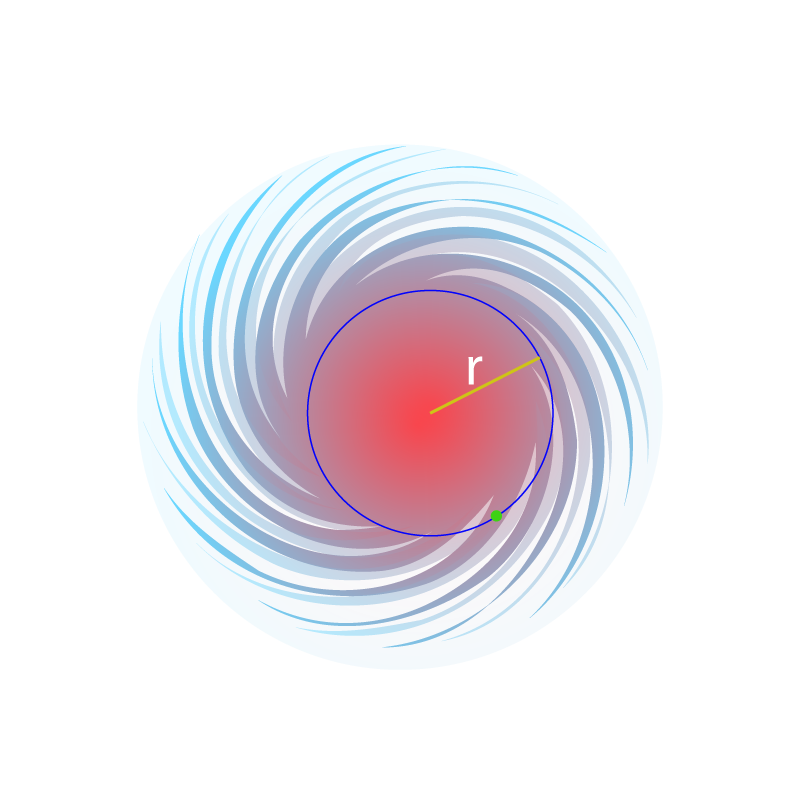
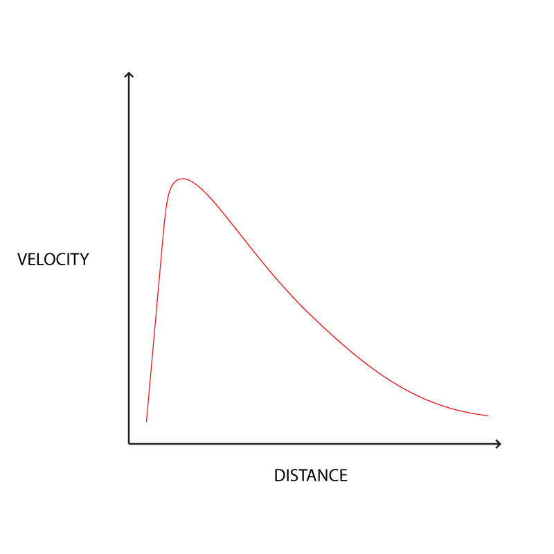
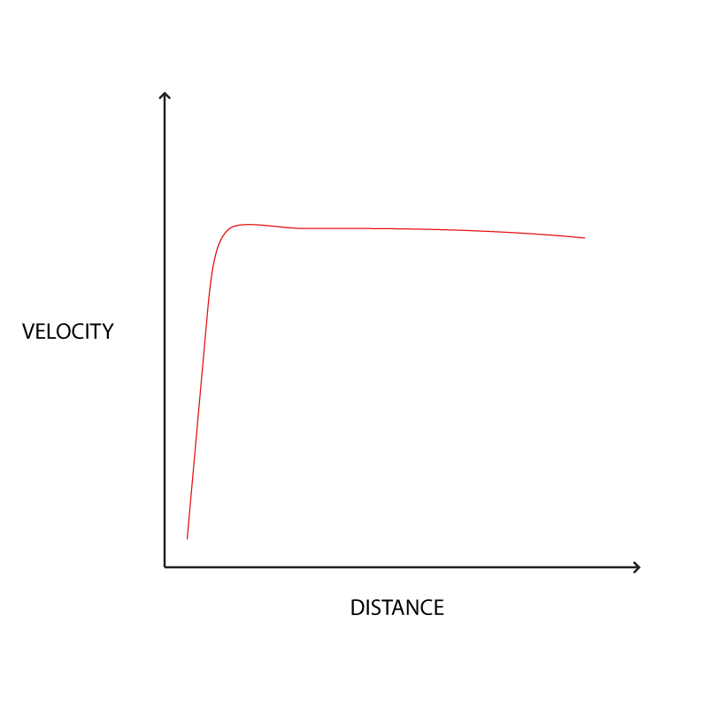
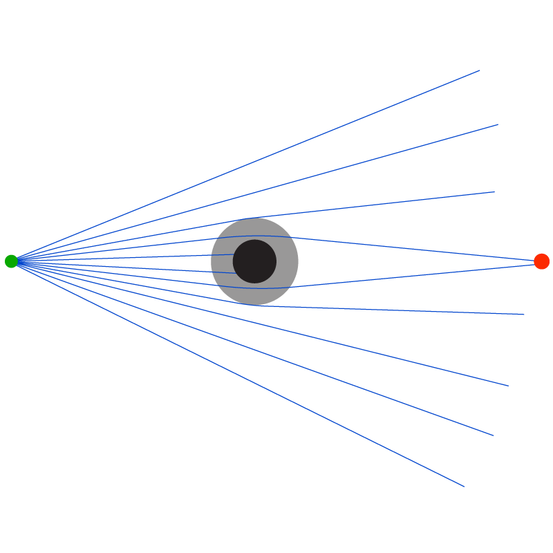

## ചാപ്റ്റര്‍ 5 – ഡാര്‍ക്ക്‌ മാറ്റര്‍

“ഡാര്‍ക്ക്‌ മാറ്റര്‍” എന്ന് വിളിക്കുന്നത് എന്താണ് എന്നും എങ്ങനെയാണ് ഇതിന്‍റെ കണ്ടെത്തല്‍ ഉണ്ടായത് എന്നുമെല്ലാം ഈ ചാപ്റ്ററില്‍ നോക്കാം.

### ഗാലക്സികളുടെ റൊട്ടേഷന്‍ കര്‍വ് 

1930കളില്‍, ഗാലക്സികളിലെ നക്ഷത്രങ്ങളുടെ ചലനങ്ങളെ പറ്റി പഠിക്കുകയായിരുന്നു ചില ആസ്ട്രോണമേര്‍സ്. അതില്‍ ഒരു പ്രമുഖനായ ഒരു ഡച്ച് ആസ്ട്രോണമര്‍ ആയിരുന്നു ജാന്‍ ഹെന്‍ട്രിക് ഊര്‍ട്ട് (Jan Hendrik Oort). 
ഗാലക്സികളുടെ ചലനത്തില്‍ ചില പൊരുത്തക്കേടുകള്‍ ഉണ്ടെന്ന് ഊര്‍ട്ട്, 1932ല്‍ കണ്ടെത്തി. പൊരുത്തക്കേട് എന്നുവെച്ചാല്‍ അവ ചലന നിയമങ്ങള്‍ അനുസരിക്കുന്നില്ല എന്ന്. 

ഒരു വര്‍ഷത്തിനു ശേഷം, 1933ല്‍, ഗാലക്സി ക്ലസ്റ്ററുകളും ബിഹേവ്‌ ചെയ്യുന്നതില്‍ ചില ശരികേട് ഉണ്ടെന്നു സ്വിസ് ആസ്ട്രോണമര്‍ ആയിരുന്ന ഫ്രിറ്റ്സ് സ്വിക്കി (Fritz Zwicky) നിരീക്ഷിച്ചു. 

മാത്രവുമല്ല, വിറിയല്‍ തിയറം (Virial theorem) എന്ന മാത്തമാറ്റിക്കല്‍ തിയറം ഉപയോഗിച്ച് "dunkle materie" അഥവാ ഡാര്‍ക്ക്‌ മാറ്റര്‍ എന്ന് അദ്ദേഹം വിളിച്ച വസ്തുക്കളുടെ അസ്തിത്വം അനുമാനിച്ചു. 

ഇക്കാലത്ത് ഗാലക്സികളുടെ മാസ് എന്നത് അതിന്‍റെ ലുമിനോസിറ്റിയില്‍ നിന്നാണ് അനുമാനിച്ചിരുന്നത്. പക്ഷെ അത് അങ്ങനെ അല്ലാ എന്നും പ്രകാശവുമായി ഇന്‍ററാക്റ്റ് ചെയ്യാത്ത വസ്തുക്കള്‍ കൂടി ചേര്‍ത്താലേ മൊത്തം ഗാലക്സികളുടെ മാസ് കൃത്യമായി കണക്കാക്കാന്‍ ആകൂ എന്നും ഇതില്‍ നിന്നും വാദിച്ചു. ഈ വാദങ്ങള്‍ പിന്നീടു സ്ഥിതീകരിക്കുകയുണ്ടായി.

ഇതിനെ കുറിച്ച് മനസ്സിലാക്കാന്‍, ഒരു ഗ്രാവിറ്റെഷണല്‍ ഫീല്‍ഡില്‍ ഒരു ഒബ്ജെക്റ്റ് എങ്ങനെ ചലിക്കും എന്ന് നോക്കാം. ഉദാഹരണത്തിന് ഒരു നക്ഷത്രത്തിന് ചുറ്റും ഒരു ഗ്രഹം അല്ലെങ്കില്‍ ഒരു ഗാലക്സിയിലെ ഒരു നക്ഷത്രം.

 

ഒരു ഗാലക്സി. ചുവന്ന നിറം മാസ് ഡിസ്ട്രിബ്യൂഷനെ കാണിക്കുന്നു. (അതായത്, മദ്ധ്യത്തില്‍ ആണ് കൂടുതല്‍ മാസ്)

കുറിപ്പ്: ഇത് ഇങ്ങനെ അല്ലാ എന്ന് ഇന്ന്‍ നമുക്കറിയാം.

 

ഒരു നക്ഷത്രത്തെ പരിഗണിക്കാം (പച്ച).

 

ഈ നക്ഷത്രം മദ്ധ്യത്തിലെ മാസ്സിന്‍റെ ചുറ്റും ഓര്‍ബിറ്റ് ചെയ്യുന്നു (നീല നിറത്തില്‍ ഓര്‍ബിറ്റ്).

 

ഈ ഓര്‍ബിറ്റ്, മദ്ധ്യത്തില്‍ നിന്നും \\(r\\) റേഡിയസ് അകലെ ആണ് എന്ന് വെക്കുക.

ന്യൂട്ടന്‍റെ \\(F = ma\\) സമവാക്യം ഉപയോഗിക്കാം.

ആ നക്ഷത്രത്തില്‍, മദ്ധ്യത്തിലെ മാസ് \\(M\\) മൂലം ഉണ്ടാകുന്ന ആക്സലറേഷന്‍ \\(a\\) എന്നത്:

$$\frac{MG}{r^2} = a$$

ആക്സലറേഷന്‍ \\(a\\) എന്നത് \\(\frac{v^2}{r}\\) എന്നും എഴുതാം.

അപ്പോള്‍:

$$\frac{MG}{r^2} = \frac{v^2}{r}$$

\\(r\\) കൊണ്ട് ഇരുവശവും ഗുണിച്ചാല്‍:

$$\frac{MG}{r} =  v^2$$

എന്നുവെച്ചാല്‍:

$$\sqrt{\frac{MG}{r}} =  v$$

അതായത്, വെലോസിറ്റി, \\(\frac{1}{\sqrt{r}}\\)ന് ആനുപാതികമായി കുറയുന്നു എന്ന്.

കുറിപ്പ്: ഇത്, കെപ്ലറുടെ പ്ലാനറ്ററി ചലന നിയമങ്ങളില്‍ (Keplar’s laws of planetary motion) ഒന്നും രണ്ടും നിയമങ്ങളുടെ ജെനറലൈസേഷന്‍ ആണ്.

ഇതിനെ ഒരു ഗ്രാഫില്‍ ചിത്രീകരിച്ചാല്‍ ഇങ്ങനെ ഇരിക്കും:

 

പക്ഷെ, ഊര്‍ട്ട്, ഫ്രിറ്റ്സ് സ്വിക്കി തുടങ്ങിയവര്‍ കണ്ടെത്തിയ ബിഹേവിയര്‍ ഇങ്ങനെ അല്ല. അത് താഴെ കാണുന്നപോലെ ആണ്:

 

അതായത്, ഗാലക്സികളിലെ നക്ഷത്രങ്ങളുടെ ചലനം, മദ്ധ്യത്തില്‍ നിന്നും അവ എത്ര അകലെയാണ് എന്നത് അനുസരിച്ചല്ല. മദ്ധ്യത്തില്‍ നിന്നും എത്ര ദൂരത്തായാലും ഏകദേശം ഒരേ ഓര്‍ബിറ്റല്‍ വെലോസിറ്റി ആകും അവയ്ക്ക്.

<video style="display:block; margin: 0 auto; width:100%; height:100%" autoplay="" loop="" muted="" controls="">
        <source src="../videos/Galaxy_rotation_under_the_influence_of_dark_matter.mp4">        
        
Your browser does not support HTML5 video.

</video>
 
 <a href="https://commons.wikimedia.org/w/index.php?title=File%3AGalaxy_rotation_under_the_influence_of_dark_matter.ogv"> Credit: Wikipedia</a>

 

ഇങ്ങനെ സംഭവിക്കണമെങ്കില്‍ രണ്ടു വഴിയേ ഉള്ളൂ.
1.	ചലന നിയമങ്ങള്‍ ഗാലക്സികള്‍ക്ക് ബാധകമല്ല അഥവാ ചലന നിയമങ്ങള്‍ ഗാലക്സികള്‍ക്ക് അപ്ലൈ ചെയ്യുമ്പോള്‍ മോഡിഫൈ ചെയ്യണം.
2.	ഇലക്ട്രോ മാഗ്നറ്റിക് റേഡിയേഷന്‍ ഉപയോഗിച്ച് നമുക്ക് കാണാന്‍ സാധിക്കാത്ത മാസ് ഗാലക്സികളില്‍ ഉണ്ട്.

ഇതില്‍ ആദ്യത്തെ പോയിന്‍റ് അനുസരിച്ച് ചില മോഡലുകള്‍ (മോഡിഫൈഡ് ന്യൂട്ടോണിയന്‍ ഡൈനാമിക്സ്) നിര്‍മ്മിക്കപ്പെട്ടു എങ്കിലും അവ വിജയിച്ചില്ല. 

കൂടുതല്‍ നിരീക്ഷണങ്ങള്‍, രണ്ടാമത്തെ പോയിന്‍റ് ആണ് ശരി എന്ന് സ്ഥാപിച്ചു.

ഗ്രാവിറ്റെഷണല്‍  ലെന്‍സിങ്ങ് എന്ന പ്രതിഭാസം ഉപയോഗിച്ച് ഗാലക്സികളിലെ മാസ് നിര്‍ണ്ണയിക്കാന്‍ തുടങ്ങിയതോടെ ഡാര്‍ക്ക്‌ മാറ്ററിന്‍റെ സാന്നിധ്യം കൂടുതല്‍ വ്യക്തമായി.

### ഗ്രാവിറ്റേഷണല്‍  ലെന്‍സിങ്ങ്

ജനറല്‍ ആപേക്ഷികത അനുസരിച്ച്, ഗ്രാവിറ്റി എന്നത് സ്പേസ്-ടൈമില്‍ മാസ്/എനര്‍ജി ഡെന്‍സിറ്റി കാരണം ഉണ്ടാകുന്ന കര്‍വേച്ചറുകള്‍ ആണ്.

കര്‍വ്ഡ് ആയ സ്പേസ്-ടൈമിലൂടെ സഞ്ചരിക്കുന്ന പ്രകാശത്തിന്‍റെ പാതയും അതിനനുസരിച്ച് “ബെന്‍ഡ്” ആകുന്നു.

 

മുകളിലത്തെ ചിത്രത്തില്‍, ചുവന്ന ബിന്ദുവില്‍ ആണ് നാം. പച്ച നിറത്തില്‍ ഉള്ള പോയിന്‍റ് ഒരു വിദൂര ഗാലക്സി അഥവാ ലൈറ്റ് സോര്‍സ്. നീല നിറത്തില്‍ പ്രകാശത്തിന്‍റെ രശ്മികള്‍. കറുത്ത നിറത്തില്‍ ഉള്ളത് ഒരു വലിയ ഗ്രാവിറ്റേഷണല്‍ ഒബ്ജെക്റ്റ് (ഉദാഹരണം: ഒരു ബ്ലാക്ക് ഹോള്‍). ചാര നിറത്തില്‍ കാണുന്നത് ആ ഓബ്ജെക്റ്റിന്‍റെ ഗ്രാവിറ്റേഷണല്‍ ഫീല്‍ഡിന്‍റെ പരിധി. ഈ ഗ്രാവിറ്റേഷണല്‍ ഫീല്‍ഡിലൂടെ കടന്നുപോകുന്ന പ്രകാശ രശ്മികള്‍ വളഞ്ഞു പോകുന്നത് ശ്രദ്ധിക്കുക.

പ്രകാശത്തിന്‍റെ പാതയില്‍ വളരെയധികം മാസ് ഉണ്ടെങ്കില്‍ അവ കാരണം സ്പേസ്-ടൈമില്‍ ഉണ്ടാകുന്ന കര്‍വേച്ചറുകള്‍ ഒരു ഒപ്റ്റിക്കല്‍ ലെന്‍സ് പോലെ പ്രവര്‍ത്തിക്കുന്നു.

ഈ പ്രതിഭാസത്തെ ഗ്രാവിറ്റേഷണല്‍ ലെന്‍സിങ്ങ് എന്ന് വിളിക്കുന്നു.

 
 
 LRG 3-757 (Luminous Red Galaxy 3-757) എന്ന ഗാലക്സിയുടെ ഗ്രാവിറ്റേഷണല്‍ ലെന്‍സിങ്ങ് കാരണം മറ്റൊരു വിദൂര ബ്ലൂ ഗാലക്സി ഒരു “റിംഗ്‌” ഷെയിപ്പില്‍ കാണപ്പെടുന്നു. ഐന്‍സ്റ്റൈന്‍ റിംഗ് എന്നാണു ഈ പ്രതിഭാസം അറിയപ്പെടുന്നത്. <a href="https://en.wikipedia.org/wiki/File:A_Horseshoe_Einstein_Ring_from_Hubble.JPG"> Credit: ESA/Hubble & NASA Hosted on Wikipedia</a>

പ്രകാശ രശ്മികള്‍ എന്തുമാത്രം വളയുന്നു എന്ന് നോക്കിയാല്‍, അവ സഞ്ചരിച്ച ഗ്രാവിറ്റേഷണല്‍ ഫീല്‍ഡിന്‍റെ ശക്തി കണക്കാക്കാം. ഇതില്‍ നിന്നും അവിടെ എന്തുമാത്രം മാസ് ഉണ്ട് എന്നും കണക്കാക്കാം.

2006ല്‍, ഡഗ്ലസ് ക്ലോവ് തുടങ്ങിയവര്‍ നേതൃത്വം നല്‍കിയ ഒരു ഇന്‍റര്‍നാഷണല്‍ കൊളാബറേഷന്‍, നാസയുടെ ചന്ദ്ര x-ray ഒബ്സര്‍വേറ്ററിയുടെ സഹായത്തോടെ നടത്തിയ നിരീക്ഷണങ്ങളുടെ ഫലമായി, ആസ്ട്രോ ഫിസിക്കല്‍ ജേര്‍ണല്‍ ലെറ്റേര്‍സില്‍ ഒരു പേപ്പര്‍ പബ്ലിഷ് ചെയ്തു (A Direct Empirical Proof of the Existence of Dark Matter, Douglas Clowe; et al. 2006, The Astrophysical Journal Letters). ഇതില്‍ ഇവര്‍ നിരീക്ഷിച്ചത് “ബുള്ളറ്റ് ക്ലസ്റ്റര്‍” എന്നറിയപ്പെടുന്ന ഒരു ഗാലക്സി ക്ലസ്റ്ററിനെ ആണ്.

ബുള്ളറ്റ് ക്ലസ്റ്റര്‍ x-ray വഴി നോക്കുമ്പോള്‍ ഇങ്ങനെ:

 
 
<a href="https://en.wikipedia.org/wiki/File:Bullet_cluster.jpg"> Credit: Chandra X-Ray Observatory - NASA, Hosted on Wikipedia</a>

ഗ്രാവിറ്റേഷണല്‍ ലെന്‍സിങ്ങ് ഉപയോഗിച്ച് മാസ് ഡിസ്ട്രിബ്യൂഷന്‍ നീല നിറത്തില്‍:

 
 
<a href="http://hubblesite.org/image/2401/news_release/2008-32"> Credit: NASA, ESA, CXC, M. Bradac (University of California, Santa Barbara),  and S. Allen (Stanford University)</a>

 
<video style="display:block; margin: 0 auto; " width ="320" autoplay="" loop="" muted="" controls="">
        <source src="../videos/1e0657_dark_matter_lg.mp4">        
        
Your browser does not support HTML5 video.

</video> 

<a href="http://chandra.harvard.edu/photo/2006/1e0657/animations.html"> Credit: X-ray: NASA/CXC/CfA/M.Markevitch et al.  Optical: NASA/STScI; Magellan/U.Arizona/D.Clowe et al. Lensing Map: NASA/STScI; ESO WFI; Magellan/U.Arizona/D.Clowe et al.</a>

 

രണ്ടു ഗാലക്സികള്‍ കൂടിച്ചേര്‍ന്ന് ഉണ്ടായതാണ് ബുള്ളറ്റ് ക്ലസ്റ്റര്‍. പക്ഷെ ഈ ഗാലക്സി കളിലെ ബാരിയോണിക് മാറ്റര്‍ (അതായത് സാധാരണമായ മാറ്റര്‍) മാത്രമാണ് കൂടിച്ചേര്‍ന്നത്. ഡാര്‍ക്ക്‌ മാറ്റര്‍ അതേ സ്ഥലത്ത് തന്നെ തുടര്‍ന്നു. ഇതിനു കാരണം ഡാര്‍ക്ക്‌ മാറ്റര്‍ വളരെ വീക്ക് ആയി മാത്രമേ ഇന്‍ററാക്റ്റ് ചെയ്യുള്ളൂ  എന്നതാണ്.

ഈ ഗാലക്സികളുടെ കൊളിഷന്‍ സിമുലേഷന്‍:
 
<video style="display:block; margin: 0 auto;" width ="320" autoplay="" loop="" muted="" controls="">
        <source src="../videos/bullet_lg_3dsim.mp4">        
        
Your browser does not support HTML5 video.

</video> 

<a href="http://chandra.harvard.edu/photo/2006/1e0657/animations.html"> Credit: KIPAC/John Wise</a>

 

ഇന്ന് മറ്റു പല രീതിയിലും ഡാര്‍ക്ക്‌ മാറ്ററിനെ ഡിറ്റെക്റ്റ് ചെയ്യാനുള്ള രീതികള്‍ നിലവിലുണ്ട്.

### FLRW (അ)സമ വാക്യം 

ഇങ്ങനെ ഒരു തരം മാറ്ററിന്‍റെ കണ്ടെത്തല്‍ കോസ്മോളജിസ്റ്റുകള്‍ക്ക് ഉപയോഗപ്രദമായി! കാരണം, ബാരിയോണിക് മാറ്റര്‍ മാത്രം പരിഗണിച്ചാല്‍ FLRW സമവാക്യത്തിന്‍റെ ഇരു വശവും യോജിക്കില്ല. ഇതെങ്ങിനെ എന്ന് നോക്കാം.

എന്താണ്  FLRW സമവാക്യം പറയുന്നത്?

$$ \left( \frac {\dot a}{a}\right)^2 = \frac {8}{3} \pi  G \rho $$

അതായത്, പ്രപഞ്ചത്തിലെ എനര്‍ജി ഡെന്‍സിറ്റി എന്നത് ഹബ്ബിള്‍ കോണ്‍സ്റ്റന്‍റിന്‍റെ സ്ക്വയറിന് തുല്യം.

പ്രപഞ്ചത്തിന്‍റെ ജിയോമെട്രി കൂടി പരിഗണിച്ചാല്‍, വലതുവശത്ത്‌ ഒരു ഘടകം കൂടി വരും:

$$ \left( \frac {\dot a}{a}\right)^2 = \frac {8}{3} \pi  G \rho +  \frac {\kappa}{a^2}$$

ഇനി, എനര്‍ജി ഡെന്‍സിറ്റി റോ (\\( \rho\\)) എന്നത് പല തരത്തിലുള്ളവയില്‍ നിന്നാണ് ഉണ്ടാകുന്നത്:

 
\\(C_R\\) - റേഡിയേഷന്‍

\\(C_M\\) - മാറ്റര്‍

\\(C_\Lambda\\) - ഡാര്‍ക്ക്‌ എനര്‍ജി

എന്നുവെച്ചാല്‍ ചുരുക്കത്തില്‍:

$$C_R + C_M + C_\Lambda + C_\kappa = H^2$$

ഇതിനെ പൊതുവേ മറ്റൊരു തരത്തില്‍ എഴുതാറുണ്ട്: \\(H\\)ന്‍റെ റേഷിയോ ആയി:

$$\Omega_R + \Omega_M + \Omega_\Lambda + \Omega_\kappa = 1 $$

ഇവിടെ,

\\(\Omega_R\\) = \\(\frac{C_R}{H^2}\\) 

\\(\Omega_M\\) = \\(\frac{C_M}{H^2}\\) 

\\(\Omega_\Lambda\\) = \\(\frac{C_\Lambda}{H^2}\\) 

\\(\Omega_\kappa\\) = \\(\frac{C_\kappa}{H^2}\\)
