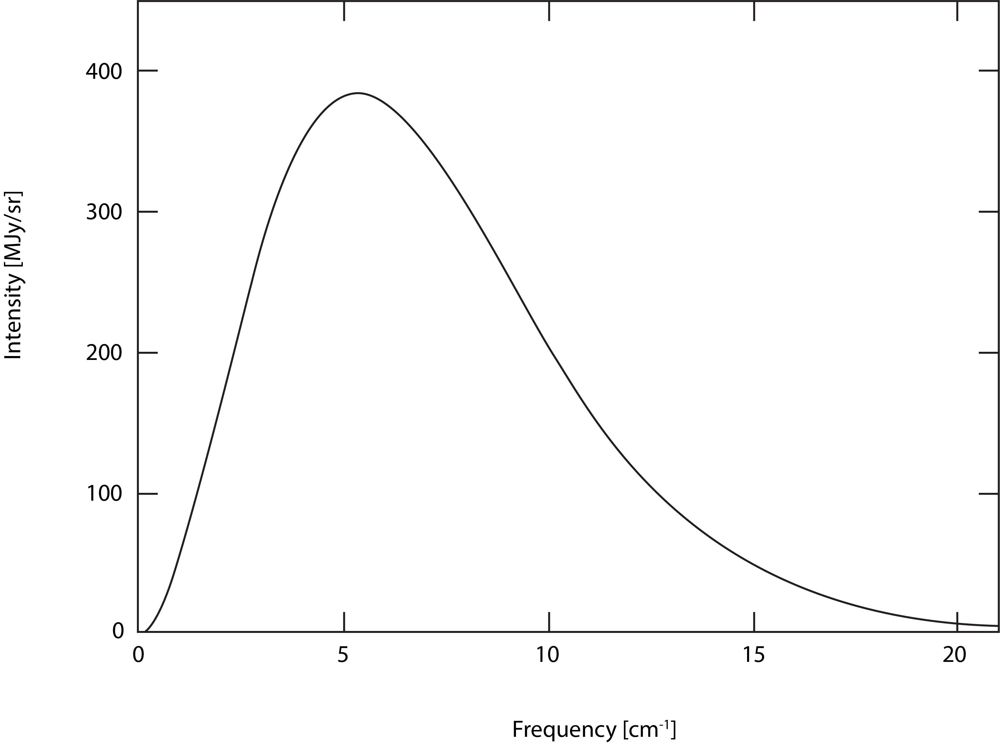

## ചാപ്റ്റര്‍ 6 – കോസ്മിക് മൈക്രോവേവ് ബാക്ക്ഗ്രൌണ്ട്

1964ല്‍, ന്യു ജേര്‍സിയിലെ പ്രശസ്തമായ ബെല്‍ ലാബ്സില്‍ ചില പരീക്ഷണങ്ങള്‍ നടത്തുകയായിരുന്നു ഫിസിസിസ്റ്റുകളായ ആര്‍നൊ പെന്‍സിയാസ്, റോബര്‍ട്ട്‌ വില്‍സണ്‍ എന്നിവര്‍. 

ബല്ലൂണ്‍ സാറ്റലൈറ്റ്കള്‍ എന്നറിയപ്പെടുന്ന ചെറിയ ഉപഗ്രഹങ്ങളില്‍ നിന്നും റിഫ്ലക്റ്റ് ചെയ്തു വരുന്ന റേഡിയോ സിഗ്നലുകള്‍, ബെല്‍ ലാബ്സിന്‍റെ ഉടമസ്ഥതയിലുള്ള ഹോണ്‍ ആന്‍റെന ഉപയോഗിച്ച് പിടിച്ചെടുത്തു പഠിക്കുക എന്നതാണ് പരീക്ഷണങ്ങള്‍. 

 
	
 <a href="https://en.wikipedia.org/wiki/File:Bell_Labs_Horn_Antenna_Crawford_Hill_NJ.jpg"> Credit: Wikipedia</a>

വളരെ സെന്‍സിറ്റിവ് ആയ ഈ തരംഗങ്ങള്‍ പിടിച്ചെടുക്കുന്നതിനായി മറ്റുള്ള ഇന്‍റര്‍ഫിയറെന്‍സുകള്‍ പരമാവധി കുറക്കേണ്ടതുണ്ട്. പലതരത്തിലും ട്യൂണ്‍ ചെയ്തും, ഫില്‍ട്ടറുകള്‍ സ്ഥാപിച്ചും ഒരുവിധം നോയിസുകളെല്ലാം ഒഴിവാക്കി. പക്ഷെ ഒരു പ്രത്യേക തരം മൈക്രോവേവ് സിഗ്നല്‍ എത്ര ശ്രമിച്ചിട്ടും ഒഴിവായില്ല. 

ഈ സിഗ്നല്‍ ഒഴിവാകാന്‍ ഇവര്‍ നടത്തിയ ശ്രമങ്ങള്‍ രസകരമാണ്. ആന്‍റെനയില്‍ പ്രാവുകള്‍ കാഷ്ടിച്ചത്തിന്‍റെ ഫലമാണ് ഈ നോയിസ് എന്ന് പറഞ്ഞ് ആന്‍റെന മുഴുവന്‍ കഴുകി വൃത്തിയാക്കുകയും ഒക്കെ ചെയ്യുകയുണ്ടായെങ്കിലും ഫലമുണ്ടായില്ല. 

ആകാശത്തില്‍ ഏത് ആങ്കിളില്‍ ആന്‍റെന തിരിച്ചുവെച്ചാലും ഈ നോയിസ് ഔട്പുട്ടില്‍ ദൃശ്യമായി.

ഏകദേശം 7 cm  തരംഗ ദൈര്‍ഘ്യം ഉള്ള ഈ സിഗ്നലുകള്‍ സൂര്യനില്‍ നിന്നോ, ഗാലക്സികളില്‍ നിന്നോ അല്ല എന്ന് ഇവര്‍ മനസ്സിലാക്കി.

ഇതേ സമയം തന്നെ, പ്രിന്‍സ്റ്റണ്‍ സര്‍വകലാശാലയില്‍, മറ്റൊരു ടീം ഇത്തരം ഒരു റേഡിയേഷന്‍ തപ്പുന്നുണ്ടായിരുന്നു എന്ന വിവരം  പെന്‍സിയാസിനും വില്‍സണിനും അറിയില്ലായിരുന്നു. ഇതിനെക്കുറിച്ച്‌ പിന്നീട് ഇവര്‍ മനസ്സിലാകുകയും ഈ കണ്ടെത്തല്‍ ഒരു കൊസ്മോളോജിക്കല്‍ സ്കെയിലില്‍ ഉള്ള കണ്ടെത്തല്‍ ആണെന്ന് തിരിച്ചറിയും ചെയ്തു. ഇവര്‍ എല്ലാം കൂടി ജോയിന്‍റ് ആയി ഈ കണ്ടെത്തല്‍ പബ്ലിഷ് ചെയ്തു.

ഈ കണ്ടെത്തലിന് 1978ല്‍ പെന്‍സിയാസിനും വില്‍സണും നോബല്‍ പുരസ്കാരം ലഭിച്ചു.

ഇതാണ് ഇവര്‍ കണ്ടെത്തിയ സിഗ്നലിന്‍റെ സിഗ്നെച്ചര്‍:

  

ഫിസിക്സില്‍ ബാക്ക്ഗ്രൌണ്ട് ഉള്ള എല്ലാവര്‍ക്കും പെട്ടന്ന് മനസ്സിലാകും ഇത് എന്താണെന്ന് – പ്രശസ്തമായ ബ്ലാക്ക് ബോഡി കര്‍വ്.

കോസ്മിക് മൈക്രോവേവ് ബാക്ക്ഗ്രൗണ്ട് എന്ന് ഇന്ന് നാം വിളിക്കുന്ന ഈ റേഡിയേഷന്‍ എവിടെ നിന്നാണ് ഉത്ഭവിച്ചത്‌, എന്തുകൊണ്ട് ഇതിനു ബ്ലാക്ക്‌ ബോഡി സ്പെക്ട്രം ഷെയ്പ് വന്നു എന്നെല്ലാം നോക്കാം.

എല്ലാ ബാരിയോണിക് മാറ്ററും (അതായത് സാധാരണമായ മാറ്റര്‍) റേഡിയേറ്റ് ചെയ്യും.

എന്താണ് റേഡിയേഷന്‍?

റേഡിയേഷന്‍ എന്ന് വെച്ചാല്‍ സ്പേസിലൂടെ എനര്‍ജിയുടെ ട്രാന്‍സ്ഫര്‍.

ഒരു മെഴുകുതിരി കത്തിച്ചു എന്ന് വെക്കുക. ഈ മെഴുകുതിരി വെളിച്ചം പരത്തുന്നു. 

 
	
 <a href="https://en.wikipedia.org/wiki/File:Candle_(Slava_celebration).jpg"> Credit: Wikipedia</a>

ഈ വെളിച്ചം എവിടെ നിന്ന് വന്നു?

വെളിച്ചം എന്നത് ഒരുതരം റേഡിയേഷന്‍ ആണ് – ഇലക്ട്രോ മാഗ്നറ്റിക് റേഡിയേഷന്‍, അഥവാ ഫോട്ടോണുകള്‍.

ഈ മെഴുകുതിരി വെളിച്ചത്തിന്‍റെ നിറം ശ്രദ്ധിച്ചിട്ടുണ്ടോ? ഇതിനു മഞ്ഞ നിറമായിരിക്കും.

എന്നാല്‍ ഒരു ഗ്യാസ് സ്റ്റൌ കത്തിച്ചാല്‍ അത് പരത്തുന്ന വെളിച്ചത്തിന് നീല നിറമായിരിക്കും.

  

എന്താണ് ഇതിനു കാരണം? 

അത് മനസ്സിലാകാന്‍ ഈ റേഡിയേഷന്‍ എങ്ങനെ ഉണ്ടാകുന്നു എന്ന് നോക്കണം.

ഏറ്റവും അടിസ്ഥാനപരമായ ക്വാണ്ടം ഫീല്‍ഡ് തിയറിയില്‍ നിന്നും തുടങ്ങാം.

പ്രപഞ്ചത്തില്‍ പലതരം ഫീല്‍ഡുകള്‍ ഉണ്ട്.

എന്താണ് ഫീല്‍ഡുകള്‍?

ഫീല്‍ഡ് എന്നാല്‍ ഒരു തരം മാത്തമാറ്റിക്കല്‍ കണ്‍സ്ട്രക്റ്റ് ആണ്.

ഇവ സ്പേസിലെ (ടൈമിലെയും) ഓരോ പോയിന്‍റുകളിലും ഒരു വാല്യൂ അസൈന്‍ ചെയ്യുന്നു.

അതായത് സ്പേസിലെ  (ടൈമിലെയും) എല്ലാ പോയിന്‍റുകളിലും ഉള്ള വാല്യൂകളിലേക്ക് മാപ് ചെയ്തിരിക്കുന്ന ഒരു ഫങ്ങ്ഷന്‍ ആണ് ഒരു ഫീല്‍ഡ്.

ഇങ്ങനെ മാപ് ചെയ്തിരിക്കുന്ന വല്യൂകള്‍ സ്കെയിലാര്‍ ആകാം (സ്കെയിലാര്‍ ഫീല്‍ഡ്), വെക്ടറുകള്‍ ആകാം (വെക്ടര്‍ ഫീല്‍ഡ്), ടെന്‍സറുകള്‍ ആകാം (ടെന്‍സര്‍ ഫീല്‍ഡ്), അങ്ങനെ ഏതു മാത്തമാറ്റിക്കല്‍ ഒബ്ജെച്റ്റുകളും ആകാം. 

ഇങ്ങനെ ഒരു കോണ്‍സപ്റ്റിന്‍റെ ഉപയോഗം എന്താണ്?

ഫീല്‍ഡ് എന്ന കോണ്‍സപ്റ്റ് ഉപയോഗിച്ച് പലതരം പ്രതിഭാസങ്ങളേയും പറ്റി വിവരിക്കാനും പഠികാനും സാധിക്കും.

ഉദാഹരണതിന് ഒരു റൂമിലെ ടെമ്പറെച്ചര്‍ വിവരിക്കണം എന്ന് വെക്കുക.

ആ റൂമില്‍ ഒരു മൂലയില്‍ ഒരു ഹീറ്റര്‍ ഉണ്ട്.  ഹീറ്ററിന് അടുത്ത് നല്ല ചൂടായിരിക്കും,  അകന്നകന്നു പോകുന്തോറും ചൂട് കുറഞ്ഞുകുറഞ്ഞു വരും. അതായത് ഈ റൂമിലെ ടെമ്പറെച്ചര്‍ ഒരു ഗ്രേഡിയന്‍റ് ആണ്. ഇതിനെ ഒരു ഫീല്‍ഡ് കൊണ്ട് വിവരിക്കാം. അപ്പോള്‍ ഈ റൂമിലെ സ്പേസിലെ എല്ലാ പോയിന്‍റുകളിലും ടെമ്പറെച്ചറിന് വാല്ല്യൂ ഉണ്ടാകും.

ഫിസിക്സില്‍ ക്ലാസിക്കല്‍ ഫീല്‍ഡുകളും ക്വാണ്ടം ഫീല്‍ഡുകളും ഉണ്ട്. ക്ലാസിക്കല്‍ ഇലക്ട്രോ മാഗ്നറ്റിക് ഫീല്‍ഡ്, ന്യൂട്ടോണിയന്‍ ഗ്രാവിറ്റെഷണല്‍ ഫീല്‍ഡ് എന്നിവ  ക്ലാസിക്കല്‍ ഫീല്‍ഡുകള്‍ക്ക് ഉദാഹരണം.
ക്വാണ്ടം മെക്കാനിക്സ്, ആപേക്ഷികത എന്നിവ ഉപയോഗിച്ച് ജനറലൈസ് ചെയ്തിട്ടുള്ള ഫീല്‍ഡുകള്‍ ആണ് ക്വാണ്ടം ഫീല്‍ഡുകള്‍.

ക്ലാസിക്കല്‍ ഫീല്‍ഡുകളും ക്വാണ്ടം ഫീല്‍ഡുകളും തമ്മില്‍ ഉള്ള ഒരു വലിയ വ്യത്യാസം എന്തെന്നാല്‍, ക്വാണ്ടം ഫീല്‍ഡ് തിയറിയില്‍ ഉള്ള ഫീല്‍ഡുകള്‍ നോണ്‍ കമ്മ്യുട്ടേറ്റിവ് (non commutative) ആണ് എന്നതാണ്. 

കമ്മ്യുട്ടേറ്റിവിറ്റി (Commutativity) എന്നത് ഒരു മാത്തമാറ്റിക്കല്‍ പ്രോപര്‍റ്റി ആണ്. ഇത് ഇങ്ങനെ:

\\(A\\), \\(B\\) എന്നിവ രണ്ടു സെറ്റുകള്‍ ആണെന്ന് വെക്കുക. 

ഈ സെറ്റുകളില്‍ ഡിഫൈന്‍ ചെയ്തിട്ടുള്ള ഒരു ഓപറേഷന്‍ ആണ് \\(X\\).

\\(A \; X \; B  = B \; X \; A\\) എങ്കില്‍, \\(A\\)യും \\(B\\)യും \\(X\\) എന്ന ഓപറേഷനില്‍ കമ്മ്യുട്ടേറ്റിവ് ആണ് എന്ന് പറയാം.

ഒരു ഉദാഹരണം: \\(2\\) ഗുണം \\(3\\) = \\(3\\) ഗുണം \\(2\\) = \\(6\\)

ഇത് ഇങ്ങനെ അല്ലാ എങ്കില്‍ അത് നോണ്‍ കമ്മ്യുട്ടേറ്റിവ് ആണ് എന്നര്‍ത്ഥം.

ഉദാഹരണം: \\(2-5 \neq  5-2\\)

മറ്റൊരു ഉദാഹരണം: മാട്ട്രിക്സ്‌ മള്‍ട്ടിപ്ലിക്കേഷന്‍ നോണ്‍ കമ്മ്യുട്ടേറ്റിവ് ആണ്.

ക്ലാസിക്കല്‍ ഫിസിക്സില്‍ പൊസിഷന്‍, മൊമെന്‍റം എന്നിവ കമ്മ്യുട്ടേറ്റിവ് ആണ്. എന്നാല്‍ ക്വാണ്ടം ഫിസിക്സില്‍ ഇവ നോണ്‍ കമ്മ്യുട്ടേറ്റിവ് ആണ്.

അതായത്, ക്വാണ്ടം ഫീല്‍ഡ് തിയറിയില്‍ പൊസിഷന്‍, മൊമെന്‍റം എന്നിവ ഒരു ഫോറിയര്‍ ട്രാന്‍സ്ഫോം പെയര്‍ (Fourier Transform Pairs) ആണ്.

ഇതിന്‍റെ ഒരു ഭവിഷ്യത്ത് ആണ് പ്രശസ്തമായ ഹൈസന്‍ബെര്‍ഗ് അണ്‍സെര്‍ട്ടെന്‍റ്റി പ്രിന്‍സിപ്പ്ള്‍ (Heisenberg's uncertainty principle).

ഈ ഫീല്‍ഡ്കളുടെ വാല്യൂകള്‍ ഹാര്‍മോണിക് ഓസ്സിലെറ്ററുകള്‍ കൊണ്ടാണ് മോഡല്‍ ചെയ്തിരിക്കുന്നത്.
ഹാര്‍മോണിക് ഓസ്സിലെറ്ററുകള്‍ എന്ന് വെച്ചാല്‍, ഉദാഹരണത്തിന്, അറ്റത്ത് ഒരു മാസ് ഘടിപിച്ച ഒരു സ്പ്രിങ്ങ്. 

ഇവയെ വലിച്ചു നീട്ടിയിട്ട്‌ വിടുകയാണെങ്കില്‍, ഇവ ഒരു പ്രതേക പാറ്റെണില്‍ (ഡാംപിംഗ് സൈന്‍ വേവ്) ചലിച്ചിട്ടു കാലക്രമേണ നിശ്ചലമാകും. അതായത് ഈ സിസ്റ്റത്തിന് ഒരു റീസ്റ്റോറിങ്ങ് ഫോര്‍സ് ഉണ്ട്.

സ്പേസ് മുഴുവന്‍, ഒരോ പോയിന്‍റ്കളിലും ഇതുപോലെ ഇന്‍ഫിനിറ്റ് എണ്ണം ഹാര്‍മോണിക് ഓസ്സിലെറ്ററുകള്‍ ഉണ്ടെന്നു വെക്കുക. ഈ ഓരോ ഹാര്‍മോണിക് ഓസ്സിലെറ്ററുകളും ഓരോ ഫീല്‍ഡിനെ സൂചിപ്പിക്കുന്നു. കൂടാതെ. ഇവ തമ്മില്‍ പരസ്പരം ഇന്‍ററാക്റ്റ് ചെയ്യുകയും ചെയ്യുന്നു.

അതായത് ഇതില്‍ ഒരു ഹാര്‍മോണിക് ഓസ്സിലെറ്ററിനെ നാം ചലിപ്പിച്ചാല്‍, അതുമായി ബന്ധപ്പെട്ടുകിടക്കുന്ന എല്ലാ ഓസ്സിലെറ്ററുകളും ചലിക്കും. ഒരു ഓളം പോലെ. ഈ ‘ഓളം’ ആണ് ഓരോ പാര്‍ട്ടിക്ക്ള്കള്‍.

ഇലക്ട്രോണ്‍ ഫീല്‍ഡില്‍ ഉണ്ടാകുന്ന ‘ഓളം’ ആണ് ഒരു ഇലക്ട്രോണ്‍.

ഫോട്ടോണ്‍ ഫീല്‍ഡില്‍ ഉണ്ടാകുന്ന ‘ഓളം’ ആണ് ഒരു ഫോട്ടോണ്‍.

ഹിഗ്ഗ്സ് ഫീല്‍ഡില്‍ ഉണ്ടാകുന്ന ‘ഓളം’ ആണ് ഒരു ഹിഗ്ഗ്സ് ബോസോണ്‍.

അങ്ങനെ അങ്ങനെ, ഈ പ്രപഞ്ചത്തില്‍ കാണപ്പെടുന്ന എല്ലാ പാര്‍ട്ടിക്ക്ള്കള്‍ക്കും അനുശ്രുതമായി ഫീല്‍ഡുകള്‍ ഉണ്ട്.

ഇങ്ങനെ ഫീല്‍ഡിലെ എനര്‍ജിയുടെ ട്രാന്‍സ്ഫര്‍ ആണ് റേഡിയേഷന്‍.

<<This page is under construction>>
